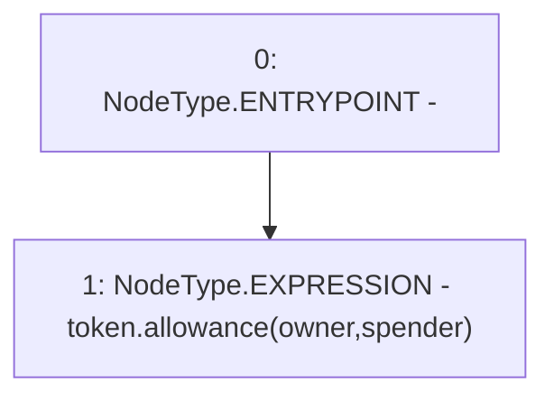

# Context: TokenScript.allowance

**Contract:** `TokenScript` (Inherits: CheckContract)
**Signature:** `allowance(address,address) returns (uint256)`
**Method Selector ID:** `0xdd62ed3e`
**Visibility:** `external`
**Environment-Free:** `Yes`
**Modifiers:** None

### State Variables Interaction
- **Reads:** token
- **Writes:** None

### Environment & Verification Flags
- **Uses Foundry Cheatcodes:** No
- **Has Echidna Properties:** No

### Internal Calls Tree
- None

### External Calls / Value Transfers
- `IERC20.TMP_13(uint256) = HIGH_LEVEL_CALL, dest:token(IERC20), function:allowance, arguments:['owner', 'spender']  `

### Control Flow Graph (CFG)


### Source Mapping
Declared in: `certora-ac-datasets/detasets/web3bugs/dataset/web3bugs/66/packages/contracts/contracts/Proxy/TokenScript.sol` on lines **23** to **25**

```solidity
    function allowance(address owner, address spender) external view returns (uint256) {
        token.allowance(owner, spender);
    }

```
