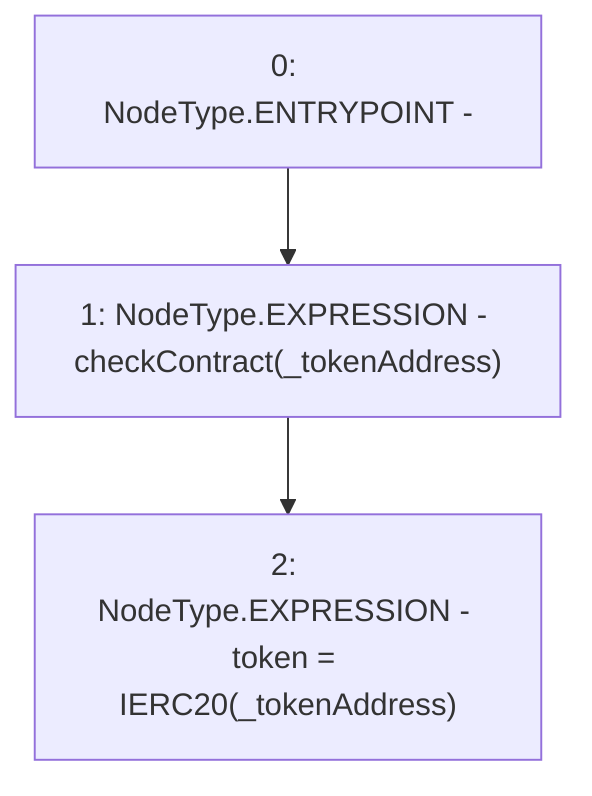

# Context: TokenScript.constructor

**Contract:** `TokenScript` (Inherits: CheckContract)
**Signature:** `constructor(address)`
**Method Selector ID:** `0xf8a6c595`
**Visibility:** `public`
**Environment-Free:** `Yes`
**Modifiers:** None

### State Variables Interaction
- **Reads:** None
- **Writes:** token

### Environment & Verification Flags
- **Uses Foundry Cheatcodes:** No
- **Has Echidna Properties:** No

### Internal Calls Tree
- None

### External Calls / Value Transfers
- None

### Control Flow Graph (CFG)


### Source Mapping
Declared in: `certora-ac-datasets/detasets/web3bugs/dataset/web3bugs/66/packages/contracts/contracts/Proxy/TokenScript.sol` on lines **14** to **17**

```solidity
    constructor(address _tokenAddress) public {
        checkContract(_tokenAddress);
        token = IERC20(_tokenAddress);
    }

```
