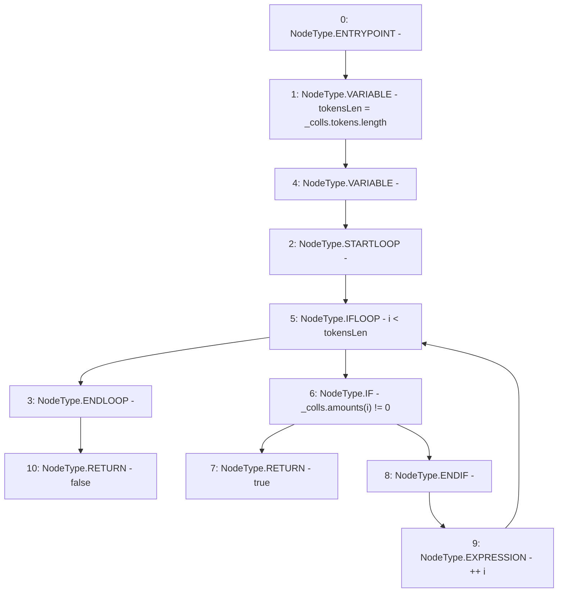

# Context: TroveManagerLiquidations._CollsIsNonZero

**Contract:** `TroveManagerLiquidations` (Inherits: ITroveManagerLiquidations, TroveManagerBase, CheckContract, Ownable, LiquityBase, YetiCustomBase, BaseMath, ILiquityBase)
**Signature:** `_CollsIsNonZero(YetiCustomBase.newColls) returns (bool)`
**Method Selector ID:** `Internal (No Method ID)`
**Visibility:** `internal`
**Environment-Free:** `Yes`
**Modifiers:** None

### State Variables Interaction
- **Reads:** None
- **Writes:** None

### Environment & Verification Flags
- **Uses Foundry Cheatcodes:** No
- **Has Echidna Properties:** No

### Internal Calls Tree
- None

### External Calls / Value Transfers
- None

### Control Flow Graph (CFG)


### Source Mapping
Declared in: `certora-ac-datasets/detasets/web3bugs/dataset/web3bugs/66/packages/contracts/contracts/Dependencies/LiquityBase.sol` on lines **131** to **139**

```solidity
    function _CollsIsNonZero(newColls memory _colls) internal pure returns (bool) {
        uint256 tokensLen = _colls.tokens.length;
        for (uint256 i; i < tokensLen; ++i) {
            if (_colls.amounts[i] != 0) {
                return true;
            }
        }
        return false;
    }

```
