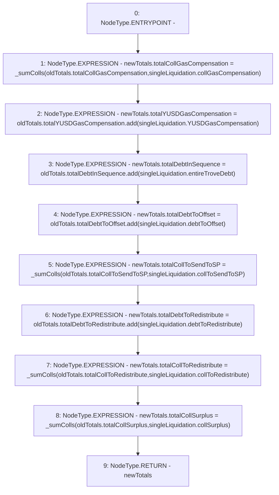

# Context: TroveManagerLiquidations._addLiquidationValuesToTotals

**Contract:** `TroveManagerLiquidations` (Inherits: ITroveManagerLiquidations, TroveManagerBase, CheckContract, Ownable, LiquityBase, YetiCustomBase, BaseMath, ILiquityBase)
**Signature:** `_addLiquidationValuesToTotals(TroveManagerLiquidations.LiquidationTotals,TroveManagerLiquidations.LiquidationValues) returns (TroveManagerLiquidations.LiquidationTotals)`
**Method Selector ID:** `Internal (No Method ID)`
**Visibility:** `internal`
**Environment-Free:** `Yes`
**Modifiers:** None

### State Variables Interaction
- **Reads:** None
- **Writes:** None

### Environment & Verification Flags
- **Uses Foundry Cheatcodes:** No
- **Has Echidna Properties:** No

### Internal Calls Tree
- None

### External Calls / Value Transfers
- `SafeMath.TMP_607(uint256) = LIBRARY_CALL, dest:SafeMath, function:SafeMath.add(uint256,uint256), arguments:['REF_911', 'REF_913'] `
- `SafeMath.TMP_603(uint256) = LIBRARY_CALL, dest:SafeMath, function:SafeMath.add(uint256,uint256), arguments:['REF_896', 'REF_898'] `
- `SafeMath.TMP_605(uint256) = LIBRARY_CALL, dest:SafeMath, function:SafeMath.add(uint256,uint256), arguments:['REF_904', 'REF_906'] `
- `SafeMath.TMP_604(uint256) = LIBRARY_CALL, dest:SafeMath, function:SafeMath.add(uint256,uint256), arguments:['REF_900', 'REF_902'] `

### Control Flow Graph (CFG)


### Source Mapping
Declared in: `certora-ac-datasets/detasets/web3bugs/dataset/web3bugs/66/packages/contracts/contracts/TroveManagerLiquidations.sol` on lines **756** to **790**

```solidity
    function _addLiquidationValuesToTotals(
        LiquidationTotals memory oldTotals,
        LiquidationValues memory singleLiquidation
    ) internal view returns (LiquidationTotals memory newTotals) {
        // Tally all the values with their respective running totals
        //update one of these
        newTotals.totalCollGasCompensation = _sumColls(
            oldTotals.totalCollGasCompensation,
            singleLiquidation.collGasCompensation
        );
        newTotals.totalYUSDGasCompensation = oldTotals.totalYUSDGasCompensation.add(
            singleLiquidation.YUSDGasCompensation
        );
        newTotals.totalDebtInSequence = oldTotals.totalDebtInSequence.add(
            singleLiquidation.entireTroveDebt
        );
        newTotals.totalDebtToOffset = oldTotals.totalDebtToOffset.add(
            singleLiquidation.debtToOffset
        );
        newTotals.totalCollToSendToSP = _sumColls(
            oldTotals.totalCollToSendToSP,
            singleLiquidation.collToSendToSP
        );
        newTotals.totalDebtToRedistribute = oldTotals.totalDebtToRedistribute.add(
            singleLiquidation.debtToRedistribute
        );
        newTotals.totalCollToRedistribute = _sumColls(
            oldTotals.totalCollToRedistribute,
            singleLiquidation.collToRedistribute
        );
        newTotals.totalCollSurplus = _sumColls(
            oldTotals.totalCollSurplus,
            singleLiquidation.collSurplus
        );
    }

```
