# Context: TroveManagerLiquidations._getCappedOffsetVals

**Contract:** `TroveManagerLiquidations` (Inherits: ITroveManagerLiquidations, TroveManagerBase, CheckContract, Ownable, LiquityBase, YetiCustomBase, BaseMath, ILiquityBase)
**Signature:** `_getCappedOffsetVals(uint256,address[],uint256[],uint256) returns (TroveManagerLiquidations.LiquidationValues)`
**Method Selector ID:** `Internal (No Method ID)`
**Visibility:** `internal`
**Environment-Free:** `Yes`
**Modifiers:** None

### State Variables Interaction
- **Reads:** PERCENT_DIVISOR, YUSD_GAS_COMPENSATION, _100pct
- **Writes:** None

### Environment & Verification Flags
- **Uses Foundry Cheatcodes:** No
- **Has Echidna Properties:** No

### Internal Calls Tree
- None

### External Calls / Value Transfers
- `SafeMath.TMP_624(uint256) = LIBRARY_CALL, dest:SafeMath, function:SafeMath.div(uint256,uint256), arguments:['TMP_623', '_100pct'] `
- `SafeMath.TMP_610(uint256) = LIBRARY_CALL, dest:SafeMath, function:SafeMath.mul(uint256,uint256), arguments:['_MCR', '_entireTroveDebt'] `
- `SafeMath.TMP_614(uint256) = LIBRARY_CALL, dest:SafeMath, function:SafeMath.div(uint256,uint256), arguments:['TMP_613', 'USD_Value_of_Trove_Colls'] `
- `SafeMath.TMP_627(uint256) = LIBRARY_CALL, dest:SafeMath, function:SafeMath.sub(uint256,uint256), arguments:['REF_950', '_cappedCollAmount'] `
- `SafeMath.TMP_613(uint256) = LIBRARY_CALL, dest:SafeMath, function:SafeMath.mul(uint256,uint256), arguments:['USD_Value_To_Send_To_SP', '_100pct'] `
- `SafeMath.TMP_625(uint256) = LIBRARY_CALL, dest:SafeMath, function:SafeMath.div(uint256,uint256), arguments:['_cappedCollAmount', 'PERCENT_DIVISOR'] `
- `SafeMath.TMP_623(uint256) = LIBRARY_CALL, dest:SafeMath, function:SafeMath.mul(uint256,uint256), arguments:['SPRatio', 'REF_946'] `
- `SafeMath.TMP_611(uint256) = LIBRARY_CALL, dest:SafeMath, function:SafeMath.div(uint256,uint256), arguments:['TMP_610', '_100pct'] `
- `SafeMath.TMP_626(uint256) = LIBRARY_CALL, dest:SafeMath, function:SafeMath.sub(uint256,uint256), arguments:['_cappedCollAmount', '_gasComp'] `
- `LiquityMath.TMP_615(uint256) = LIBRARY_CALL, dest:LiquityMath, function:LiquityMath._min(uint256,uint256), arguments:['SPRatio', '_100pct'] `

### Control Flow Graph (CFG)

```mermaid
flowchart TD
    Node_0["0: NodeType.ENTRYPOINT - "]
    Node_0 --> Node_1
    Node_1["1: NodeType.VARIABLE - "]
    Node_1 --> Node_2
    Node_2["2: NodeType.EXPRESSION - _entireTroveColl.tokens = _troveTokens"]
    Node_2 --> Node_3
    Node_3["3: NodeType.EXPRESSION - _entireTroveColl.amounts = _troveAmounts"]
    Node_3 --> Node_4
    Node_4["4: NodeType.VARIABLE - USD_Value_To_Send_To_SP = _MCR.mul(_entireTroveDebt).div(_100pct)"]
    Node_4 --> Node_5
    Node_5["5: NodeType.VARIABLE - USD_Value_of_Trove_Colls = _getUSDColls(_entireTroveColl)"]
    Node_5 --> Node_6
    Node_6["6: NodeType.VARIABLE - SPRatio = USD_Value_To_Send_To_SP.mul(_100pct).div(USD_Value_of_Trove_Colls)"]
    Node_6 --> Node_7
    Node_7["7: NodeType.EXPRESSION - SPRatio = LiquityMath._min(SPRatio,_100pct)"]
    Node_7 --> Node_8
    Node_8["8: NodeType.EXPRESSION - singleLiquidation.entireTroveDebt = _entireTroveDebt"]
    Node_8 --> Node_9
    Node_9["9: NodeType.EXPRESSION - singleLiquidation.entireTroveColl = _entireTroveColl"]
    Node_9 --> Node_10
    Node_10["10: NodeType.EXPRESSION - singleLiquidation.YUSDGasCompensation = YUSD_GAS_COMPENSATION"]
    Node_10 --> Node_11
    Node_11["11: NodeType.EXPRESSION - singleLiquidation.debtToOffset = _entireTroveDebt"]
    Node_11 --> Node_12
    Node_12["12: NodeType.EXPRESSION - singleLiquidation.debtToRedistribute = 0"]
    Node_12 --> Node_13
    Node_13["13: NodeType.EXPRESSION - singleLiquidation.collToSendToSP.tokens = _troveTokens"]
    Node_13 --> Node_14
    Node_14["14: NodeType.VARIABLE - troveTokensLen = _troveTokens.length"]
    Node_14 --> Node_15
    Node_15["15: NodeType.EXPRESSION - singleLiquidation.collToSendToSP.amounts = new uint256()(troveTokensLen)"]
    Node_15 --> Node_16
    Node_16["16: NodeType.EXPRESSION - singleLiquidation.collSurplus.tokens = _troveTokens"]
    Node_16 --> Node_17
    Node_17["17: NodeType.EXPRESSION - singleLiquidation.collSurplus.amounts = new uint256()(troveTokensLen)"]
    Node_17 --> Node_18
    Node_18["18: NodeType.EXPRESSION - singleLiquidation.collGasCompensation.tokens = _troveTokens"]
    Node_18 --> Node_19
    Node_19["19: NodeType.EXPRESSION - singleLiquidation.collGasCompensation.amounts = new uint256()(troveTokensLen)"]
    Node_19 --> Node_22
    Node_20["20: NodeType.STARTLOOP - "]
    Node_20 --> Node_23
    Node_21["21: NodeType.ENDLOOP - "]
    Node_21 --> Node_32
    Node_22["22: NodeType.VARIABLE - "]
    Node_22 --> Node_20
    Node_23["23: NodeType.IFLOOP - i < troveTokensLen"]
    Node_23 --> Node_24
    Node_23 --> Node_21
    Node_24["24: NodeType.VARIABLE - _cappedCollAmount = SPRatio.mul(_troveAmounts(i)).div(_100pct)"]
    Node_24 --> Node_25
    Node_25["25: NodeType.VARIABLE - _gasComp = _cappedCollAmount.div(PERCENT_DIVISOR)"]
    Node_25 --> Node_26
    Node_26["26: NodeType.VARIABLE - _toSP = _cappedCollAmount.sub(_gasComp)"]
    Node_26 --> Node_27
    Node_27["27: NodeType.VARIABLE - _collSurplus = _troveAmounts(i).sub(_cappedCollAmount)"]
    Node_27 --> Node_28
    Node_28["28: NodeType.EXPRESSION - singleLiquidation.collGasCompensation.amounts(i) = _gasComp"]
    Node_28 --> Node_29
    Node_29["29: NodeType.EXPRESSION - singleLiquidation.collToSendToSP.amounts(i) = _toSP"]
    Node_29 --> Node_30
    Node_30["30: NodeType.EXPRESSION - singleLiquidation.collSurplus.amounts(i) = _collSurplus"]
    Node_30 --> Node_31
    Node_31["31: NodeType.EXPRESSION - ++ i"]
    Node_31 --> Node_23
    Node_32["32: NodeType.RETURN - singleLiquidation"]
```


### Source Mapping
Declared in: `certora-ac-datasets/detasets/web3bugs/dataset/web3bugs/66/packages/contracts/contracts/TroveManagerLiquidations.sol` on lines **795** to **845**

```solidity
    function _getCappedOffsetVals
    (
        uint _entireTroveDebt,
        address[] memory _troveTokens,
        uint[] memory _troveAmounts,
        uint _MCR
    )
    internal
    view
    returns (LiquidationValues memory singleLiquidation)
    {
        newColls memory _entireTroveColl;
        _entireTroveColl.tokens = _troveTokens;
        _entireTroveColl.amounts = _troveAmounts;

        uint USD_Value_To_Send_To_SP = _MCR.mul(_entireTroveDebt).div(_100pct);
        uint USD_Value_of_Trove_Colls = _getUSDColls(_entireTroveColl);

        uint SPRatio = USD_Value_To_Send_To_SP.mul(_100pct).div(USD_Value_of_Trove_Colls);
        SPRatio = LiquityMath._min(SPRatio, _100pct);

        singleLiquidation.entireTroveDebt = _entireTroveDebt;
        singleLiquidation.entireTroveColl = _entireTroveColl;

        singleLiquidation.YUSDGasCompensation = YUSD_GAS_COMPENSATION;

        singleLiquidation.debtToOffset = _entireTroveDebt;
        singleLiquidation.debtToRedistribute = 0;

        singleLiquidation.collToSendToSP.tokens = _troveTokens;
        uint256 troveTokensLen = _troveTokens.length;
        
        singleLiquidation.collToSendToSP.amounts = new uint[](troveTokensLen);

        singleLiquidation.collSurplus.tokens = _troveTokens;
        singleLiquidation.collSurplus.amounts = new uint[](troveTokensLen);

        singleLiquidation.collGasCompensation.tokens = _troveTokens;
        singleLiquidation.collGasCompensation.amounts = new uint[](troveTokensLen);

        for (uint256 i; i < troveTokensLen; ++i) {
            uint _cappedCollAmount = SPRatio.mul(_troveAmounts[i]).div(_100pct);
            uint _gasComp = _cappedCollAmount.div(PERCENT_DIVISOR);
            uint _toSP = _cappedCollAmount.sub(_gasComp);
            uint _collSurplus = _troveAmounts[i].sub(_cappedCollAmount);

            singleLiquidation.collGasCompensation.amounts[i] = _gasComp;
            singleLiquidation.collToSendToSP.amounts[i] = _toSP;
            singleLiquidation.collSurplus.amounts[i] = _collSurplus;
        }
    }

```
