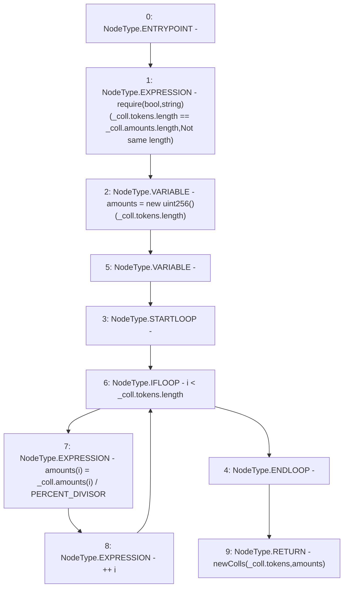

# Context: TroveManagerLiquidations._getCollGasCompensation

**Contract:** `TroveManagerLiquidations` (Inherits: ITroveManagerLiquidations, TroveManagerBase, CheckContract, Ownable, LiquityBase, YetiCustomBase, BaseMath, ILiquityBase)
**Signature:** `_getCollGasCompensation(YetiCustomBase.newColls) returns (YetiCustomBase.newColls)`
**Method Selector ID:** `Internal (No Method ID)`
**Visibility:** `internal`
**Environment-Free:** `Yes`
**Modifiers:** None

### State Variables Interaction
- **Reads:** PERCENT_DIVISOR
- **Writes:** None

### Assertion Checks & Business Requirements
- require/assert: `require(bool,string)(_coll.tokens.length == _coll.amounts.length,Not same length)`

### Environment & Verification Flags
- **Uses Foundry Cheatcodes:** No
- **Has Echidna Properties:** No

### Internal Calls Tree
- None

### External Calls / Value Transfers
- None

### Control Flow Graph (CFG)


### Source Mapping
Declared in: `certora-ac-datasets/detasets/web3bugs/dataset/web3bugs/66/packages/contracts/contracts/TroveManagerLiquidations.sol` on lines **883** to **891**

```solidity
    function _getCollGasCompensation(newColls memory _coll) internal pure returns (newColls memory) {
        require(_coll.tokens.length == _coll.amounts.length, "Not same length");

        uint[] memory amounts = new uint[](_coll.tokens.length);
        for (uint256 i; i < _coll.tokens.length; ++i) {
            amounts[i] = _coll.amounts[i] / PERCENT_DIVISOR;
        }
        return newColls(_coll.tokens, amounts);
    }

```
