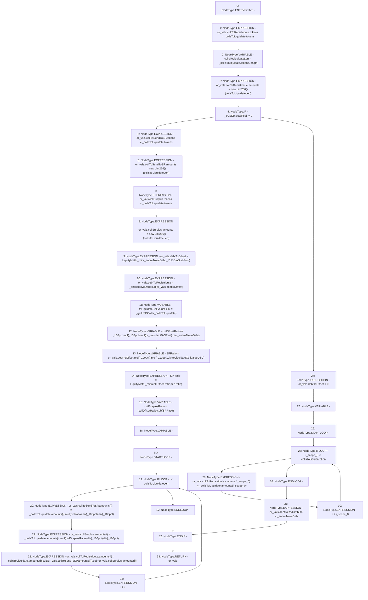

# Context: TroveManagerLiquidations._getOffsetAndRedistributionVals

**Contract:** `TroveManagerLiquidations` (Inherits: ITroveManagerLiquidations, TroveManagerBase, CheckContract, Ownable, LiquityBase, YetiCustomBase, BaseMath, ILiquityBase)
**Signature:** `_getOffsetAndRedistributionVals(uint256,YetiCustomBase.newColls,uint256) returns (TroveManagerLiquidations.LocalVariables_ORVals)`
**Method Selector ID:** `Internal (No Method ID)`
**Visibility:** `internal`
**Environment-Free:** `Yes`
**Modifiers:** None

### State Variables Interaction
- **Reads:** _100pct, _110pct
- **Writes:** None

### Environment & Verification Flags
- **Uses Foundry Cheatcodes:** No
- **Has Echidna Properties:** No

### Internal Calls Tree
- None

### External Calls / Value Transfers
- `SafeMath.TMP_587(uint256) = LIBRARY_CALL, dest:SafeMath, function:SafeMath.mul(uint256,uint256), arguments:['REF_850', '_100pct'] `
- `SafeMath.TMP_593(uint256) = LIBRARY_CALL, dest:SafeMath, function:SafeMath.mul(uint256,uint256), arguments:['REF_860', 'SPRatio'] `
- `SafeMath.TMP_599(uint256) = LIBRARY_CALL, dest:SafeMath, function:SafeMath.sub(uint256,uint256), arguments:['REF_876', 'REF_880'] `
- `SafeMath.TMP_591(uint256) = LIBRARY_CALL, dest:SafeMath, function:SafeMath.sub(uint256,uint256), arguments:['collOffsetRatio', 'SPRatio'] `
- `SafeMath.TMP_588(uint256) = LIBRARY_CALL, dest:SafeMath, function:SafeMath.mul(uint256,uint256), arguments:['TMP_587', '_110pct'] `
- `LiquityMath.TMP_581(uint256) = LIBRARY_CALL, dest:LiquityMath, function:LiquityMath._min(uint256,uint256), arguments:['_entireTroveDebt', '_YUSDInStabPool'] `
- `SafeMath.TMP_595(uint256) = LIBRARY_CALL, dest:SafeMath, function:SafeMath.div(uint256,uint256), arguments:['TMP_594', '_100pct'] `
- `SafeMath.TMP_586(uint256) = LIBRARY_CALL, dest:SafeMath, function:SafeMath.div(uint256,uint256), arguments:['TMP_585', '_entireTroveDebt'] `
- `SafeMath.TMP_596(uint256) = LIBRARY_CALL, dest:SafeMath, function:SafeMath.mul(uint256,uint256), arguments:['REF_868', 'collSurplusRatio'] `
- `SafeMath.TMP_582(uint256) = LIBRARY_CALL, dest:SafeMath, function:SafeMath.sub(uint256,uint256), arguments:['_entireTroveDebt', 'REF_845'] `
- `SafeMath.TMP_589(uint256) = LIBRARY_CALL, dest:SafeMath, function:SafeMath.div(uint256,uint256), arguments:['TMP_588', 'toLiquidateCollValueUSD'] `
- `SafeMath.TMP_585(uint256) = LIBRARY_CALL, dest:SafeMath, function:SafeMath.mul(uint256,uint256), arguments:['TMP_584', 'REF_848'] `
- `SafeMath.TMP_600(uint256) = LIBRARY_CALL, dest:SafeMath, function:SafeMath.sub(uint256,uint256), arguments:['TMP_599', 'REF_884'] `
- `LiquityMath.TMP_590(uint256) = LIBRARY_CALL, dest:LiquityMath, function:LiquityMath._min(uint256,uint256), arguments:['collOffsetRatio', 'SPRatio'] `
- `SafeMath.TMP_598(uint256) = LIBRARY_CALL, dest:SafeMath, function:SafeMath.div(uint256,uint256), arguments:['TMP_597', '_100pct'] `
- `SafeMath.TMP_597(uint256) = LIBRARY_CALL, dest:SafeMath, function:SafeMath.div(uint256,uint256), arguments:['TMP_596', '_100pct'] `
- `SafeMath.TMP_584(uint256) = LIBRARY_CALL, dest:SafeMath, function:SafeMath.mul(uint256,uint256), arguments:['_100pct', '_100pct'] `
- `SafeMath.TMP_594(uint256) = LIBRARY_CALL, dest:SafeMath, function:SafeMath.div(uint256,uint256), arguments:['TMP_593', '_100pct'] `

### Control Flow Graph (CFG)


### Source Mapping
Declared in: `certora-ac-datasets/detasets/web3bugs/dataset/web3bugs/66/packages/contracts/contracts/TroveManagerLiquidations.sol` on lines **676** to **754**

```solidity
    function _getOffsetAndRedistributionVals(
        uint256 _entireTroveDebt,
        newColls memory _collsToLiquidate,
        uint256 _YUSDInStabPool
    ) internal view returns (LocalVariables_ORVals memory or_vals) {
        or_vals.collToRedistribute.tokens = _collsToLiquidate.tokens;
        uint256 collsToLiquidateLen = _collsToLiquidate.tokens.length;
        or_vals.collToRedistribute.amounts = new uint256[](collsToLiquidateLen);

        if (_YUSDInStabPool != 0) {
            /*
             * Offset as much debt & collateral as possible against the Stability Pool, and redistribute the remainder
             * between all active troves.
             *
             *  If the trove's debt is larger than the deposited YUSD in the Stability Pool:
             *
             *  - Offset an amount of the trove's debt equal to the YUSD in the Stability Pool
             *  - Remainder of trove's debt will be redistributed
             *  - Trove collateral can be partitioned into two parts:
             *  - (1) Offsetting Collateral = (debtToOffset / troveDebt) * Collateral
             *  - (2) Redistributed Collateral = Total Collateral - Offsetting Collateral
             *  - The max offsetting collateral that can be sent to the stability pool is an amount of collateral such that
             *  - the stability pool receives 110% of value of the debtToOffset. Any extra Offsetting Collateral is
             *  - sent to the collSurplusPool and can be claimed by the borrower.
             */
            or_vals.collToSendToSP.tokens = _collsToLiquidate.tokens;
            or_vals.collToSendToSP.amounts = new uint256[](collsToLiquidateLen);

            or_vals.collSurplus.tokens = _collsToLiquidate.tokens;
            or_vals.collSurplus.amounts = new uint256[](collsToLiquidateLen);

            or_vals.debtToOffset = LiquityMath._min(_entireTroveDebt, _YUSDInStabPool);

            or_vals.debtToRedistribute = _entireTroveDebt.sub(or_vals.debtToOffset);

            uint toLiquidateCollValueUSD = _getUSDColls(_collsToLiquidate);

            // collOffsetRatio: max percentage of the collateral that can be sent to the SP as offsetting collateral
            // collOffsetRatio = percentage of the trove's debt that can be offset by the stability pool
            uint256 collOffsetRatio = _100pct.mul(_100pct).mul(or_vals.debtToOffset).div(_entireTroveDebt);

            // SPRatio: percentage of liquidated collateral that needs to be sent to SP in order to give SP depositors
            // $110 of collateral for every 100 YUSD they are using to liquidate.
            uint256 SPRatio = or_vals.debtToOffset.mul(_100pct).mul(_110pct).div(toLiquidateCollValueUSD);

            // But SP ratio is capped at collOffsetRatio:
            SPRatio = LiquityMath._min(collOffsetRatio, SPRatio);

            // if there is extra collateral left in the offset portion of the collateral after
            // giving stability pool holders $110 of collateral for every 100 YUSD that is taken from them,
            // then this is surplus collateral that can be claimed by the borrower
            uint256 collSurplusRatio = collOffsetRatio.sub(SPRatio);

            for (uint256 i; i < collsToLiquidateLen; ++i) {
                or_vals.collToSendToSP.amounts[i] = _collsToLiquidate.amounts[i].mul(SPRatio).div(
                    _100pct
                ).div(_100pct);

                or_vals.collSurplus.amounts[i] = _collsToLiquidate
                    .amounts[i]
                    .mul(collSurplusRatio)
                    .div(_100pct)
                    .div(_100pct);

                // remaining collateral is redistributed:
                or_vals.collToRedistribute.amounts[i] = _collsToLiquidate
                    .amounts[i]
                    .sub(or_vals.collToSendToSP.amounts[i])
                    .sub(or_vals.collSurplus.amounts[i]);
            }
        } else {
            // all colls are redistributed because no YUSD in stability pool to liquidate
            or_vals.debtToOffset = 0;
            for (uint256 i; i < collsToLiquidateLen; ++i) {
                or_vals.collToRedistribute.amounts[i] = _collsToLiquidate.amounts[i];
            }
            or_vals.debtToRedistribute = _entireTroveDebt;
        }
    }

```
