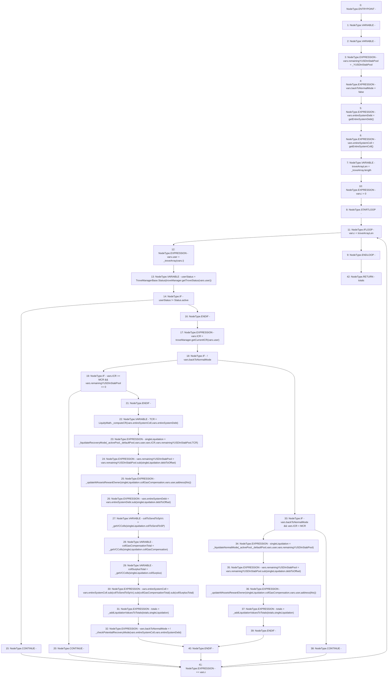

# Context: TroveManagerLiquidations._getTotalFromBatchLiquidate_RecoveryMode

**Contract:** `TroveManagerLiquidations` (Inherits: ITroveManagerLiquidations, TroveManagerBase, CheckContract, Ownable, LiquityBase, YetiCustomBase, BaseMath, ILiquityBase)
**Signature:** `_getTotalFromBatchLiquidate_RecoveryMode(IActivePool,IDefaultPool,uint256,address[]) returns (TroveManagerLiquidations.LiquidationTotals)`
**Method Selector ID:** `Internal (No Method ID)`
**Visibility:** `internal`
**Environment-Free:** `Yes`
**Modifiers:** None

### State Variables Interaction
- **Reads:** MCR, troveManager
- **Writes:** None

### Environment & Verification Flags
- **Uses Foundry Cheatcodes:** No
- **Has Echidna Properties:** No

### Internal Calls Tree
- None

### External Calls / Value Transfers
- `SafeMath.TMP_498(uint256) = LIBRARY_CALL, dest:SafeMath, function:SafeMath.sub(uint256,uint256), arguments:['REF_622', 'collToSendToSpVc'] `
- `ITroveManager.TMP_481(uint256) = HIGH_LEVEL_CALL, dest:troveManager(ITroveManager), function:getTroveStatus, arguments:['REF_594']  `
- `SafeMath.TMP_507(uint256) = LIBRARY_CALL, dest:SafeMath, function:SafeMath.sub(uint256,uint256), arguments:['REF_634', 'REF_636'] `
- `SafeMath.TMP_500(uint256) = LIBRARY_CALL, dest:SafeMath, function:SafeMath.sub(uint256,uint256), arguments:['TMP_499', 'collSurplusTotal'] `
- `SafeMath.TMP_494(uint256) = LIBRARY_CALL, dest:SafeMath, function:SafeMath.sub(uint256,uint256), arguments:['REF_615', 'REF_617'] `
- `SafeMath.TMP_491(uint256) = LIBRARY_CALL, dest:SafeMath, function:SafeMath.sub(uint256,uint256), arguments:['REF_609', 'REF_611'] `
- `ITroveManager.TMP_484(uint256) = HIGH_LEVEL_CALL, dest:troveManager(ITroveManager), function:getCurrentICR, arguments:['REF_598']  `
- `SafeMath.TMP_499(uint256) = LIBRARY_CALL, dest:SafeMath, function:SafeMath.sub(uint256,uint256), arguments:['TMP_498', 'collGasCompensationTotal'] `
- `LiquityMath.TMP_489(uint256) = LIBRARY_CALL, dest:LiquityMath, function:LiquityMath._computeCR(uint256,uint256), arguments:['REF_603', 'REF_604'] `

### Control Flow Graph (CFG)


### Source Mapping
Declared in: `certora-ac-datasets/detasets/web3bugs/dataset/web3bugs/66/packages/contracts/contracts/TroveManagerLiquidations.sol` on lines **263** to **352**

```solidity
    function _getTotalFromBatchLiquidate_RecoveryMode(
        IActivePool _activePool,
        IDefaultPool _defaultPool,
        uint256 _YUSDInStabPool,
        address[] memory _troveArray
    ) internal returns (LiquidationTotals memory totals) {
        LocalVariables_LiquidationSequence memory vars;
        LiquidationValues memory singleLiquidation;

        vars.remainingYUSDInStabPool = _YUSDInStabPool;
        vars.backToNormalMode = false;
        vars.entireSystemDebt = getEntireSystemDebt();
        // get total VC
        vars.entireSystemColl = getEntireSystemColl();
        uint256 troveArrayLen = _troveArray.length;
        for (vars.i = 0; vars.i < troveArrayLen; ++vars.i) {
            vars.user = _troveArray[vars.i];

            // Skip non-active troves
            Status userStatus = Status(troveManager.getTroveStatus(vars.user));
            if (userStatus != Status.active) {
                continue;
            }
            vars.ICR = troveManager.getCurrentICR(vars.user);

            if (!vars.backToNormalMode) {
                // Skip this trove if ICR is greater than MCR and Stability Pool is empty
                if (vars.ICR >= MCR && vars.remainingYUSDInStabPool == 0) {
                    continue;
                }

                uint256 TCR = LiquityMath._computeCR(vars.entireSystemColl, vars.entireSystemDebt);

                singleLiquidation = _liquidateRecoveryMode(
                    _activePool,
                    _defaultPool,
                    vars.user,
                    vars.ICR,
                    vars.remainingYUSDInStabPool,
                    TCR
                );

                // Update aggregate trackers
                vars.remainingYUSDInStabPool = vars.remainingYUSDInStabPool.sub(
                    singleLiquidation.debtToOffset
                );

                // If wrapped assets exist then update the reward to this contract temporarily
                _updateWAssetsRewardOwner(singleLiquidation.collGasCompensation, vars.user, address(this));

                vars.entireSystemDebt = vars.entireSystemDebt.sub(singleLiquidation.debtToOffset);

                uint256 collToSendToSpVc = _getVCColls(singleLiquidation.collToSendToSP);
                uint256 collGasCompensationTotal = _getVCColls(
                    singleLiquidation.collGasCompensation
                );
                uint256 collSurplusTotal = _getVCColls(singleLiquidation.collSurplus);

                vars.entireSystemColl = vars
                    .entireSystemColl
                    .sub(collToSendToSpVc)
                    .sub(collGasCompensationTotal)
                    .sub(collSurplusTotal);

                // Add liquidation values to their respective running totals
                totals = _addLiquidationValuesToTotals(totals, singleLiquidation);

                vars.backToNormalMode = !_checkPotentialRecoveryMode(
                    vars.entireSystemColl,
                    vars.entireSystemDebt
                );
            } else if (vars.backToNormalMode && vars.ICR < MCR) {
                singleLiquidation = _liquidateNormalMode(
                    _activePool,
                    _defaultPool,
                    vars.user,
                    vars.remainingYUSDInStabPool
                );
                vars.remainingYUSDInStabPool = vars.remainingYUSDInStabPool.sub(
                    singleLiquidation.debtToOffset
                );

                // If wrapped assets exist then update the reward to this contract temporarily
                _updateWAssetsRewardOwner(singleLiquidation.collGasCompensation, vars.user, address(this));

                // Add liquidation values to their respective running totals
                totals = _addLiquidationValuesToTotals(totals, singleLiquidation);
            } else continue; // In Normal Mode skip troves with ICR >= MCR
        }
    }

```
