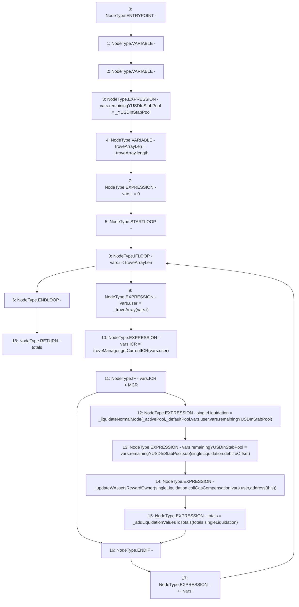

# Context: TroveManagerLiquidations._getTotalsFromBatchLiquidate_NormalMode

**Contract:** `TroveManagerLiquidations` (Inherits: ITroveManagerLiquidations, TroveManagerBase, CheckContract, Ownable, LiquityBase, YetiCustomBase, BaseMath, ILiquityBase)
**Signature:** `_getTotalsFromBatchLiquidate_NormalMode(IActivePool,IDefaultPool,uint256,address[]) returns (TroveManagerLiquidations.LiquidationTotals)`
**Method Selector ID:** `Internal (No Method ID)`
**Visibility:** `internal`
**Environment-Free:** `Yes`
**Modifiers:** None

### State Variables Interaction
- **Reads:** MCR, troveManager
- **Writes:** None

### Environment & Verification Flags
- **Uses Foundry Cheatcodes:** No
- **Has Echidna Properties:** No

### Internal Calls Tree
- None

### External Calls / Value Transfers
- `SafeMath.TMP_515(uint256) = LIBRARY_CALL, dest:SafeMath, function:SafeMath.sub(uint256,uint256), arguments:['REF_654', 'REF_656'] `
- `ITroveManager.TMP_512(uint256) = HIGH_LEVEL_CALL, dest:troveManager(ITroveManager), function:getCurrentICR, arguments:['REF_649']  `

### Control Flow Graph (CFG)


### Source Mapping
Declared in: `certora-ac-datasets/detasets/web3bugs/dataset/web3bugs/66/packages/contracts/contracts/TroveManagerLiquidations.sol` on lines **354** to **386**

```solidity
    function _getTotalsFromBatchLiquidate_NormalMode(
        IActivePool _activePool,
        IDefaultPool _defaultPool,
        uint256 _YUSDInStabPool,
        address[] memory _troveArray
    ) internal returns (LiquidationTotals memory totals) {
        LocalVariables_LiquidationSequence memory vars;
        LiquidationValues memory singleLiquidation;

        vars.remainingYUSDInStabPool = _YUSDInStabPool;
        uint256 troveArrayLen = _troveArray.length;
        for (vars.i = 0; vars.i < troveArrayLen; ++vars.i) {
            vars.user = _troveArray[vars.i];
            vars.ICR = troveManager.getCurrentICR(vars.user);
            if (vars.ICR < MCR) {
                singleLiquidation = _liquidateNormalMode(
                    _activePool,
                    _defaultPool,
                    vars.user,
                    vars.remainingYUSDInStabPool
                );
                vars.remainingYUSDInStabPool = vars.remainingYUSDInStabPool.sub(
                    singleLiquidation.debtToOffset
                );

                // If wrapped assets exist then update the reward to this contract temporarily
                _updateWAssetsRewardOwner(singleLiquidation.collGasCompensation, vars.user, address(this));

                // Add liquidation values to their respective running totals
                totals = _addLiquidationValuesToTotals(totals, singleLiquidation);
            }
        }
    }

```
