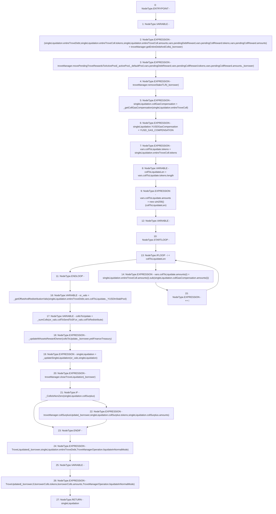

# Context: TroveManagerLiquidations._liquidateNormalMode

**Contract:** `TroveManagerLiquidations` (Inherits: ITroveManagerLiquidations, TroveManagerBase, CheckContract, Ownable, LiquityBase, YetiCustomBase, BaseMath, ILiquityBase)
**Signature:** `_liquidateNormalMode(IActivePool,IDefaultPool,address,uint256) returns (TroveManagerLiquidations.LiquidationValues)`
**Method Selector ID:** `Internal (No Method ID)`
**Visibility:** `internal`
**Environment-Free:** `Yes`
**Modifiers:** None

### State Variables Interaction
- **Reads:** YUSD_GAS_COMPENSATION, troveManager, yetiFinanceTreasury
- **Writes:** None

### Environment & Verification Flags
- **Uses Foundry Cheatcodes:** No
- **Has Echidna Properties:** No

### Internal Calls Tree
- None

### External Calls / Value Transfers
- `ITroveManager.HIGH_LEVEL_CALL, dest:troveManager(ITroveManager), function:movePendingTroveRewardsToActivePool, arguments:['_activePool', '_defaultPool', 'REF_672', 'REF_674', 'REF_676', '_borrower']  `
- `ITroveManager.HIGH_LEVEL_CALL, dest:troveManager(ITroveManager), function:collSurplusUpdate, arguments:['_borrower', 'REF_708', 'REF_710']  `
- `SafeMath.TMP_525(uint256) = LIBRARY_CALL, dest:SafeMath, function:SafeMath.sub(uint256,uint256), arguments:['REF_695', 'REF_699'] `
- `ITroveManager.TUPLE_0(uint256,address[],uint256[],uint256,address[],uint256[]) = HIGH_LEVEL_CALL, dest:troveManager(ITroveManager), function:getEntireDebtAndColls, arguments:['_borrower']  `
- `ITroveManager.HIGH_LEVEL_CALL, dest:troveManager(ITroveManager), function:removeStakeTLR, arguments:['_borrower']  `
- `ITroveManager.HIGH_LEVEL_CALL, dest:troveManager(ITroveManager), function:closeTroveLiquidation, arguments:['_borrower']  `

### Control Flow Graph (CFG)


### Source Mapping
Declared in: `certora-ac-datasets/detasets/web3bugs/dataset/web3bugs/66/packages/contracts/contracts/TroveManagerLiquidations.sol` on lines **389** to **466**

```solidity
    function _liquidateNormalMode(
        IActivePool _activePool,
        IDefaultPool _defaultPool,
        address _borrower,
        uint256 _YUSDInStabPool
    ) internal returns (LiquidationValues memory singleLiquidation) {
        LocalVariables_InnerSingleLiquidateFunction memory vars;

        (
            singleLiquidation.entireTroveDebt,
            singleLiquidation.entireTroveColl.tokens,
            singleLiquidation.entireTroveColl.amounts,
            vars.pendingDebtReward,
            vars.pendingCollReward.tokens,
            vars.pendingCollReward.amounts
        ) = troveManager.getEntireDebtAndColls(_borrower);

        troveManager.movePendingTroveRewardsToActivePool(
            _activePool,
            _defaultPool,
            vars.pendingDebtReward,
            vars.pendingCollReward.tokens,
            vars.pendingCollReward.amounts, 
            _borrower
        );
        troveManager.removeStakeTLR(_borrower);

        singleLiquidation.collGasCompensation = _getCollGasCompensation(
            singleLiquidation.entireTroveColl
        );

        singleLiquidation.YUSDGasCompensation = YUSD_GAS_COMPENSATION;

        vars.collToLiquidate.tokens = singleLiquidation.entireTroveColl.tokens;
        uint256 collToLiquidateLen = vars.collToLiquidate.tokens.length;
        vars.collToLiquidate.amounts = new uint256[](collToLiquidateLen);
        for (uint256 i; i < collToLiquidateLen; ++i) {
            vars.collToLiquidate.amounts[i] = singleLiquidation.entireTroveColl.amounts[i].sub(
                singleLiquidation.collGasCompensation.amounts[i]
            );
        }

        LocalVariables_ORVals memory or_vals = _getOffsetAndRedistributionVals(
            singleLiquidation.entireTroveDebt,
            vars.collToLiquidate,
            _YUSDInStabPool
        );

        newColls memory collsToUpdate = _sumColls(or_vals.collToSendToSP, or_vals.collToRedistribute);
        // rewards for WAssets sent to SP and collToRedistribute will
        // accrue to Yeti Finance Treasury until the assets are claimed
        _updateWAssetsRewardOwner(collsToUpdate, _borrower, yetiFinanceTreasury);

        singleLiquidation = _updateSingleLiquidation(or_vals, singleLiquidation);
        troveManager.closeTroveLiquidation(_borrower);

        if (_CollsIsNonZero(singleLiquidation.collSurplus)) {
            troveManager.collSurplusUpdate(
                _borrower,
                singleLiquidation.collSurplus.tokens,
                singleLiquidation.collSurplus.amounts
            );
        }

        emit TroveLiquidated(
            _borrower,
            singleLiquidation.entireTroveDebt,
            TroveManagerOperation.liquidateInNormalMode
        );
        newColls memory borrowerColls;
        emit TroveUpdated(
            _borrower,
            0,
            borrowerColls.tokens,
            borrowerColls.amounts,
            TroveManagerOperation.liquidateInNormalMode
        );
    }

```
