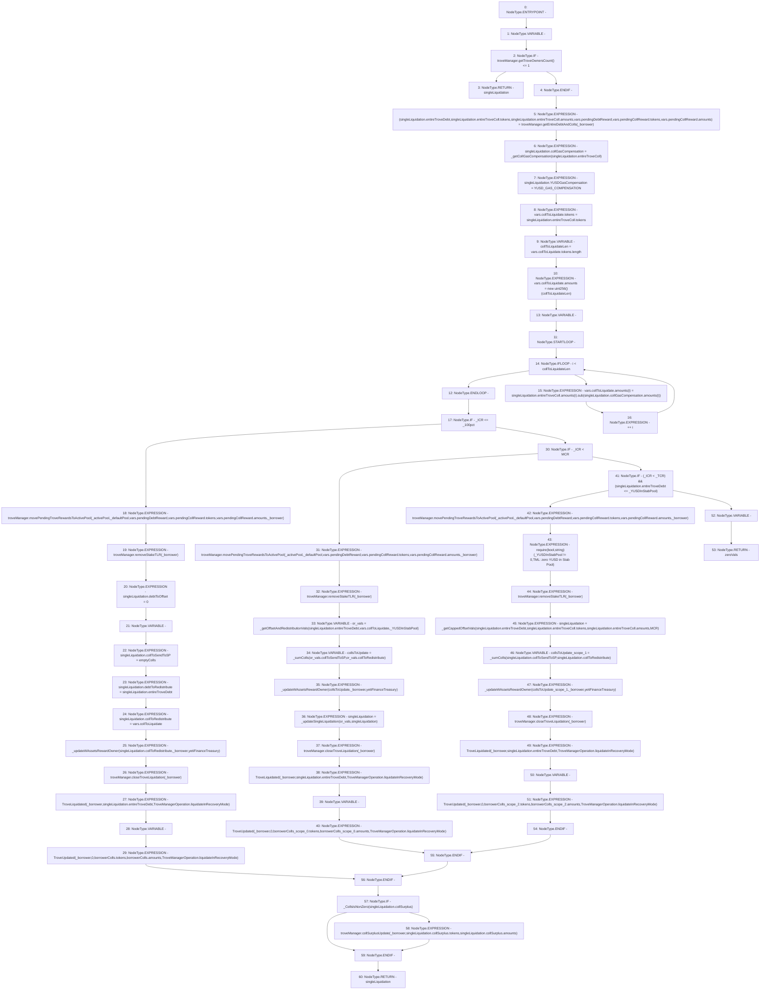

# Context: TroveManagerLiquidations._liquidateRecoveryMode

**Contract:** `TroveManagerLiquidations` (Inherits: ITroveManagerLiquidations, TroveManagerBase, CheckContract, Ownable, LiquityBase, YetiCustomBase, BaseMath, ILiquityBase)
**Signature:** `_liquidateRecoveryMode(IActivePool,IDefaultPool,address,uint256,uint256,uint256) returns (TroveManagerLiquidations.LiquidationValues)`
**Method Selector ID:** `Internal (No Method ID)`
**Visibility:** `internal`
**Environment-Free:** `Yes`
**Modifiers:** None

### State Variables Interaction
- **Reads:** MCR, YUSD_GAS_COMPENSATION, _100pct, troveManager, yetiFinanceTreasury
- **Writes:** None

### Assertion Checks & Business Requirements
- require/assert: `require(bool,string)(_YUSDInStabPool != 0,TML: zero YUSD in Stab Pool)`

### Environment & Verification Flags
- **Uses Foundry Cheatcodes:** No
- **Has Echidna Properties:** No

### Internal Calls Tree
- None

### External Calls / Value Transfers
- `SafeMath.TMP_541(uint256) = LIBRARY_CALL, dest:SafeMath, function:SafeMath.sub(uint256,uint256), arguments:['REF_745', 'REF_749'] `
- `ITroveManager.TMP_535(uint256) = HIGH_LEVEL_CALL, dest:troveManager(ITroveManager), function:getTroveOwnersCount, arguments:[]  `
- `ITroveManager.HIGH_LEVEL_CALL, dest:troveManager(ITroveManager), function:collSurplusUpdate, arguments:['_borrower', 'REF_811', 'REF_813']  `
- `ITroveManager.HIGH_LEVEL_CALL, dest:troveManager(ITroveManager), function:movePendingTroveRewardsToActivePool, arguments:['_activePool', '_defaultPool', 'REF_771', 'REF_773', 'REF_775', '_borrower']  `
- `ITroveManager.TUPLE_1(uint256,address[],uint256[],uint256,address[],uint256[]) = HIGH_LEVEL_CALL, dest:troveManager(ITroveManager), function:getEntireDebtAndColls, arguments:['_borrower']  `
- `ITroveManager.HIGH_LEVEL_CALL, dest:troveManager(ITroveManager), function:movePendingTroveRewardsToActivePool, arguments:['_activePool', '_defaultPool', 'REF_751', 'REF_753', 'REF_755', '_borrower']  `
- `ITroveManager.HIGH_LEVEL_CALL, dest:troveManager(ITroveManager), function:movePendingTroveRewardsToActivePool, arguments:['_activePool', '_defaultPool', 'REF_789', 'REF_791', 'REF_793', '_borrower']  `
- `ITroveManager.HIGH_LEVEL_CALL, dest:troveManager(ITroveManager), function:removeStakeTLR, arguments:['_borrower']  `
- `ITroveManager.HIGH_LEVEL_CALL, dest:troveManager(ITroveManager), function:closeTroveLiquidation, arguments:['_borrower']  `

### Control Flow Graph (CFG)


### Source Mapping
Declared in: `certora-ac-datasets/detasets/web3bugs/dataset/web3bugs/66/packages/contracts/contracts/TroveManagerLiquidations.sol` on lines **470** to **654**

```solidity
    function _liquidateRecoveryMode(
        IActivePool _activePool,
        IDefaultPool _defaultPool,
        address _borrower,
        uint256 _ICR,
        uint256 _YUSDInStabPool,
        uint256 _TCR
    ) internal returns (LiquidationValues memory singleLiquidation) {
        LocalVariables_InnerSingleLiquidateFunction memory vars;

        if (troveManager.getTroveOwnersCount() <= 1) {
            return singleLiquidation;
        } // don't liquidate if last trove

        (
            singleLiquidation.entireTroveDebt,
            singleLiquidation.entireTroveColl.tokens,
            singleLiquidation.entireTroveColl.amounts,
            vars.pendingDebtReward,
            vars.pendingCollReward.tokens,
            vars.pendingCollReward.amounts
        ) = troveManager.getEntireDebtAndColls(_borrower);

        singleLiquidation.collGasCompensation = _getCollGasCompensation(
            singleLiquidation.entireTroveColl
        );

        singleLiquidation.YUSDGasCompensation = YUSD_GAS_COMPENSATION;

        vars.collToLiquidate.tokens = singleLiquidation.entireTroveColl.tokens;
        uint256 collToLiquidateLen = vars.collToLiquidate.tokens.length;
        vars.collToLiquidate.amounts = new uint256[](collToLiquidateLen);
        for (uint256 i; i < collToLiquidateLen; ++i) {
            vars.collToLiquidate.amounts[i] = singleLiquidation.entireTroveColl.amounts[i].sub(
                singleLiquidation.collGasCompensation.amounts[i]
            );
        }

        // If ICR <= 100%, purely redistribute the Trove across all active Troves
        if (_ICR <= _100pct) {
            troveManager.movePendingTroveRewardsToActivePool(
                _activePool,
                _defaultPool,
                vars.pendingDebtReward,
                vars.pendingCollReward.tokens,
                vars.pendingCollReward.amounts, 
                _borrower
            );
            // troveManager.movePendingTroveRewardsToActivePool(_activePool, _defaultPool, vars.pendingDebtReward, singleLiquidation.entireTroveColl.tokens, singleLiquidation.entireTroveColl.amounts);
            troveManager.removeStakeTLR(_borrower);

            singleLiquidation.debtToOffset = 0;
            newColls memory emptyColls;
            singleLiquidation.collToSendToSP = emptyColls;
            singleLiquidation.debtToRedistribute = singleLiquidation.entireTroveDebt;
            singleLiquidation.collToRedistribute = vars.collToLiquidate;

            // WAsset rewards for collToRedistribute will accrue to
            // Yeti Finance Treasury until the WAssets are claimed by troves
            _updateWAssetsRewardOwner(singleLiquidation.collToRedistribute, _borrower, yetiFinanceTreasury);

            troveManager.closeTroveLiquidation(_borrower);
            emit TroveLiquidated(
                _borrower,
                singleLiquidation.entireTroveDebt,
                TroveManagerOperation.liquidateInRecoveryMode
            );
            newColls memory borrowerColls;// = troveManager.getTroveColls(_borrower);
            emit TroveUpdated(
                _borrower,
                0,
                borrowerColls.tokens,
                borrowerColls.amounts,
                TroveManagerOperation.liquidateInRecoveryMode
            );

            // If 100% < ICR < MCR, offset as much as possible, and redistribute the remainder
            // ICR > 100% is implied by prevoius state. 
        } else if (_ICR < MCR) {

            troveManager.movePendingTroveRewardsToActivePool(
                _activePool,
                _defaultPool,
                vars.pendingDebtReward,
                vars.pendingCollReward.tokens,
                vars.pendingCollReward.amounts, 
                _borrower
            );

            troveManager.removeStakeTLR(_borrower);

            LocalVariables_ORVals memory or_vals = _getOffsetAndRedistributionVals(
                singleLiquidation.entireTroveDebt,
                vars.collToLiquidate,
                _YUSDInStabPool
            );

            newColls memory collsToUpdate = _sumColls(or_vals.collToSendToSP, or_vals.collToRedistribute);
            // rewards for WAssets sent to SP and collToRedistribute will
            // accrue to Yeti Finance Treasury until the assets are claimed
            _updateWAssetsRewardOwner(collsToUpdate, _borrower, yetiFinanceTreasury);

            singleLiquidation = _updateSingleLiquidation(or_vals, singleLiquidation);

            troveManager.closeTroveLiquidation(_borrower);
            emit TroveLiquidated(
                _borrower,
                singleLiquidation.entireTroveDebt,
                TroveManagerOperation.liquidateInRecoveryMode
            );
            newColls memory borrowerColls;// = troveManager.getTroveColls(_borrower);
            emit TroveUpdated(
                _borrower,
                0,
                borrowerColls.tokens,
                borrowerColls.amounts,
                TroveManagerOperation.liquidateInRecoveryMode
            );
            /*
             * If 110% <= ICR < current TCR (accounting for the preceding liquidations in the current sequence)
             * and there is YUSD in the Stability Pool, only offset, with no redistribution,
             * but at a capped rate of 1.1 and only if the whole debt can be liquidated.
             * The remainder due to the capped rate will be claimable as collateral surplus.
             * ICR >= 110% is implied from last else if statement. 
             */
        } else if (
           (_ICR < _TCR) && (singleLiquidation.entireTroveDebt <= _YUSDInStabPool)
        ) {
            troveManager.movePendingTroveRewardsToActivePool(
                _activePool,
                _defaultPool,
                vars.pendingDebtReward,
                vars.pendingCollReward.tokens,
                vars.pendingCollReward.amounts,
                _borrower
            );

            require(_YUSDInStabPool != 0, "TML: zero YUSD in Stab Pool");

            troveManager.removeStakeTLR(_borrower);

            singleLiquidation = _getCappedOffsetVals(
                singleLiquidation.entireTroveDebt,
                singleLiquidation.entireTroveColl.tokens,
                singleLiquidation.entireTroveColl.amounts,
                MCR
            );

            newColls memory collsToUpdate = _sumColls(
                singleLiquidation.collToSendToSP,
                singleLiquidation.collToRedistribute
            );
            // rewards for WAssets sent to SP and collToRedistribute will
            // accrue to Yeti Finance Treasury until the assets are claimed
            _updateWAssetsRewardOwner(collsToUpdate, _borrower, yetiFinanceTreasury);

            troveManager.closeTroveLiquidation(_borrower);

            emit TroveLiquidated(
                _borrower,
                singleLiquidation.entireTroveDebt,
                TroveManagerOperation.liquidateInRecoveryMode
            );
            newColls memory borrowerColls;
            emit TroveUpdated(
                _borrower,
                0,
                borrowerColls.tokens,
                borrowerColls.amounts,
                TroveManagerOperation.liquidateInRecoveryMode
            );
        } else {
            // if (_ICR >= MCR && ( _ICR >= _TCR || singleLiquidation.entireTroveDebt > _YUSDInStabPool))
            LiquidationValues memory zeroVals;
            return zeroVals;
        }

        if (_CollsIsNonZero(singleLiquidation.collSurplus)) {
            troveManager.collSurplusUpdate(
                _borrower,
                singleLiquidation.collSurplus.tokens,
                singleLiquidation.collSurplus.amounts
            );
        }
    }

```
