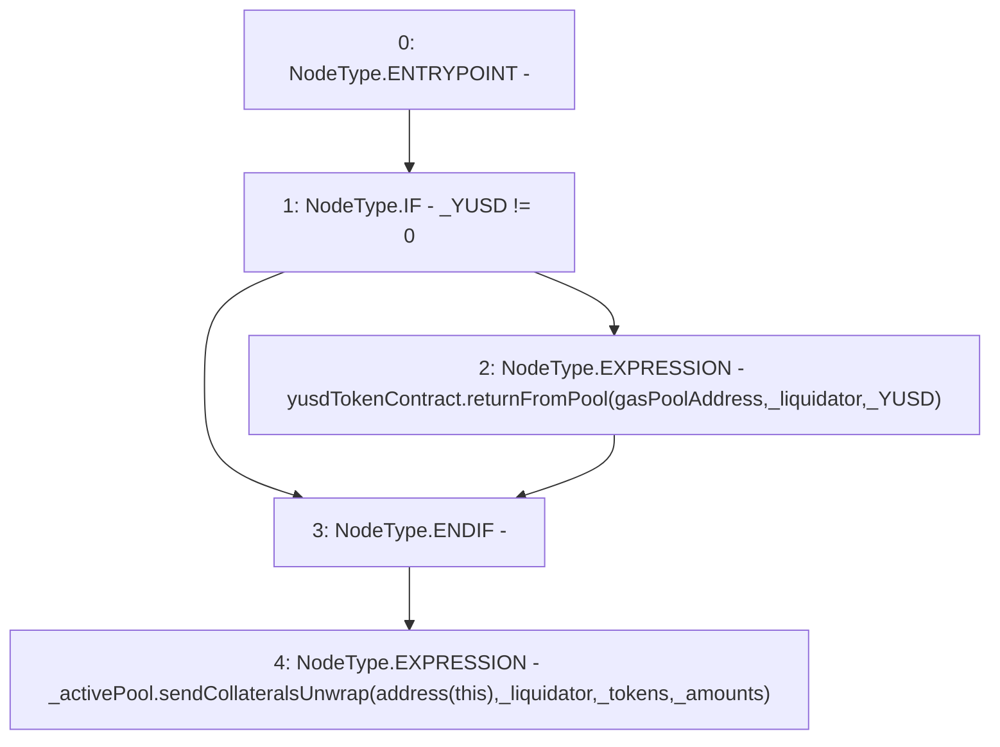

# Context: TroveManagerLiquidations._sendGasCompensation

**Contract:** `TroveManagerLiquidations` (Inherits: ITroveManagerLiquidations, TroveManagerBase, CheckContract, Ownable, LiquityBase, YetiCustomBase, BaseMath, ILiquityBase)
**Signature:** `_sendGasCompensation(IActivePool,address,uint256,address[],uint256[])`
**Method Selector ID:** `Internal (No Method ID)`
**Visibility:** `internal`
**Environment-Free:** `Yes`
**Modifiers:** None

### State Variables Interaction
- **Reads:** gasPoolAddress, yusdTokenContract
- **Writes:** None

### Environment & Verification Flags
- **Uses Foundry Cheatcodes:** No
- **Has Echidna Properties:** No

### Internal Calls Tree
- None

### External Calls / Value Transfers
- `IYUSDToken.HIGH_LEVEL_CALL, dest:yusdTokenContract(IYUSDToken), function:returnFromPool, arguments:['gasPoolAddress', '_liquidator', '_YUSD']  `
- `IActivePool.TMP_631(bool) = HIGH_LEVEL_CALL, dest:_activePool(IActivePool), function:sendCollateralsUnwrap, arguments:['TMP_630', '_liquidator', '_tokens', '_amounts']  `

### Control Flow Graph (CFG)


### Source Mapping
Declared in: `certora-ac-datasets/detasets/web3bugs/dataset/web3bugs/66/packages/contracts/contracts/TroveManagerLiquidations.sol` on lines **847** to **860**

```solidity
    function _sendGasCompensation(
        IActivePool _activePool,
        address _liquidator,
        uint256 _YUSD,
        address[] memory _tokens,
        uint256[] memory _amounts
    ) internal {
        if (_YUSD != 0) {
            yusdTokenContract.returnFromPool(gasPoolAddress, _liquidator, _YUSD);
        }

        // This contract owns the rewards temporarily until the liquidation is complete
        _activePool.sendCollateralsUnwrap(address(this), _liquidator, _tokens, _amounts);
    }

```
