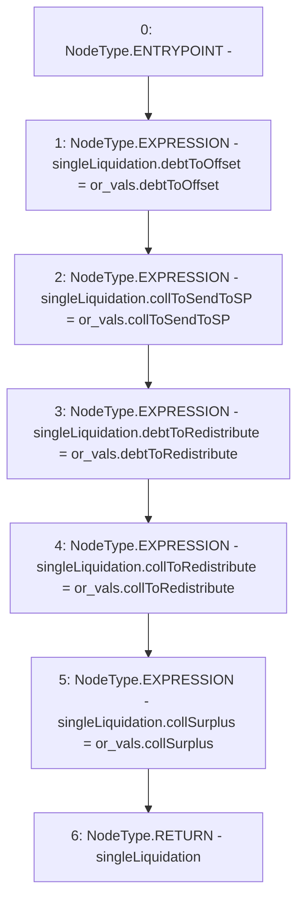

# Context: TroveManagerLiquidations._updateSingleLiquidation

**Contract:** `TroveManagerLiquidations` (Inherits: ITroveManagerLiquidations, TroveManagerBase, CheckContract, Ownable, LiquityBase, YetiCustomBase, BaseMath, ILiquityBase)
**Signature:** `_updateSingleLiquidation(TroveManagerLiquidations.LocalVariables_ORVals,TroveManagerLiquidations.LiquidationValues) returns (TroveManagerLiquidations.LiquidationValues)`
**Method Selector ID:** `Internal (No Method ID)`
**Visibility:** `internal`
**Environment-Free:** `Yes`
**Modifiers:** None

### State Variables Interaction
- **Reads:** None
- **Writes:** None

### Environment & Verification Flags
- **Uses Foundry Cheatcodes:** No
- **Has Echidna Properties:** No

### Internal Calls Tree
- None

### External Calls / Value Transfers
- None

### Control Flow Graph (CFG)


### Source Mapping
Declared in: `certora-ac-datasets/detasets/web3bugs/dataset/web3bugs/66/packages/contracts/contracts/TroveManagerLiquidations.sol` on lines **656** to **666**

```solidity
    function _updateSingleLiquidation(
        LocalVariables_ORVals memory or_vals,
        LiquidationValues memory singleLiquidation
    ) internal pure returns (LiquidationValues memory) {
        singleLiquidation.debtToOffset = or_vals.debtToOffset;
        singleLiquidation.collToSendToSP = or_vals.collToSendToSP;
        singleLiquidation.debtToRedistribute = or_vals.debtToRedistribute;
        singleLiquidation.collToRedistribute = or_vals.collToRedistribute;
        singleLiquidation.collSurplus = or_vals.collSurplus;
        return singleLiquidation;
    }

```
