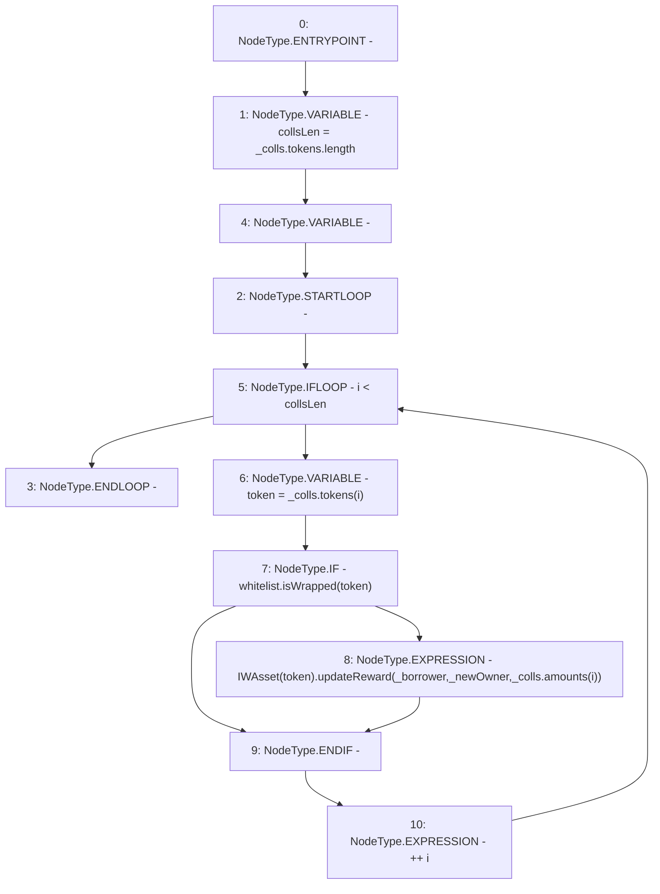

# Context: TroveManagerLiquidations._updateWAssetsRewardOwner

**Contract:** `TroveManagerLiquidations` (Inherits: ITroveManagerLiquidations, TroveManagerBase, CheckContract, Ownable, LiquityBase, YetiCustomBase, BaseMath, ILiquityBase)
**Signature:** `_updateWAssetsRewardOwner(YetiCustomBase.newColls,address,address)`
**Method Selector ID:** `Internal (No Method ID)`
**Visibility:** `internal`
**Environment-Free:** `Yes`
**Modifiers:** None

### State Variables Interaction
- **Reads:** whitelist
- **Writes:** None

### Environment & Verification Flags
- **Uses Foundry Cheatcodes:** No
- **Has Echidna Properties:** No

### Internal Calls Tree
- None

### External Calls / Value Transfers
- `IWhitelist.TMP_633(bool) = HIGH_LEVEL_CALL, dest:whitelist(IWhitelist), function:isWrapped, arguments:['token']  `
- `IWAsset.HIGH_LEVEL_CALL, dest:TMP_634(IWAsset), function:updateReward, arguments:['_borrower', '_newOwner', 'REF_970']  `

### Control Flow Graph (CFG)


### Source Mapping
Declared in: `certora-ac-datasets/detasets/web3bugs/dataset/web3bugs/66/packages/contracts/contracts/TroveManagerLiquidations.sol` on lines **867** to **875**

```solidity
    function _updateWAssetsRewardOwner(newColls memory _colls, address _borrower, address _newOwner) internal {
        uint256 collsLen = _colls.tokens.length;
        for (uint256 i; i < collsLen; ++i) {
            address token = _colls.tokens[i];
            if (whitelist.isWrapped(token)) {
                IWAsset(token).updateReward(_borrower, _newOwner, _colls.amounts[i]);
            }
        }
    }

```
