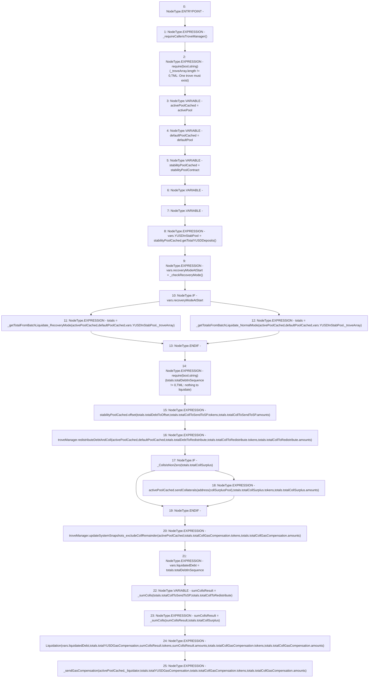

# Context: TroveManagerLiquidations.batchLiquidateTroves

**Contract:** `TroveManagerLiquidations` (Inherits: ITroveManagerLiquidations, TroveManagerBase, CheckContract, Ownable, LiquityBase, YetiCustomBase, BaseMath, ILiquityBase)
**Signature:** `batchLiquidateTroves(address[],address)`
**Method Selector ID:** `0xe369e4ab`
**Visibility:** `external`
**Environment-Free:** `No (reads EVM state context)`
**Modifiers:** None

### State Variables Interaction
- **Reads:** activePool, collSurplusPool, defaultPool, stabilityPoolContract, troveManager
- **Writes:** None

### Assertion Checks & Business Requirements
- require/assert: `require(bool,string)(_troveArray.length != 0,TML: One trove must exist)`
- require/assert: `require(bool,string)(totals.totalDebtInSequence != 0,TML: nothing to liquidate)`

### Environment & Verification Flags
- **Uses Foundry Cheatcodes:** No
- **Has Echidna Properties:** No

### Internal Calls Tree
- None

### External Calls / Value Transfers
- `IActivePool.TMP_472(bool) = HIGH_LEVEL_CALL, dest:activePoolCached(IActivePool), function:sendCollaterals, arguments:['TMP_471', 'REF_557', 'REF_559']  `
- `ITroveManager.HIGH_LEVEL_CALL, dest:troveManager(ITroveManager), function:updateSystemSnapshots_excludeCollRemainder, arguments:['activePoolCached', 'REF_562', 'REF_564']  `
- `IStabilityPool.TMP_462(uint256) = HIGH_LEVEL_CALL, dest:stabilityPoolCached(IStabilityPool), function:getTotalYUSDDeposits, arguments:[]  `
- `IStabilityPool.HIGH_LEVEL_CALL, dest:stabilityPoolCached(IStabilityPool), function:offset, arguments:['REF_543', 'REF_545', 'REF_547']  `
- `ITroveManager.HIGH_LEVEL_CALL, dest:troveManager(ITroveManager), function:redistributeDebtAndColl, arguments:['activePoolCached', 'defaultPoolCached', 'REF_549', 'REF_551', 'REF_553']  `

### Control Flow Graph (CFG)


### Source Mapping
Declared in: `certora-ac-datasets/detasets/web3bugs/dataset/web3bugs/66/packages/contracts/contracts/TroveManagerLiquidations.sol` on lines **171** to **257**

```solidity
    function batchLiquidateTroves(address[] memory _troveArray, address _liquidator) external override {
        _requireCallerisTroveManager();
        require(_troveArray.length != 0, "TML: One trove must exist");

        IActivePool activePoolCached = activePool;
        IDefaultPool defaultPoolCached = defaultPool;
        IStabilityPool stabilityPoolCached = stabilityPoolContract;

        LocalVariables_OuterLiquidationFunction memory vars;
        LiquidationTotals memory totals;

        vars.YUSDInStabPool = stabilityPoolCached.getTotalYUSDDeposits();
        vars.recoveryModeAtStart = _checkRecoveryMode();

        // Perform the appropriate liquidation sequence - tally values and obtain their totals.
        if (vars.recoveryModeAtStart) {
            totals = _getTotalFromBatchLiquidate_RecoveryMode(
                activePoolCached,
                defaultPoolCached,
                vars.YUSDInStabPool,
                _troveArray
            );
        } else {
            //  if !vars.recoveryModeAtStart
            totals = _getTotalsFromBatchLiquidate_NormalMode(
                activePoolCached,
                defaultPoolCached,
                vars.YUSDInStabPool,
                _troveArray
            );
        }

        require(totals.totalDebtInSequence != 0, "TML: nothing to liquidate");
        // Move liquidated Collateral and YUSD to the appropriate pools
        stabilityPoolCached.offset(
            totals.totalDebtToOffset,
            totals.totalCollToSendToSP.tokens,
            totals.totalCollToSendToSP.amounts
        );
        troveManager.redistributeDebtAndColl(
            activePoolCached,
            defaultPoolCached,
            totals.totalDebtToRedistribute,
            totals.totalCollToRedistribute.tokens,
            totals.totalCollToRedistribute.amounts
        );
        if (_CollsIsNonZero(totals.totalCollSurplus)) {
            activePoolCached.sendCollaterals(
                address(collSurplusPool),
                totals.totalCollSurplus.tokens,
                totals.totalCollSurplus.amounts
            );
        }

        // Update system snapshots
        troveManager.updateSystemSnapshots_excludeCollRemainder(
            activePoolCached,
            totals.totalCollGasCompensation.tokens,
            totals.totalCollGasCompensation.amounts
        );

        vars.liquidatedDebt = totals.totalDebtInSequence;

        // merge the colls into one to emit correct event.
        newColls memory sumCollsResult = _sumColls(
            totals.totalCollToSendToSP,
            totals.totalCollToRedistribute
        );
        sumCollsResult = _sumColls(sumCollsResult, totals.totalCollSurplus);

        emit Liquidation(
            vars.liquidatedDebt,
            totals.totalYUSDGasCompensation,
            sumCollsResult.tokens,
            sumCollsResult.amounts,
            totals.totalCollGasCompensation.tokens,
            totals.totalCollGasCompensation.amounts
        );
        // Send gas compensation to caller
        _sendGasCompensation(
            activePoolCached,
            _liquidator,
            totals.totalYUSDGasCompensation,
            totals.totalCollGasCompensation.tokens,
            totals.totalCollGasCompensation.amounts
        );
    }

```
