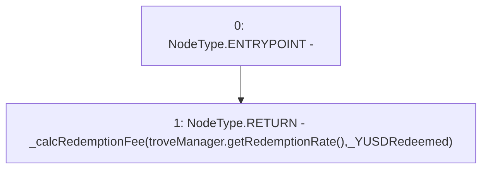

# Context: TroveManagerRedemptions._getRedemptionFee

**Contract:** `TroveManagerRedemptions` (Inherits: ITroveManagerRedemptions, TroveManagerBase, CheckContract, Ownable, LiquityBase, YetiCustomBase, BaseMath, ILiquityBase)
**Signature:** `_getRedemptionFee(uint256) returns (uint256)`
**Method Selector ID:** `Internal (No Method ID)`
**Visibility:** `internal`
**Environment-Free:** `Yes`
**Modifiers:** None

### State Variables Interaction
- **Reads:** troveManager
- **Writes:** None

### Environment & Verification Flags
- **Uses Foundry Cheatcodes:** No
- **Has Echidna Properties:** No

### Internal Calls Tree
- None

### External Calls / Value Transfers
- `ITroveManager.TMP_729(uint256) = HIGH_LEVEL_CALL, dest:troveManager(ITroveManager), function:getRedemptionRate, arguments:[]  `

### Control Flow Graph (CFG)


### Source Mapping
Declared in: `certora-ac-datasets/detasets/web3bugs/dataset/web3bugs/66/packages/contracts/contracts/TroveManagerRedemptions.sol` on lines **737** to **739**

```solidity
    function _getRedemptionFee(uint256 _YUSDRedeemed) internal view returns (uint256) {
        return _calcRedemptionFee(troveManager.getRedemptionRate(), _YUSDRedeemed);
    }

```
