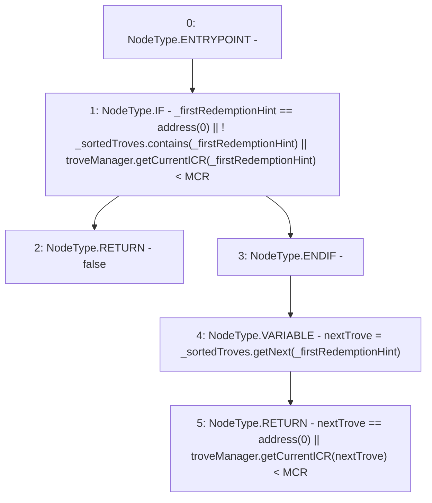

# Context: TroveManagerRedemptions._isValidFirstRedemptionHint

**Contract:** `TroveManagerRedemptions` (Inherits: ITroveManagerRedemptions, TroveManagerBase, CheckContract, Ownable, LiquityBase, YetiCustomBase, BaseMath, ILiquityBase)
**Signature:** `_isValidFirstRedemptionHint(ISortedTroves,address) returns (bool)`
**Method Selector ID:** `Internal (No Method ID)`
**Visibility:** `internal`
**Environment-Free:** `Yes`
**Modifiers:** None

### State Variables Interaction
- **Reads:** MCR, troveManager
- **Writes:** None

### Environment & Verification Flags
- **Uses Foundry Cheatcodes:** No
- **Has Echidna Properties:** No

### Internal Calls Tree
- None

### External Calls / Value Transfers
- `ITroveManager.TMP_695(uint256) = HIGH_LEVEL_CALL, dest:troveManager(ITroveManager), function:getCurrentICR, arguments:['_firstRedemptionHint']  `
- `ISortedTroves.TMP_698(address) = HIGH_LEVEL_CALL, dest:_sortedTroves(ISortedTroves), function:getNext, arguments:['_firstRedemptionHint']  `
- `ITroveManager.TMP_701(uint256) = HIGH_LEVEL_CALL, dest:troveManager(ITroveManager), function:getCurrentICR, arguments:['nextTrove']  `
- `ISortedTroves.TMP_692(bool) = HIGH_LEVEL_CALL, dest:_sortedTroves(ISortedTroves), function:contains, arguments:['_firstRedemptionHint']  `

### Control Flow Graph (CFG)


### Source Mapping
Declared in: `certora-ac-datasets/detasets/web3bugs/dataset/web3bugs/66/packages/contracts/contracts/TroveManagerRedemptions.sol` on lines **669** to **684**

```solidity
    function _isValidFirstRedemptionHint(ISortedTroves _sortedTroves, address _firstRedemptionHint)
        internal
        view
        returns (bool)
    {
        if (
            _firstRedemptionHint == address(0) ||
            !_sortedTroves.contains(_firstRedemptionHint) ||
            troveManager.getCurrentICR(_firstRedemptionHint) < MCR
        ) {
            return false;
        }

        address nextTrove = _sortedTroves.getNext(_firstRedemptionHint);
        return nextTrove == address(0) || troveManager.getCurrentICR(nextTrove) < MCR;
    }

```
