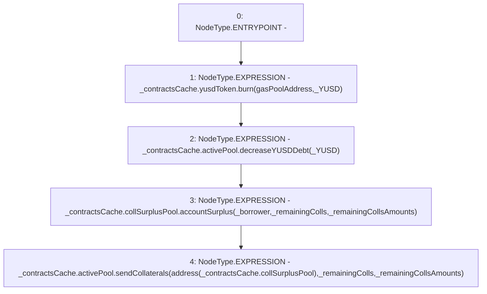

# Context: TroveManagerRedemptions._redeemCloseTrove

**Contract:** `TroveManagerRedemptions` (Inherits: ITroveManagerRedemptions, TroveManagerBase, CheckContract, Ownable, LiquityBase, YetiCustomBase, BaseMath, ILiquityBase)
**Signature:** `_redeemCloseTrove(TroveManagerBase.ContractsCache,address,uint256,address[],uint256[])`
**Method Selector ID:** `Internal (No Method ID)`
**Visibility:** `internal`
**Environment-Free:** `Yes`
**Modifiers:** None

### State Variables Interaction
- **Reads:** gasPoolAddress
- **Writes:** None

### Environment & Verification Flags
- **Uses Foundry Cheatcodes:** No
- **Has Echidna Properties:** No

### Internal Calls Tree
- None

### External Calls / Value Transfers
- `IActivePool.TMP_682(bool) = HIGH_LEVEL_CALL, dest:REF_813(IActivePool), function:sendCollaterals, arguments:['TMP_681', '_remainingColls', '_remainingCollsAmounts']  `
- `ICollSurplusPool.HIGH_LEVEL_CALL, dest:REF_811(ICollSurplusPool), function:accountSurplus, arguments:['_borrower', '_remainingColls', '_remainingCollsAmounts']  `
- `IActivePool.HIGH_LEVEL_CALL, dest:REF_809(IActivePool), function:decreaseYUSDDebt, arguments:['_YUSD']  `
- `IYUSDToken.HIGH_LEVEL_CALL, dest:REF_807(IYUSDToken), function:burn, arguments:['gasPoolAddress', '_YUSD']  `

### Control Flow Graph (CFG)


### Source Mapping
Declared in: `certora-ac-datasets/detasets/web3bugs/dataset/web3bugs/66/packages/contracts/contracts/TroveManagerRedemptions.sol` on lines **622** to **644**

```solidity
    function _redeemCloseTrove(
        ContractsCache memory _contractsCache,
        address _borrower,
        uint256 _YUSD,
        address[] memory _remainingColls,
        uint256[] memory _remainingCollsAmounts
    ) internal {
        _contractsCache.yusdToken.burn(gasPoolAddress, _YUSD);
        // Update Active Pool YUSD, and send Collateral to account
        _contractsCache.activePool.decreaseYUSDDebt(_YUSD);

        // send Collaterals from Active Pool to CollSurplus Pool
        _contractsCache.collSurplusPool.accountSurplus(
            _borrower,
            _remainingColls,
            _remainingCollsAmounts
        );
        _contractsCache.activePool.sendCollaterals(
            address(_contractsCache.collSurplusPool),
            _remainingColls,
            _remainingCollsAmounts
        );
    }

```
