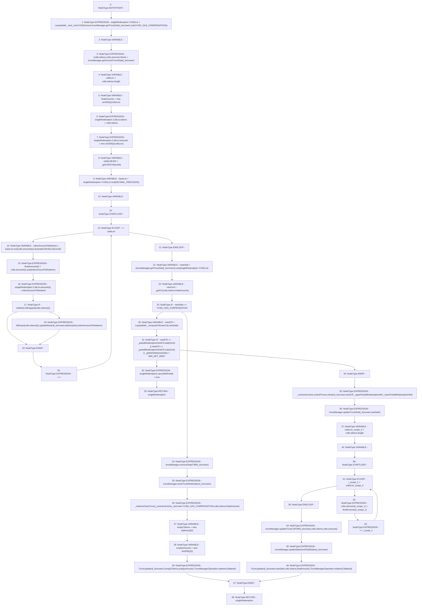

# Context: TroveManagerRedemptions._redeemCollateralFromTrove

**Contract:** `TroveManagerRedemptions` (Inherits: ITroveManagerRedemptions, TroveManagerBase, CheckContract, Ownable, LiquityBase, YetiCustomBase, BaseMath, ILiquityBase)
**Signature:** `_redeemCollateralFromTrove(TroveManagerBase.ContractsCache,address,uint256,address,address,uint256) returns (TroveManagerBase.SingleRedemptionValues)`
**Method Selector ID:** `Internal (No Method ID)`
**Visibility:** `internal`
**Environment-Free:** `Yes`
**Modifiers:** None

### State Variables Interaction
- **Reads:** DECIMAL_PRECISION, MIN_NET_DEBT, YUSD_GAS_COMPENSATION, troveManager, whitelist
- **Writes:** None

### Environment & Verification Flags
- **Uses Foundry Cheatcodes:** No
- **Has Echidna Properties:** No

### Internal Calls Tree
- None

### External Calls / Value Transfers
- `ISortedTroves.HIGH_LEVEL_CALL, dest:REF_793(ISortedTroves), function:reInsert, arguments:['_borrower', 'newICR', '_upperPartialRedemptionHint', '_lowerPartialRedemptionHint']  `
- `ITroveManager.HIGH_LEVEL_CALL, dest:troveManager(ITroveManager), function:closeTroveRedemption, arguments:['_borrower']  `
- `ITroveManager.HIGH_LEVEL_CALL, dest:troveManager(ITroveManager), function:updateTroveCollTMR, arguments:['_borrower', 'REF_802', 'REF_803']  `
- `IWhitelist.TMP_647(bool) = HIGH_LEVEL_CALL, dest:whitelist(IWhitelist), function:isWrapped, arguments:['REF_777']  `
- `SafeMath.TMP_645(uint256) = LIBRARY_CALL, dest:SafeMath, function:SafeMath.div(uint256,uint256), arguments:['TMP_644', '1000000000000000000'] `
- `ITroveManager.TMP_633(uint256) = HIGH_LEVEL_CALL, dest:troveManager(ITroveManager), function:getTroveDebt, arguments:['_borrower']  `
- `SafeMath.TMP_652(uint256) = LIBRARY_CALL, dest:SafeMath, function:SafeMath.sub(uint256,uint256), arguments:['TMP_651', 'REF_783'] `
- `SafeMath.TMP_666(uint256) = LIBRARY_CALL, dest:SafeMath, function:SafeMath.sub(uint256,uint256), arguments:['_partialRedemptionHintICR', '20000000000000000'] `
- `IWAsset.HIGH_LEVEL_CALL, dest:TMP_648(IWAsset), function:updateReward, arguments:['_borrower', 'TMP_649', 'tokenAmountToRedeem']  `
- `SafeMath.TMP_643(uint256) = LIBRARY_CALL, dest:SafeMath, function:SafeMath.mul(uint256,uint256), arguments:['baseLot', 'REF_765'] `
- `ITroveManager.TMP_651(uint256) = HIGH_LEVEL_CALL, dest:troveManager(ITroveManager), function:getTroveDebt, arguments:['_borrower']  `
- `ITroveManager.TUPLE_5(address[],uint256[],uint256) = HIGH_LEVEL_CALL, dest:troveManager(ITroveManager), function:getCurrentTroveState, arguments:['_borrower']  `
- `ITroveManager.HIGH_LEVEL_CALL, dest:troveManager(ITroveManager), function:updateTroveDebt, arguments:['_borrower', 'newDebt']  `
- `LiquityMath.TMP_663(uint256) = LIBRARY_CALL, dest:LiquityMath, function:LiquityMath._computeCR(uint256,uint256), arguments:['newColl', 'newDebt'] `
- `ITroveManager.HIGH_LEVEL_CALL, dest:troveManager(ITroveManager), function:removeStakeTMR, arguments:['_borrower']  `
- `LiquityMath.TMP_635(uint256) = LIBRARY_CALL, dest:LiquityMath, function:LiquityMath._min(uint256,uint256), arguments:['_maxYUSDAmount', 'TMP_634'] `
- `SafeMath.TMP_644(uint256) = LIBRARY_CALL, dest:SafeMath, function:SafeMath.div(uint256,uint256), arguments:['TMP_643', 'totalCollUSD'] `
- `SafeMath.TMP_646(uint256) = LIBRARY_CALL, dest:SafeMath, function:SafeMath.sub(uint256,uint256), arguments:['REF_770', 'tokenAmountToRedeem'] `
- `SafeMath.TMP_664(uint256) = LIBRARY_CALL, dest:SafeMath, function:SafeMath.add(uint256,uint256), arguments:['_partialRedemptionHintICR', '20000000000000000'] `
- `SafeMath.TMP_634(uint256) = LIBRARY_CALL, dest:SafeMath, function:SafeMath.sub(uint256,uint256), arguments:['TMP_633', 'YUSD_GAS_COMPENSATION'] `
- `ITroveManager.HIGH_LEVEL_CALL, dest:troveManager(ITroveManager), function:updateStakeAndTotalStakes, arguments:['_borrower']  `
- `SafeMath.TMP_641(uint256) = LIBRARY_CALL, dest:SafeMath, function:SafeMath.mul(uint256,uint256), arguments:['REF_761', 'DECIMAL_PRECISION'] `

### Control Flow Graph (CFG)


### Source Mapping
Declared in: `certora-ac-datasets/detasets/web3bugs/dataset/web3bugs/66/packages/contracts/contracts/TroveManagerRedemptions.sol` on lines **505** to **613**

```solidity
    function _redeemCollateralFromTrove(
        ContractsCache memory _contractsCache,
        address _borrower,
        uint256 _maxYUSDAmount,
        address _upperPartialRedemptionHint,
        address _lowerPartialRedemptionHint,
        uint256 _partialRedemptionHintICR
    ) internal returns (SingleRedemptionValues memory singleRedemption) {
        // Determine the remaining amount (lot) to be redeemed, capped by the entire debt of the Trove minus the liquidation reserve
        singleRedemption.YUSDLot = LiquityMath._min(
            _maxYUSDAmount,
            troveManager.getTroveDebt(_borrower).sub(YUSD_GAS_COMPENSATION)
        );

        newColls memory colls;
        (colls.tokens, colls.amounts, ) = troveManager.getCurrentTroveState(_borrower);

        uint256 collsLen = colls.tokens.length;
        uint256[] memory finalAmounts = new uint256[](collsLen);


        // redemption addresses are the same as coll addresses for trove
        // Calculation for how much collateral to send of each type. 
        singleRedemption.CollLot.tokens = colls.tokens;
        singleRedemption.CollLot.amounts = new uint256[](collsLen);
        { // limit scope

            uint256 totalCollUSD = _getUSDColls(colls);
            uint256 baseLot = singleRedemption.YUSDLot.mul(DECIMAL_PRECISION);
            for (uint256 i; i < collsLen; ++i) {
                uint tokenAmountToRedeem = baseLot.mul(colls.amounts[i]).div(totalCollUSD).div(1e18);
                finalAmounts[i] = colls.amounts[i].sub(tokenAmountToRedeem);
                singleRedemption.CollLot.amounts[i] = tokenAmountToRedeem;
                // For wrapped assets, update the wrapped token reward to this contract temporarily 
                // to consolidate all trove's rewards. This is transferred all to the redeemer later. 
                if (whitelist.isWrapped(colls.tokens[i])) {
                    IWAsset(colls.tokens[i]).updateReward(_borrower, address(this), tokenAmountToRedeem);
                }
            }
        }

        // Decrease the debt and collateral of the current Trove according to the YUSD lot and corresponding Collateral to send
        uint256 newDebt = (troveManager.getTroveDebt(_borrower)).sub(singleRedemption.YUSDLot);
        uint256 newColl = _getVC(colls.tokens, finalAmounts); // VC given newAmounts in trove

        if (newDebt == YUSD_GAS_COMPENSATION) {
            // No debt left in the Trove (except for the liquidation reserve), therefore the trove gets closed
            troveManager.removeStakeTMR(_borrower);
            troveManager.closeTroveRedemption(_borrower);
            _redeemCloseTrove(
                _contractsCache,
                _borrower,
                YUSD_GAS_COMPENSATION,
                colls.tokens,
                finalAmounts
            );

            address[] memory emptyTokens = new address[](0);
            uint256[] memory emptyAmounts = new uint256[](0);

            emit TroveUpdated(
                _borrower,
                0,
                emptyTokens,
                emptyAmounts,
                TroveManagerOperation.redeemCollateral
            );
        } else {
            uint256 newICR = LiquityMath._computeCR(newColl, newDebt);

            /*
             * If the provided hint is too inaccurate of date, we bail since trying to reinsert without a good hint will almost
             * certainly result in running out of gas. Arbitrary measures of this mean newICR must be greater than hint ICR - 2%, 
             * and smaller than hint ICR + 2%.
             *
             * If the resultant net debt of the partial is less than the minimum, net debt we bail.
             */

            if (newICR >= _partialRedemptionHintICR.add(2e16) || 
                newICR <= _partialRedemptionHintICR.sub(2e16) || 
                _getNetDebt(newDebt) < MIN_NET_DEBT) {
                singleRedemption.cancelledPartial = true;
                return singleRedemption;
            }

            _contractsCache.sortedTroves.reInsert(
                _borrower,
                newICR,
                _upperPartialRedemptionHint,
                _lowerPartialRedemptionHint
            );

            troveManager.updateTroveDebt(_borrower, newDebt);
            uint256 collsLen = colls.tokens.length;
            for (uint256 i; i < collsLen; ++i) {
                colls.amounts[i] = finalAmounts[i];
            }
            troveManager.updateTroveCollTMR(_borrower, colls.tokens, colls.amounts);
            troveManager.updateStakeAndTotalStakes(_borrower);

            emit TroveUpdated(
                _borrower,
                newDebt,
                colls.tokens,
                finalAmounts,
                TroveManagerOperation.redeemCollateral
            );
        }
    }

```
