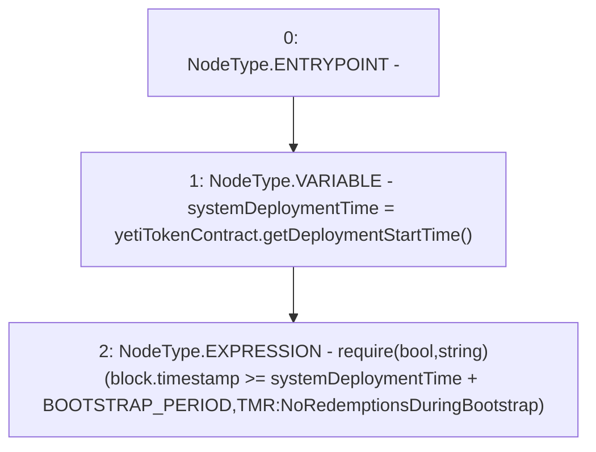

# Context: TroveManagerRedemptions._requireAfterBootstrapPeriod

**Contract:** `TroveManagerRedemptions` (Inherits: ITroveManagerRedemptions, TroveManagerBase, CheckContract, Ownable, LiquityBase, YetiCustomBase, BaseMath, ILiquityBase)
**Signature:** `_requireAfterBootstrapPeriod()`
**Method Selector ID:** `Internal (No Method ID)`
**Visibility:** `internal`
**Environment-Free:** `No (reads EVM state context)`
**Modifiers:** None

### State Variables Interaction
- **Reads:** BOOTSTRAP_PERIOD, yetiTokenContract
- **Writes:** None

### Assertion Checks & Business Requirements
- require/assert: `require(bool,string)(block.timestamp >= systemDeploymentTime + BOOTSTRAP_PERIOD,TMR:NoRedemptionsDuringBootstrap)`

### Environment & Verification Flags
- **Uses Foundry Cheatcodes:** No
- **Has Echidna Properties:** No

### Internal Calls Tree
- None

### External Calls / Value Transfers
- `IYETIToken.TMP_712(uint256) = HIGH_LEVEL_CALL, dest:yetiTokenContract(IYETIToken), function:getDeploymentStartTime, arguments:[]  `

### Control Flow Graph (CFG)


### Source Mapping
Declared in: `certora-ac-datasets/detasets/web3bugs/dataset/web3bugs/66/packages/contracts/contracts/TroveManagerRedemptions.sol` on lines **696** to **702**

```solidity
    function _requireAfterBootstrapPeriod() internal view {
        uint256 systemDeploymentTime = yetiTokenContract.getDeploymentStartTime();
        require(
            block.timestamp >= systemDeploymentTime + BOOTSTRAP_PERIOD,
            "TMR:NoRedemptionsDuringBootstrap"
        );
    }

```
