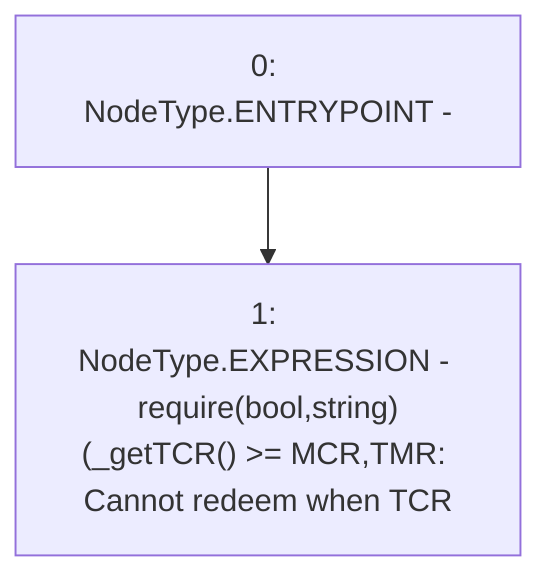

# Context: TroveManagerRedemptions._requireTCRoverMCR

**Contract:** `TroveManagerRedemptions` (Inherits: ITroveManagerRedemptions, TroveManagerBase, CheckContract, Ownable, LiquityBase, YetiCustomBase, BaseMath, ILiquityBase)
**Signature:** `_requireTCRoverMCR()`
**Method Selector ID:** `Internal (No Method ID)`
**Visibility:** `internal`
**Environment-Free:** `Yes`
**Modifiers:** None

### State Variables Interaction
- **Reads:** MCR
- **Writes:** None

### Assertion Checks & Business Requirements
- require/assert: `require(bool,string)(_getTCR() >= MCR,TMR: Cannot redeem when TCR<MCR)`

### Environment & Verification Flags
- **Uses Foundry Cheatcodes:** No
- **Has Echidna Properties:** No

### Internal Calls Tree
- None

### External Calls / Value Transfers
- None

### Control Flow Graph (CFG)


### Source Mapping
Declared in: `certora-ac-datasets/detasets/web3bugs/dataset/web3bugs/66/packages/contracts/contracts/TroveManagerRedemptions.sol` on lines **704** to **706**

```solidity
    function _requireTCRoverMCR() internal view {
        require(_getTCR() >= MCR, "TMR: Cannot redeem when TCR<MCR");
    }

```
