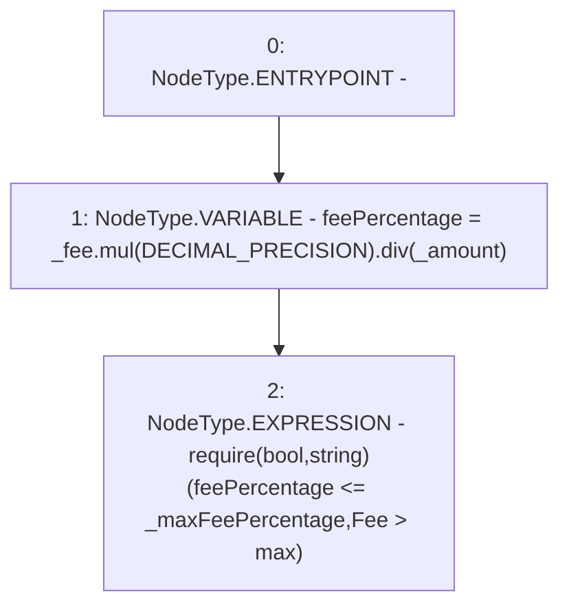

# Context: TroveManagerRedemptions._requireUserAcceptsFee

**Contract:** `TroveManagerRedemptions` (Inherits: ITroveManagerRedemptions, TroveManagerBase, CheckContract, Ownable, LiquityBase, YetiCustomBase, BaseMath, ILiquityBase)
**Signature:** `_requireUserAcceptsFee(uint256,uint256,uint256)`
**Method Selector ID:** `Internal (No Method ID)`
**Visibility:** `internal`
**Environment-Free:** `Yes`
**Modifiers:** None

### State Variables Interaction
- **Reads:** DECIMAL_PRECISION
- **Writes:** None

### Assertion Checks & Business Requirements
- require/assert: `require(bool,string)(feePercentage <= _maxFeePercentage,Fee > max)`

### Environment & Verification Flags
- **Uses Foundry Cheatcodes:** No
- **Has Echidna Properties:** No

### Internal Calls Tree
- None

### External Calls / Value Transfers
- `SafeMath.TMP_417(uint256) = LIBRARY_CALL, dest:SafeMath, function:SafeMath.div(uint256,uint256), arguments:['TMP_416', '_amount'] `
- `SafeMath.TMP_416(uint256) = LIBRARY_CALL, dest:SafeMath, function:SafeMath.mul(uint256,uint256), arguments:['_fee', 'DECIMAL_PRECISION'] `

### Control Flow Graph (CFG)


### Source Mapping
Declared in: `certora-ac-datasets/detasets/web3bugs/dataset/web3bugs/66/packages/contracts/contracts/Dependencies/LiquityBase.sol` on lines **125** to **128**

```solidity
    function _requireUserAcceptsFee(uint _fee, uint _amount, uint _maxFeePercentage) internal pure {
        uint feePercentage = _fee.mul(DECIMAL_PRECISION).div(_amount);
        require(feePercentage <= _maxFeePercentage, "Fee > max");
    }

```
