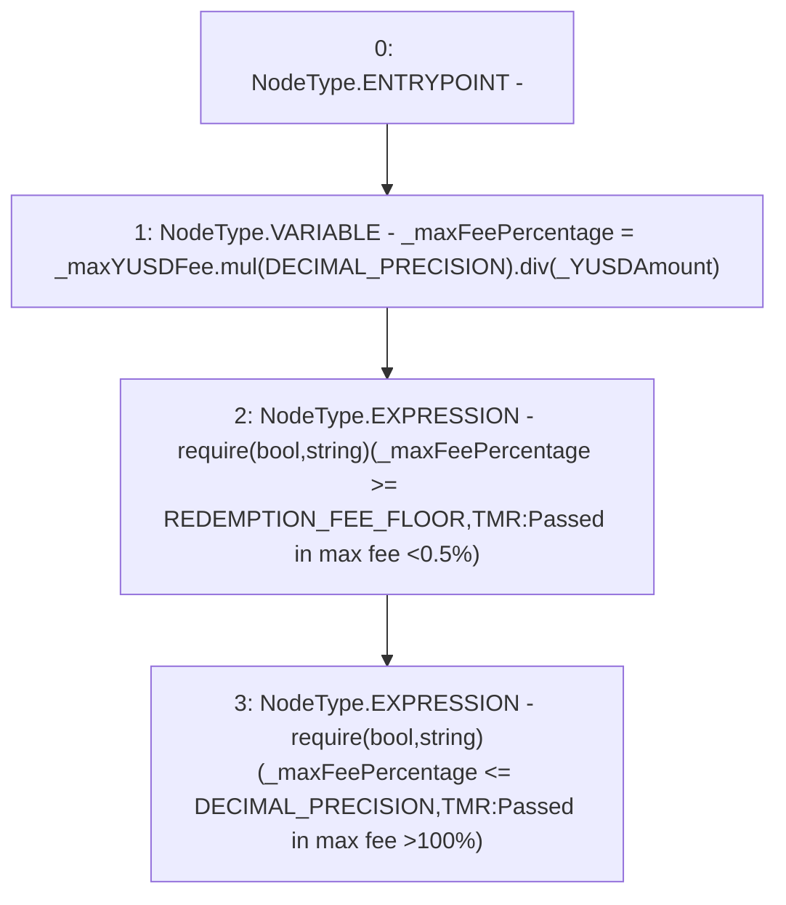

# Context: TroveManagerRedemptions._requireValidMaxFee

**Contract:** `TroveManagerRedemptions` (Inherits: ITroveManagerRedemptions, TroveManagerBase, CheckContract, Ownable, LiquityBase, YetiCustomBase, BaseMath, ILiquityBase)
**Signature:** `_requireValidMaxFee(uint256,uint256)`
**Method Selector ID:** `Internal (No Method ID)`
**Visibility:** `internal`
**Environment-Free:** `Yes`
**Modifiers:** None

### State Variables Interaction
- **Reads:** DECIMAL_PRECISION, REDEMPTION_FEE_FLOOR
- **Writes:** None

### Assertion Checks & Business Requirements
- require/assert: `require(bool,string)(_maxFeePercentage >= REDEMPTION_FEE_FLOOR,TMR:Passed in max fee <0.5%)`
- require/assert: `require(bool,string)(_maxFeePercentage <= DECIMAL_PRECISION,TMR:Passed in max fee >100%)`

### Environment & Verification Flags
- **Uses Foundry Cheatcodes:** No
- **Has Echidna Properties:** No

### Internal Calls Tree
- None

### External Calls / Value Transfers
- `SafeMath.TMP_707(uint256) = LIBRARY_CALL, dest:SafeMath, function:SafeMath.div(uint256,uint256), arguments:['TMP_706', '_YUSDAmount'] `
- `SafeMath.TMP_706(uint256) = LIBRARY_CALL, dest:SafeMath, function:SafeMath.mul(uint256,uint256), arguments:['_maxYUSDFee', 'DECIMAL_PRECISION'] `

### Control Flow Graph (CFG)


### Source Mapping
Declared in: `certora-ac-datasets/detasets/web3bugs/dataset/web3bugs/66/packages/contracts/contracts/TroveManagerRedemptions.sol` on lines **690** to **694**

```solidity
    function _requireValidMaxFee(uint256 _YUSDAmount, uint256 _maxYUSDFee) internal pure {
        uint256 _maxFeePercentage = _maxYUSDFee.mul(DECIMAL_PRECISION).div(_YUSDAmount);
        require(_maxFeePercentage >= REDEMPTION_FEE_FLOOR, "TMR:Passed in max fee <0.5%");
        require(_maxFeePercentage <= DECIMAL_PRECISION, "TMR:Passed in max fee >100%");
    }

```
