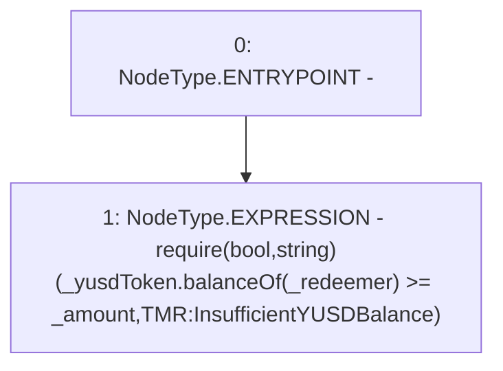

# Context: TroveManagerRedemptions._requireYUSDBalanceCoversRedemption

**Contract:** `TroveManagerRedemptions` (Inherits: ITroveManagerRedemptions, TroveManagerBase, CheckContract, Ownable, LiquityBase, YetiCustomBase, BaseMath, ILiquityBase)
**Signature:** `_requireYUSDBalanceCoversRedemption(IYUSDToken,address,uint256)`
**Method Selector ID:** `Internal (No Method ID)`
**Visibility:** `internal`
**Environment-Free:** `Yes`
**Modifiers:** None

### State Variables Interaction
- **Reads:** None
- **Writes:** None

### Assertion Checks & Business Requirements
- require/assert: `require(bool,string)(_yusdToken.balanceOf(_redeemer) >= _amount,TMR:InsufficientYUSDBalance)`

### Environment & Verification Flags
- **Uses Foundry Cheatcodes:** No
- **Has Echidna Properties:** No

### Internal Calls Tree
- None

### External Calls / Value Transfers
- `IYUSDToken.TMP_721(uint256) = HIGH_LEVEL_CALL, dest:_yusdToken(IYUSDToken), function:balanceOf, arguments:['_redeemer']  `

### Control Flow Graph (CFG)


### Source Mapping
Declared in: `certora-ac-datasets/detasets/web3bugs/dataset/web3bugs/66/packages/contracts/contracts/TroveManagerRedemptions.sol` on lines **712** to **721**

```solidity
    function _requireYUSDBalanceCoversRedemption(
        IYUSDToken _yusdToken,
        address _redeemer,
        uint256 _amount
    ) internal view {
        require(
            _yusdToken.balanceOf(_redeemer) >= _amount,
            "TMR:InsufficientYUSDBalance"
        );
    }

```
