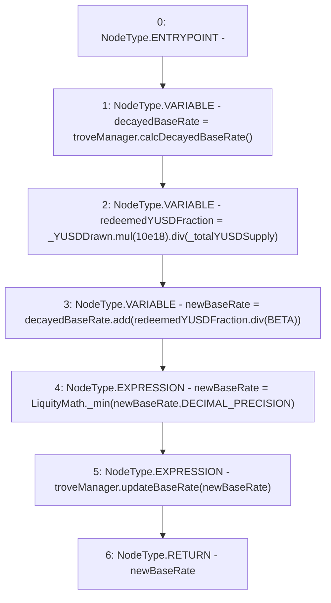

# Context: TroveManagerRedemptions._updateBaseRateFromRedemption

**Contract:** `TroveManagerRedemptions` (Inherits: ITroveManagerRedemptions, TroveManagerBase, CheckContract, Ownable, LiquityBase, YetiCustomBase, BaseMath, ILiquityBase)
**Signature:** `_updateBaseRateFromRedemption(uint256,uint256) returns (uint256)`
**Method Selector ID:** `Internal (No Method ID)`
**Visibility:** `internal`
**Environment-Free:** `Yes`
**Modifiers:** None

### State Variables Interaction
- **Reads:** BETA, DECIMAL_PRECISION, troveManager
- **Writes:** None

### Environment & Verification Flags
- **Uses Foundry Cheatcodes:** No
- **Has Echidna Properties:** No

### Internal Calls Tree
- None

### External Calls / Value Transfers
- `SafeMath.TMP_685(uint256) = LIBRARY_CALL, dest:SafeMath, function:SafeMath.div(uint256,uint256), arguments:['TMP_684', '_totalYUSDSupply'] `
- `ITroveManager.TMP_683(uint256) = HIGH_LEVEL_CALL, dest:troveManager(ITroveManager), function:calcDecayedBaseRate, arguments:[]  `
- `SafeMath.TMP_687(uint256) = LIBRARY_CALL, dest:SafeMath, function:SafeMath.add(uint256,uint256), arguments:['decayedBaseRate', 'TMP_686'] `
- `LiquityMath.TMP_688(uint256) = LIBRARY_CALL, dest:LiquityMath, function:LiquityMath._min(uint256,uint256), arguments:['newBaseRate', 'DECIMAL_PRECISION'] `
- `SafeMath.TMP_684(uint256) = LIBRARY_CALL, dest:SafeMath, function:SafeMath.mul(uint256,uint256), arguments:['_YUSDDrawn', '10000000000000000000'] `
- `ITroveManager.HIGH_LEVEL_CALL, dest:troveManager(ITroveManager), function:updateBaseRate, arguments:['newBaseRate']  `
- `SafeMath.TMP_686(uint256) = LIBRARY_CALL, dest:SafeMath, function:SafeMath.div(uint256,uint256), arguments:['redeemedYUSDFraction', 'BETA'] `

### Control Flow Graph (CFG)


### Source Mapping
Declared in: `certora-ac-datasets/detasets/web3bugs/dataset/web3bugs/66/packages/contracts/contracts/TroveManagerRedemptions.sol` on lines **652** to **667**

```solidity
    function _updateBaseRateFromRedemption(uint256 _YUSDDrawn, uint256 _totalYUSDSupply)
        internal
        returns (uint256)
    {
        uint256 decayedBaseRate = troveManager.calcDecayedBaseRate();

        /* Convert the drawn Collateral back to YUSD at face value rate (1 YUSD:1 USD), in order to get
         * the fraction of total supply that was redeemed at face value. */
        uint256 redeemedYUSDFraction = _YUSDDrawn.mul(10e18).div(_totalYUSDSupply);

        uint256 newBaseRate = decayedBaseRate.add(redeemedYUSDFraction.div(BETA));
        newBaseRate = LiquityMath._min(newBaseRate, DECIMAL_PRECISION); // cap baseRate at a maximum of 100%

        troveManager.updateBaseRate(newBaseRate);
        return newBaseRate;
    }

```
