# Context: TroveManagerRedemptions.redeemCollateral

**Contract:** `TroveManagerRedemptions` (Inherits: ITroveManagerRedemptions, TroveManagerBase, CheckContract, Ownable, LiquityBase, YetiCustomBase, BaseMath, ILiquityBase)
**Signature:** `redeemCollateral(uint256,uint256,address,address,address,uint256,uint256,address)`
**Method Selector ID:** `0xc2f6202d`
**Visibility:** `external`
**Environment-Free:** `No (reads EVM state context)`
**Modifiers:** None

### State Variables Interaction
- **Reads:** MCR, activePool, collSurplusPool, defaultPool, gasPoolAddress, sYETIContract, sortedTroves, troveManager, yusdTokenContract
- **Writes:** None

### Assertion Checks & Business Requirements
- require/assert: `require(bool,string)(contractsCache.yusdToken.balanceOf(_redeemer) <= totals.totalYUSDSupplyAtStart,TMR: redeemer balance too high)`
- require/assert: `require(bool,string)(isNonzero(totals.CollsDrawn),TMR: not nonzero collsDrawn)`

### Environment & Verification Flags
- **Uses Foundry Cheatcodes:** No
- **Has Echidna Properties:** No

### Internal Calls Tree
- None

### External Calls / Value Transfers
- `ISortedTroves.TMP_544(address) = HIGH_LEVEL_CALL, dest:REF_573(ISortedTroves), function:getPrev, arguments:['currentBorrower']  `
- `SafeMath.TMP_549(uint256) = LIBRARY_CALL, dest:SafeMath, function:SafeMath.add(uint256,uint256), arguments:['REF_580', 'REF_582'] `
- `IYUSDToken.TMP_523(uint256) = HIGH_LEVEL_CALL, dest:REF_562(IYUSDToken), function:balanceOf, arguments:['_redeemer']  `
- `IActivePool.HIGH_LEVEL_CALL, dest:REF_612(IActivePool), function:decreaseYUSDDebt, arguments:['REF_614']  `
- `SafeMath.TMP_551(uint256) = LIBRARY_CALL, dest:SafeMath, function:SafeMath.sub(uint256,uint256), arguments:['REF_587', 'REF_589'] `
- `ITroveManager.HIGH_LEVEL_CALL, dest:troveManager(ITroveManager), function:applyPendingRewards, arguments:['currentBorrower']  `
- `ISortedTroves.TMP_527(address) = HIGH_LEVEL_CALL, dest:REF_567(ISortedTroves), function:getLast, arguments:[]  `
- `SafeMath.TMP_556(uint256) = LIBRARY_CALL, dest:SafeMath, function:SafeMath.add(uint256,uint256), arguments:['_YUSDamount', 'REF_597'] `
- `ISortedTroves.TMP_533(address) = HIGH_LEVEL_CALL, dest:REF_570(ISortedTroves), function:getPrev, arguments:['currentBorrower']  `
- `SafeERC20.LIBRARY_CALL, dest:SafeERC20, function:SafeERC20.safeTransferFrom(IERC20,address,address,uint256), arguments:['REF_599', '_redeemer', 'TMP_559', 'REF_602'] `
- `ITroveManager.TMP_545(uint256) = HIGH_LEVEL_CALL, dest:troveManager(ITroveManager), function:getCurrentICR, arguments:['currentBorrower']  `
- `IActivePool.TMP_565(bool) = HIGH_LEVEL_CALL, dest:REF_615(IActivePool), function:sendCollateralsUnwrap, arguments:['TMP_564', '_redeemer', 'REF_618', 'REF_620']  `
- `IYUSDToken.HIGH_LEVEL_CALL, dest:REF_609(IYUSDToken), function:burn, arguments:['_redeemer', 'REF_611']  `
- `ITroveManager.TMP_530(uint256) = HIGH_LEVEL_CALL, dest:troveManager(ITroveManager), function:getCurrentICR, arguments:['currentBorrower']  `

### Control Flow Graph (CFG)

```mermaid
flowchart TD
    Node_0["0: NodeType.ENTRYPOINT - "]
    Node_0 --> Node_1
    Node_1["1: NodeType.EXPRESSION - _requireCallerisTroveManager()"]
    Node_1 --> Node_2
    Node_2["2: NodeType.VARIABLE - contractsCache = ContractsCache(activePool,defaultPool,yusdTokenContract,sYETIContract,sortedTroves,collSurplusPool,gasPoolAddress)"]
    Node_2 --> Node_3
    Node_3["3: NodeType.VARIABLE - "]
    Node_3 --> Node_4
    Node_4["4: NodeType.EXPRESSION - _requireValidMaxFee(_YUSDamount,_YUSDMaxFee)"]
    Node_4 --> Node_5
    Node_5["5: NodeType.EXPRESSION - _requireAfterBootstrapPeriod()"]
    Node_5 --> Node_6
    Node_6["6: NodeType.EXPRESSION - _requireTCRoverMCR()"]
    Node_6 --> Node_7
    Node_7["7: NodeType.EXPRESSION - _requireAmountGreaterThanZero(_YUSDamount)"]
    Node_7 --> Node_8
    Node_8["8: NodeType.EXPRESSION - totals.totalYUSDSupplyAtStart = getEntireSystemDebt()"]
    Node_8 --> Node_9
    Node_9["9: NodeType.EXPRESSION - require(bool,string)(contractsCache.yusdToken.balanceOf(_redeemer) <= totals.totalYUSDSupplyAtStart,TMR: redeemer balance too high)"]
    Node_9 --> Node_10
    Node_10["10: NodeType.EXPRESSION - totals.remainingYUSD = _YUSDamount"]
    Node_10 --> Node_11
    Node_11["11: NodeType.VARIABLE - "]
    Node_11 --> Node_12
    Node_12["12: NodeType.IF - _isValidFirstRedemptionHint(contractsCache.sortedTroves,_firstRedemptionHint)"]
    Node_12 --> Node_13
    Node_12 --> Node_14
    Node_13["13: NodeType.EXPRESSION - currentBorrower = _firstRedemptionHint"]
    Node_13 --> Node_19
    Node_14["14: NodeType.EXPRESSION - currentBorrower = contractsCache.sortedTroves.getLast()"]
    Node_14 --> Node_15
    Node_15["15: NodeType.STARTLOOP - "]
    Node_15 --> Node_16
    Node_16["16: NodeType.IFLOOP - currentBorrower != address(0) && troveManager.getCurrentICR(currentBorrower) < MCR"]
    Node_16 --> Node_17
    Node_16 --> Node_18
    Node_17["17: NodeType.EXPRESSION - currentBorrower = contractsCache.sortedTroves.getPrev(currentBorrower)"]
    Node_17 --> Node_16
    Node_18["18: NodeType.ENDLOOP - "]
    Node_18 --> Node_19
    Node_19["19: NodeType.ENDIF - "]
    Node_19 --> Node_20
    Node_20["20: NodeType.IF - _maxIterations == 0"]
    Node_20 --> Node_21
    Node_20 --> Node_22
    Node_21["21: NodeType.EXPRESSION - _maxIterations = uint256(- 1)"]
    Node_21 --> Node_22
    Node_22["22: NodeType.ENDIF - "]
    Node_22 --> Node_23
    Node_23["23: NodeType.STARTLOOP - "]
    Node_23 --> Node_24
    Node_24["24: NodeType.IFLOOP - currentBorrower != address(0) && totals.remainingYUSD != 0 && _maxIterations != 0"]
    Node_24 --> Node_25
    Node_24 --> Node_38
    Node_25["25: NodeType.EXPRESSION - _maxIterations --"]
    Node_25 --> Node_26
    Node_26["26: NodeType.VARIABLE - nextUserToCheck = contractsCache.sortedTroves.getPrev(currentBorrower)"]
    Node_26 --> Node_27
    Node_27["27: NodeType.IF - troveManager.getCurrentICR(currentBorrower) >= MCR"]
    Node_27 --> Node_28
    Node_27 --> Node_36
    Node_28["28: NodeType.EXPRESSION - troveManager.applyPendingRewards(currentBorrower)"]
    Node_28 --> Node_29
    Node_29["29: NodeType.VARIABLE - singleRedemption = _redeemCollateralFromTrove(contractsCache,currentBorrower,totals.remainingYUSD,_upperPartialRedemptionHint,_lowerPartialRedemptionHint,_partialRedemptionHintICR)"]
    Node_29 --> Node_30
    Node_30["30: NodeType.IF - singleRedemption.cancelledPartial"]
    Node_30 --> Node_31
    Node_30 --> Node_32
    Node_31["31: NodeType.BREAK - "]
    Node_31 --> Node_38
    Node_32["32: NodeType.ENDIF - "]
    Node_32 --> Node_33
    Node_33["33: NodeType.EXPRESSION - totals.totalYUSDToRedeem = totals.totalYUSDToRedeem.add(singleRedemption.YUSDLot)"]
    Node_33 --> Node_34
    Node_34["34: NodeType.EXPRESSION - totals.CollsDrawn = _sumColls(totals.CollsDrawn,singleRedemption.CollLot)"]
    Node_34 --> Node_35
    Node_35["35: NodeType.EXPRESSION - totals.remainingYUSD = totals.remainingYUSD.sub(singleRedemption.YUSDLot)"]
    Node_35 --> Node_36
    Node_36["36: NodeType.ENDIF - "]
    Node_36 --> Node_37
    Node_37["37: NodeType.EXPRESSION - currentBorrower = nextUserToCheck"]
    Node_37 --> Node_24
    Node_38["38: NodeType.ENDLOOP - "]
    Node_38 --> Node_39
    Node_39["39: NodeType.EXPRESSION - require(bool,string)(isNonzero(totals.CollsDrawn),TMR: not nonzero collsDrawn)"]
    Node_39 --> Node_40
    Node_40["40: NodeType.EXPRESSION - _updateBaseRateFromRedemption(totals.totalYUSDToRedeem,totals.totalYUSDSupplyAtStart)"]
    Node_40 --> Node_41
    Node_41["41: NodeType.EXPRESSION - totals.YUSDfee = _getRedemptionFee(totals.totalYUSDToRedeem)"]
    Node_41 --> Node_42
    Node_42["42: NodeType.EXPRESSION - _requireYUSDBalanceCoversRedemption(contractsCache.yusdToken,_redeemer,_YUSDamount.add(totals.YUSDfee))"]
    Node_42 --> Node_43
    Node_43["43: NodeType.EXPRESSION - _requireUserAcceptsFeeRedemption(totals.YUSDfee,_YUSDMaxFee)"]
    Node_43 --> Node_44
    Node_44["44: NodeType.EXPRESSION - contractsCache.yusdToken.safeTransferFrom(_redeemer,address(contractsCache.sYETI),totals.YUSDfee)"]
    Node_44 --> Node_45
    Node_45["45: NodeType.EXPRESSION - Redemption(_YUSDamount,totals.totalYUSDToRedeem,totals.YUSDfee,totals.CollsDrawn.tokens,totals.CollsDrawn.amounts)"]
    Node_45 --> Node_46
    Node_46["46: NodeType.EXPRESSION - contractsCache.yusdToken.burn(_redeemer,totals.totalYUSDToRedeem)"]
    Node_46 --> Node_47
    Node_47["47: NodeType.EXPRESSION - contractsCache.activePool.decreaseYUSDDebt(totals.totalYUSDToRedeem)"]
    Node_47 --> Node_48
    Node_48["48: NodeType.EXPRESSION - contractsCache.activePool.sendCollateralsUnwrap(address(this),_redeemer,totals.CollsDrawn.tokens,totals.CollsDrawn.amounts)"]
```


### Source Mapping
Declared in: `certora-ac-datasets/detasets/web3bugs/dataset/web3bugs/66/packages/contracts/contracts/TroveManagerRedemptions.sol` on lines **154** to **272**

```solidity
    function redeemCollateral(
        uint256 _YUSDamount,
        uint256 _YUSDMaxFee,
        address _firstRedemptionHint,
        address _upperPartialRedemptionHint,
        address _lowerPartialRedemptionHint,
        uint256 _partialRedemptionHintICR,
        uint256 _maxIterations,
        address _redeemer
    ) external override {
        _requireCallerisTroveManager();
        ContractsCache memory contractsCache = ContractsCache(
            activePool,
            defaultPool,
            yusdTokenContract,
            sYETIContract,
            sortedTroves,
            collSurplusPool,
            gasPoolAddress
        );
        RedemptionTotals memory totals;

        _requireValidMaxFee(_YUSDamount, _YUSDMaxFee);
        _requireAfterBootstrapPeriod();
        _requireTCRoverMCR();
        _requireAmountGreaterThanZero(_YUSDamount);

        totals.totalYUSDSupplyAtStart = getEntireSystemDebt();

        // Confirm redeemer's balance is less than total YUSD supply
        require(contractsCache.yusdToken.balanceOf(_redeemer) <= totals.totalYUSDSupplyAtStart, "TMR: redeemer balance too high");

        totals.remainingYUSD = _YUSDamount;
        address currentBorrower;
        if (_isValidFirstRedemptionHint(contractsCache.sortedTroves, _firstRedemptionHint)) {
            currentBorrower = _firstRedemptionHint;
        } else {
            currentBorrower = contractsCache.sortedTroves.getLast();
            // Find the first trove with ICR >= MCR
            while (
                currentBorrower != address(0) && troveManager.getCurrentICR(currentBorrower) < MCR
            ) {
                currentBorrower = contractsCache.sortedTroves.getPrev(currentBorrower);
            }
        }
        // Loop through the Troves starting from the one with lowest collateral ratio until _amount of YUSD is exchanged for collateral
        if (_maxIterations == 0) {
            _maxIterations = uint256(-1);
        }
        while (currentBorrower != address(0) && totals.remainingYUSD != 0 && _maxIterations != 0) {
            _maxIterations--;
            // Save the address of the Trove preceding the current one, before potentially modifying the list
            address nextUserToCheck = contractsCache.sortedTroves.getPrev(currentBorrower);

            if (troveManager.getCurrentICR(currentBorrower) >= MCR) {
                troveManager.applyPendingRewards(currentBorrower);

                SingleRedemptionValues memory singleRedemption = _redeemCollateralFromTrove(
                    contractsCache,
                    currentBorrower,
                    totals.remainingYUSD,
                    _upperPartialRedemptionHint,
                    _lowerPartialRedemptionHint,
                    _partialRedemptionHintICR
                );

                if (singleRedemption.cancelledPartial) break; // Partial redemption was cancelled (out-of-date hint, or new net debt < minimum), therefore we could not redeem from the last Trove

                totals.totalYUSDToRedeem = totals.totalYUSDToRedeem.add(singleRedemption.YUSDLot); 

                totals.CollsDrawn = _sumColls(totals.CollsDrawn, singleRedemption.CollLot);
                totals.remainingYUSD = totals.remainingYUSD.sub(singleRedemption.YUSDLot);
            }

            currentBorrower = nextUserToCheck;
        }

        require(isNonzero(totals.CollsDrawn), "TMR: not nonzero collsDrawn");
        // Decay the baseRate due to time passed, and then increase it according to the size of this redemption.
        // Use the saved total YUSD supply value, from before it was reduced by the redemption.
        _updateBaseRateFromRedemption(totals.totalYUSDToRedeem, totals.totalYUSDSupplyAtStart);

        totals.YUSDfee = _getRedemptionFee(totals.totalYUSDToRedeem);
        // check user has enough YUSD to pay fee and redemptions
        _requireYUSDBalanceCoversRedemption(
            contractsCache.yusdToken,
            _redeemer,
            _YUSDamount.add(totals.YUSDfee)
        );

        // check to see that the fee doesn't exceed the max fee
        _requireUserAcceptsFeeRedemption(totals.YUSDfee, _YUSDMaxFee);

        // send fee from user to YETI stakers
        contractsCache.yusdToken.safeTransferFrom(
            _redeemer,
            address(contractsCache.sYETI),
            totals.YUSDfee
        );

        emit Redemption(
            _YUSDamount,
            totals.totalYUSDToRedeem,
            totals.YUSDfee,
            totals.CollsDrawn.tokens,
            totals.CollsDrawn.amounts
        );
        // Burn the total YUSD that is cancelled with debt
        contractsCache.yusdToken.burn(_redeemer, totals.totalYUSDToRedeem);
        // Update Active Pool YUSD, and send Collaterals to account
        contractsCache.activePool.decreaseYUSDDebt(totals.totalYUSDToRedeem);

        contractsCache.activePool.sendCollateralsUnwrap(
            address(this), // This contract accumulates rewards for all the wrapped assets short term.
            _redeemer,
            totals.CollsDrawn.tokens,
            totals.CollsDrawn.amounts
        );
    }

```
