# Context: TroveManagerRedemptions.redeemCollateralSingle

**Contract:** `TroveManagerRedemptions` (Inherits: ITroveManagerRedemptions, TroveManagerBase, CheckContract, Ownable, LiquityBase, YetiCustomBase, BaseMath, ILiquityBase)
**Signature:** `redeemCollateralSingle(uint256,uint256,address,address,address,uint256,address)`
**Method Selector ID:** `0x43338372`
**Visibility:** `external`
**Environment-Free:** `No (reads EVM state context)`
**Modifiers:** None

### State Variables Interaction
- **Reads:** MCR, MIN_NET_DEBT, YUSD_GAS_COMPENSATION, activePool, collSurplusPool, defaultPool, gasPoolAddress, sYETIContract, sortedTroves, troveManager, whitelist, yusdTokenContract
- **Writes:** None

### Assertion Checks & Business Requirements
- require/assert: `require(bool,string)(contractsCache.yusdToken.balanceOf(msg.sender) <= totals.totalYUSDSupplyAtStart,TMR:Redeemer YUSD Bal too high)`
- require/assert: `require(bool,string)(_isValidFirstRedemptionHint(contractsCache.sortedTroves,hints.target),TMR:Invalid first redemption hint)`
- require/assert: `require(bool,string)(troveManager.getCurrentICR(hints.target) >= MCR,TMR:Trove is underwater)`
- require/assert: `require(bool,string)(foundCollateral,TMR:Coll not in trove)`
- revert: `revert(string)(Invalid partial redemption hint or remaining debt is too low)`
- require/assert: `require(bool,string)(isNonzero(totals.CollsDrawn),TMR: non zero collsDrawn)`

### Environment & Verification Flags
- **Uses Foundry Cheatcodes:** No
- **Has Echidna Properties:** No

### Internal Calls Tree
- None

### External Calls / Value Transfers
- `IWhitelist.TMP_587(uint256) = HIGH_LEVEL_CALL, dest:whitelist(IWhitelist), function:getValueUSD, arguments:['_collToRedeem', 'REF_652']  `
- `IYUSDToken.TMP_572(uint256) = HIGH_LEVEL_CALL, dest:REF_626(IYUSDToken), function:balanceOf, arguments:['msg.sender']  `
- `SafeMath.TMP_594(uint256) = LIBRARY_CALL, dest:SafeMath, function:SafeMath.sub(uint256,uint256), arguments:['troveDebt', 'REF_675'] `
- `IYUSDToken.HIGH_LEVEL_CALL, dest:REF_734(IYUSDToken), function:burn, arguments:['msg.sender', 'REF_736']  `
- `ITroveManager.HIGH_LEVEL_CALL, dest:troveManager(ITroveManager), function:updateStakeAndTotalStakes, arguments:['REF_704']  `
- `ITroveManager.TUPLE_4(address[],uint256[],uint256) = HIGH_LEVEL_CALL, dest:troveManager(ITroveManager), function:getCurrentTroveState, arguments:['REF_645']  `
- `LiquityMath.TMP_583(uint256) = LIBRARY_CALL, dest:LiquityMath, function:LiquityMath._min(uint256,uint256), arguments:['REF_640', 'TMP_582'] `
- `LiquityMath.TMP_605(uint256) = LIBRARY_CALL, dest:LiquityMath, function:LiquityMath._computeCR(uint256,uint256), arguments:['TMP_604', 'troveDebt'] `
- `SafeMath.TMP_606(uint256) = LIBRARY_CALL, dest:SafeMath, function:SafeMath.add(uint256,uint256), arguments:['REF_688', '20000000000000000'] `
- `ITroveManager.HIGH_LEVEL_CALL, dest:troveManager(ITroveManager), function:updateTroveDebt, arguments:['REF_698', 'troveDebt']  `
- `SafeMath.TMP_593(uint256) = LIBRARY_CALL, dest:SafeMath, function:SafeMath.sub(uint256,uint256), arguments:['REF_669', 'tokenAmountToRedeem'] `
- `ITroveManager.TMP_577(uint256) = HIGH_LEVEL_CALL, dest:troveManager(ITroveManager), function:getCurrentICR, arguments:['REF_633']  `
- `ITroveManager.HIGH_LEVEL_CALL, dest:troveManager(ITroveManager), function:closeTroveRedemption, arguments:['REF_679']  `
- `IActivePool.TMP_632(bool) = HIGH_LEVEL_CALL, dest:REF_740(IActivePool), function:sendCollateralsUnwrap, arguments:['REF_742', 'msg.sender', 'REF_744', 'REF_746']  `
- `SafeERC20.LIBRARY_CALL, dest:SafeERC20, function:SafeERC20.safeTransferFrom(IERC20,address,address,uint256), arguments:['REF_723', 'msg.sender', 'TMP_627', 'REF_726'] `
- `ITroveManager.HIGH_LEVEL_CALL, dest:troveManager(ITroveManager), function:applyPendingRewards, arguments:['REF_635']  `
- `ISortedTroves.HIGH_LEVEL_CALL, dest:REF_692(ISortedTroves), function:reInsert, arguments:['REF_694', 'newICR', 'REF_695', 'REF_696']  `
- `SafeMath.TMP_624(uint256) = LIBRARY_CALL, dest:SafeMath, function:SafeMath.add(uint256,uint256), arguments:['REF_719', 'REF_721'] `
- `SafeMath.TMP_592(uint256) = LIBRARY_CALL, dest:SafeMath, function:SafeMath.div(uint256,uint256), arguments:['TMP_591', 'singleCollUSD'] `
- `ITroveManager.TMP_581(uint256) = HIGH_LEVEL_CALL, dest:troveManager(ITroveManager), function:getTroveDebt, arguments:['REF_637']  `
- `ITroveManager.HIGH_LEVEL_CALL, dest:troveManager(ITroveManager), function:removeStakeTMR, arguments:['REF_677']  `
- `SafeMath.TMP_591(uint256) = LIBRARY_CALL, dest:SafeMath, function:SafeMath.mul(uint256,uint256), arguments:['REF_661', 'REF_664'] `
- `SafeMath.TMP_608(uint256) = LIBRARY_CALL, dest:SafeMath, function:SafeMath.sub(uint256,uint256), arguments:['REF_690', '20000000000000000'] `
- `SafeMath.TMP_582(uint256) = LIBRARY_CALL, dest:SafeMath, function:SafeMath.sub(uint256,uint256), arguments:['troveDebt', 'YUSD_GAS_COMPENSATION'] `
- `LiquityMath.TMP_588(uint256) = LIBRARY_CALL, dest:LiquityMath, function:LiquityMath._min(uint256,uint256), arguments:['singleCollUSD', 'REF_655'] `
- `IActivePool.HIGH_LEVEL_CALL, dest:REF_737(IActivePool), function:decreaseYUSDDebt, arguments:['REF_739']  `
- `ITroveManager.HIGH_LEVEL_CALL, dest:troveManager(ITroveManager), function:updateTroveCollTMR, arguments:['REF_700', 'REF_701', 'REF_702']  `

### Control Flow Graph (CFG)

```mermaid
flowchart TD
    Node_0["0: NodeType.ENTRYPOINT - "]
    Node_0 --> Node_1
    Node_1["1: NodeType.VARIABLE - contractsCache = ContractsCache(activePool,defaultPool,yusdTokenContract,sYETIContract,sortedTroves,collSurplusPool,gasPoolAddress)"]
    Node_1 --> Node_2
    Node_2["2: NodeType.VARIABLE - "]
    Node_2 --> Node_3
    Node_3["3: NodeType.VARIABLE - "]
    Node_3 --> Node_4
    Node_4["4: NodeType.EXPRESSION - hints.target = _firstRedemptionHint"]
    Node_4 --> Node_5
    Node_5["5: NodeType.EXPRESSION - hints.icr = _partialRedemptionHintICR"]
    Node_5 --> Node_6
    Node_6["6: NodeType.EXPRESSION - hints.upper = _upperPartialRedemptionHint"]
    Node_6 --> Node_7
    Node_7["7: NodeType.EXPRESSION - hints.lower = _lowerPartialRedemptionHint"]
    Node_7 --> Node_8
    Node_8["8: NodeType.EXPRESSION - _requireValidMaxFee(_YUSDamount,_YUSDMaxFee)"]
    Node_8 --> Node_9
    Node_9["9: NodeType.EXPRESSION - _requireAfterBootstrapPeriod()"]
    Node_9 --> Node_10
    Node_10["10: NodeType.EXPRESSION - _requireTCRoverMCR()"]
    Node_10 --> Node_11
    Node_11["11: NodeType.EXPRESSION - _requireAmountGreaterThanZero(_YUSDamount)"]
    Node_11 --> Node_12
    Node_12["12: NodeType.EXPRESSION - totals.totalYUSDSupplyAtStart = getEntireSystemDebt()"]
    Node_12 --> Node_13
    Node_13["13: NodeType.EXPRESSION - require(bool,string)(contractsCache.yusdToken.balanceOf(msg.sender) <= totals.totalYUSDSupplyAtStart,TMR:Redeemer YUSD Bal too high)"]
    Node_13 --> Node_14
    Node_14["14: NodeType.EXPRESSION - totals.remainingYUSD = _YUSDamount"]
    Node_14 --> Node_15
    Node_15["15: NodeType.EXPRESSION - require(bool,string)(_isValidFirstRedemptionHint(contractsCache.sortedTroves,hints.target),TMR:Invalid first redemption hint)"]
    Node_15 --> Node_16
    Node_16["16: NodeType.EXPRESSION - require(bool,string)(troveManager.getCurrentICR(hints.target) >= MCR,TMR:Trove is underwater)"]
    Node_16 --> Node_17
    Node_17["17: NodeType.EXPRESSION - troveManager.applyPendingRewards(hints.target)"]
    Node_17 --> Node_18
    Node_18["18: NodeType.VARIABLE - "]
    Node_18 --> Node_19
    Node_19["19: NodeType.VARIABLE - troveDebt = troveManager.getTroveDebt(hints.target)"]
    Node_19 --> Node_20
    Node_20["20: NodeType.EXPRESSION - singleRedemption.YUSDLot = LiquityMath._min(totals.remainingYUSD,troveDebt.sub(YUSD_GAS_COMPENSATION))"]
    Node_20 --> Node_21
    Node_21["21: NodeType.VARIABLE - "]
    Node_21 --> Node_22
    Node_22["22: NodeType.EXPRESSION - (colls.tokens,colls.amounts,None) = troveManager.getCurrentTroveState(hints.target)"]
    Node_22 --> Node_23
    Node_23["23: NodeType.VARIABLE - "]
    Node_23 --> Node_24
    Node_24["24: NodeType.VARIABLE - tokensLen = colls.tokens.length"]
    Node_24 --> Node_25
    Node_25["25: NodeType.VARIABLE - "]
    Node_25 --> Node_28
    Node_26["26: NodeType.STARTLOOP - "]
    Node_26 --> Node_29
    Node_27["27: NodeType.ENDLOOP - "]
    Node_27 --> Node_35
    Node_28["28: NodeType.EXPRESSION - i = 0"]
    Node_28 --> Node_26
    Node_29["29: NodeType.IFLOOP - i < tokensLen"]
    Node_29 --> Node_30
    Node_29 --> Node_27
    Node_30["30: NodeType.IF - colls.tokens(i) == _collToRedeem"]
    Node_30 --> Node_31
    Node_30 --> Node_33
    Node_31["31: NodeType.EXPRESSION - foundCollateral = true"]
    Node_31 --> Node_32
    Node_32["32: NodeType.BREAK - "]
    Node_32 --> Node_27
    Node_33["33: NodeType.ENDIF - "]
    Node_33 --> Node_34
    Node_34["34: NodeType.EXPRESSION - ++ i"]
    Node_34 --> Node_29
    Node_35["35: NodeType.EXPRESSION - require(bool,string)(foundCollateral,TMR:Coll not in trove)"]
    Node_35 --> Node_36
    Node_36["36: NodeType.VARIABLE - singleCollUSD = whitelist.getValueUSD(_collToRedeem,colls.amounts(i))"]
    Node_36 --> Node_37
    Node_37["37: NodeType.EXPRESSION - singleRedemption.YUSDLot = LiquityMath._min(singleCollUSD,singleRedemption.YUSDLot)"]
    Node_37 --> Node_38
    Node_38["38: NodeType.EXPRESSION - singleRedemption.CollLot.tokens = colls.tokens"]
    Node_38 --> Node_39
    Node_39["39: NodeType.EXPRESSION - singleRedemption.CollLot.amounts = new uint256()(tokensLen)"]
    Node_39 --> Node_40
    Node_40["40: NodeType.VARIABLE - tokenAmountToRedeem = singleRedemption.YUSDLot.mul(colls.amounts(i)).div(singleCollUSD)"]
    Node_40 --> Node_41
    Node_41["41: NodeType.EXPRESSION - colls.amounts(i) = colls.amounts(i).sub(tokenAmountToRedeem)"]
    Node_41 --> Node_42
    Node_42["42: NodeType.EXPRESSION - singleRedemption.CollLot.amounts(i) = tokenAmountToRedeem"]
    Node_42 --> Node_43
    Node_43["43: NodeType.EXPRESSION - troveDebt = troveDebt.sub(singleRedemption.YUSDLot)"]
    Node_43 --> Node_44
    Node_44["44: NodeType.IF - troveDebt == YUSD_GAS_COMPENSATION"]
    Node_44 --> Node_45
    Node_44 --> Node_51
    Node_45["45: NodeType.EXPRESSION - troveManager.removeStakeTMR(hints.target)"]
    Node_45 --> Node_46
    Node_46["46: NodeType.EXPRESSION - troveManager.closeTroveRedemption(hints.target)"]
    Node_46 --> Node_47
    Node_47["47: NodeType.EXPRESSION - _redeemCloseTrove(contractsCache,hints.target,YUSD_GAS_COMPENSATION,colls.tokens,colls.amounts)"]
    Node_47 --> Node_48
    Node_48["48: NodeType.VARIABLE - emptyTokens = new address()(0)"]
    Node_48 --> Node_49
    Node_49["49: NodeType.VARIABLE - emptyAmounts = new uint256()(0)"]
    Node_49 --> Node_50
    Node_50["50: NodeType.EXPRESSION - TroveUpdated(hints.target,0,emptyTokens,emptyAmounts,TroveManagerOperation.redeemCollateral)"]
    Node_50 --> Node_60
    Node_51["51: NodeType.VARIABLE - newICR = LiquityMath._computeCR(_getVC(colls.tokens,colls.amounts),troveDebt)"]
    Node_51 --> Node_52
    Node_52["52: NodeType.IF - newICR >= hints.icr.add(2e16) || newICR <= hints.icr.sub(2e16) || _getNetDebt(troveDebt) < MIN_NET_DEBT"]
    Node_52 --> Node_53
    Node_52 --> Node_54
    Node_53["53: NodeType.EXPRESSION - revert(string)(Invalid partial redemption hint or remaining debt is too low)"]
    Node_53 --> Node_54
    Node_54["54: NodeType.ENDIF - "]
    Node_54 --> Node_55
    Node_55["55: NodeType.EXPRESSION - contractsCache.sortedTroves.reInsert(hints.target,newICR,hints.upper,hints.lower)"]
    Node_55 --> Node_56
    Node_56["56: NodeType.EXPRESSION - troveManager.updateTroveDebt(hints.target,troveDebt)"]
    Node_56 --> Node_57
    Node_57["57: NodeType.EXPRESSION - troveManager.updateTroveCollTMR(hints.target,colls.tokens,colls.amounts)"]
    Node_57 --> Node_58
    Node_58["58: NodeType.EXPRESSION - troveManager.updateStakeAndTotalStakes(hints.target)"]
    Node_58 --> Node_59
    Node_59["59: NodeType.EXPRESSION - TroveUpdated(hints.target,troveDebt,colls.tokens,colls.amounts,TroveManagerOperation.redeemCollateral)"]
    Node_59 --> Node_60
    Node_60["60: NodeType.ENDIF - "]
    Node_60 --> Node_61
    Node_61["61: NodeType.EXPRESSION - totals.totalYUSDToRedeem = singleRedemption.YUSDLot"]
    Node_61 --> Node_62
    Node_62["62: NodeType.EXPRESSION - totals.CollsDrawn = singleRedemption.CollLot"]
    Node_62 --> Node_63
    Node_63["63: NodeType.EXPRESSION - require(bool,string)(isNonzero(totals.CollsDrawn),TMR: non zero collsDrawn)"]
    Node_63 --> Node_64
    Node_64["64: NodeType.EXPRESSION - _updateBaseRateFromRedemption(totals.totalYUSDToRedeem,totals.totalYUSDSupplyAtStart)"]
    Node_64 --> Node_65
    Node_65["65: NodeType.EXPRESSION - totals.YUSDfee = _getRedemptionFee(totals.totalYUSDToRedeem)"]
    Node_65 --> Node_66
    Node_66["66: NodeType.EXPRESSION - _requireYUSDBalanceCoversRedemption(contractsCache.yusdToken,msg.sender,totals.remainingYUSD.add(totals.YUSDfee))"]
    Node_66 --> Node_67
    Node_67["67: NodeType.EXPRESSION - _requireUserAcceptsFeeRedemption(totals.YUSDfee,_YUSDMaxFee)"]
    Node_67 --> Node_68
    Node_68["68: NodeType.EXPRESSION - contractsCache.yusdToken.safeTransferFrom(msg.sender,address(contractsCache.sYETI),totals.YUSDfee)"]
    Node_68 --> Node_69
    Node_69["69: NodeType.EXPRESSION - Redemption(totals.remainingYUSD,totals.totalYUSDToRedeem,totals.YUSDfee,totals.CollsDrawn.tokens,totals.CollsDrawn.amounts)"]
    Node_69 --> Node_70
    Node_70["70: NodeType.EXPRESSION - contractsCache.yusdToken.burn(msg.sender,totals.totalYUSDToRedeem)"]
    Node_70 --> Node_71
    Node_71["71: NodeType.EXPRESSION - contractsCache.activePool.decreaseYUSDDebt(totals.totalYUSDToRedeem)"]
    Node_71 --> Node_72
    Node_72["72: NodeType.EXPRESSION - contractsCache.activePool.sendCollateralsUnwrap(hints.target,msg.sender,totals.CollsDrawn.tokens,totals.CollsDrawn.amounts)"]
```


### Source Mapping
Declared in: `certora-ac-datasets/detasets/web3bugs/dataset/web3bugs/66/packages/contracts/contracts/TroveManagerRedemptions.sol` on lines **280** to **490**

```solidity
    function redeemCollateralSingle(
        uint256 _YUSDamount,
        uint256 _YUSDMaxFee,
        address _firstRedemptionHint,
        address _upperPartialRedemptionHint,
        address _lowerPartialRedemptionHint,
        uint256 _partialRedemptionHintICR,
        address _collToRedeem
    ) external {
        // _requireCallerisTroveManager();
        ContractsCache memory contractsCache = ContractsCache(
            activePool,
            defaultPool,
            yusdTokenContract,
            sYETIContract,
            sortedTroves,
            collSurplusPool,
            gasPoolAddress
        );
        RedemptionTotals memory totals;
        Hints memory hints;

        hints.target=_firstRedemptionHint;
        hints.icr=_partialRedemptionHintICR;
        hints.upper=_upperPartialRedemptionHint;
        hints.lower=_lowerPartialRedemptionHint;
        
        _requireValidMaxFee(_YUSDamount, _YUSDMaxFee);
        _requireAfterBootstrapPeriod();
        _requireTCRoverMCR();
        _requireAmountGreaterThanZero(_YUSDamount);
        // address _redeemer = msg.sender;
        totals.totalYUSDSupplyAtStart = getEntireSystemDebt();

        // Confirm redeemer's balance is less than total YUSD supply
        require(contractsCache.yusdToken.balanceOf(msg.sender) <= totals.totalYUSDSupplyAtStart, "TMR:Redeemer YUSD Bal too high");

        totals.remainingYUSD = _YUSDamount;
        require(_isValidFirstRedemptionHint(contractsCache.sortedTroves, hints.target), "TMR:Invalid first redemption hint");
        require(troveManager.getCurrentICR(hints.target) >= MCR, "TMR:Trove is underwater");
        troveManager.applyPendingRewards(hints.target);

        // Stitched in _redeemCollateralFromTrove
        /////////////////////////////////////////////////////////////////////////////////////////////////////////////////////////

        SingleRedemptionValues memory singleRedemption;
        // Determine the remaining amount (lot) to be redeemed, capped by the entire debt of the Trove minus the liquidation reserve
        uint troveDebt = troveManager.getTroveDebt(hints.target);
        singleRedemption.YUSDLot = LiquityMath._min(
            totals.remainingYUSD,
            troveDebt.sub(YUSD_GAS_COMPENSATION)
        );

        newColls memory colls;
        (colls.tokens, colls.amounts, ) = troveManager.getCurrentTroveState(hints.target);

        uint256 i; //FYI: i term will be used as the index of the collateral to redeem later too
        uint256 tokensLen = colls.tokens.length;
        {//Limit scope
            //Make sure single collateral to redeem exists in trove
            bool foundCollateral;
            
            for (i = 0; i < tokensLen; ++i) {
                if (colls.tokens[i] == _collToRedeem) {
                    foundCollateral = true;
                    break;
                }
            }
            require(foundCollateral, "TMR:Coll not in trove");
        }

        {// Limit scope
            uint256 singleCollUSD = whitelist.getValueUSD(_collToRedeem, colls.amounts[i]); //Get usd value of only the collateral being redeemed
            
            //Cap redemption amount to the max amount of collateral that can be redeemed
            singleRedemption.YUSDLot = LiquityMath._min(
                singleCollUSD,
                singleRedemption.YUSDLot
            );
            

            // redemption addresses are the same as coll addresses for trove
            // Calculation for how much collateral to send of each type. 
            singleRedemption.CollLot.tokens = colls.tokens;
            singleRedemption.CollLot.amounts = new uint256[](tokensLen);
            
            uint tokenAmountToRedeem = singleRedemption.YUSDLot.mul(colls.amounts[i]).div(singleCollUSD);
            colls.amounts[i] = colls.amounts[i].sub(tokenAmountToRedeem);
            singleRedemption.CollLot.amounts[i] = tokenAmountToRedeem;
        }

        
        // Decrease the debt and collateral of the current Trove according to the YUSD lot and corresponding Collateral to send
        troveDebt = troveDebt.sub(singleRedemption.YUSDLot);
        

        if (troveDebt == YUSD_GAS_COMPENSATION) {
            // No debt left in the Trove (except for the liquidation reserve), therefore the trove gets closed
            troveManager.removeStakeTMR(hints.target);
            troveManager.closeTroveRedemption(hints.target);
            _redeemCloseTrove(
                contractsCache,
                hints.target,
                YUSD_GAS_COMPENSATION,
                colls.tokens,
                colls.amounts
            );

            address[] memory emptyTokens = new address[](0);
            uint256[] memory emptyAmounts = new uint256[](0);

            emit TroveUpdated(
                hints.target,
                0,
                emptyTokens,
                emptyAmounts,
                TroveManagerOperation.redeemCollateral
            );
        } else {
            
            uint256 newICR = LiquityMath._computeCR(_getVC(colls.tokens, colls.amounts), troveDebt);

            /*
            * If the provided hint is too inaccurate of date, we bail since trying to reinsert without a good hint will almost
            * certainly result in running out of gas. Arbitrary measures of this mean newICR must be greater than hint ICR - 2%, 
            * and smaller than hint ICR + 2%.
            *
            * If the resultant net debt of the partial is less than the minimum, net debt we bail.
            */
            {//Stack scope
                if (newICR >= hints.icr.add(2e16) || 
                    newICR <= hints.icr.sub(2e16) || 
                    _getNetDebt(troveDebt) < MIN_NET_DEBT) {
                    revert("Invalid partial redemption hint or remaining debt is too low");
                    // singleRedemption.cancelledPartial = true;
                    // return singleRedemption;
                }
            
                contractsCache.sortedTroves.reInsert(
                    hints.target,
                    newICR,
                    hints.upper,
                    hints.lower
                );
            }
            troveManager.updateTroveDebt(hints.target, troveDebt);
            // for (uint256 k = 0; k < colls.tokens.length; k++) {
            //     colls.amounts[k] = finalAmounts[k];
            // }
            troveManager.updateTroveCollTMR(hints.target, colls.tokens, colls.amounts);
            troveManager.updateStakeAndTotalStakes(hints.target);

            emit TroveUpdated(
                hints.target,
                troveDebt,
                colls.tokens,
                colls.amounts,
                TroveManagerOperation.redeemCollateral
            );
        }
    
        //////////////////////////////////////////////////////////////////////////////////////////////////////////////////


        totals.totalYUSDToRedeem = singleRedemption.YUSDLot; 

        totals.CollsDrawn = singleRedemption.CollLot;
        // totals.remainingYUSD = totals.remainingYUSD.sub(singleRedemption.YUSDLot);

        require(isNonzero(totals.CollsDrawn), "TMR: non zero collsDrawn");
        // Decay the baseRate due to time passed, and then increase it according to the size of this redemption.
        // Use the saved total YUSD supply value, from before it was reduced by the redemption.
        _updateBaseRateFromRedemption(totals.totalYUSDToRedeem, totals.totalYUSDSupplyAtStart);

        totals.YUSDfee = _getRedemptionFee(totals.totalYUSDToRedeem);
        // check user has enough YUSD to pay fee and redemptions
        _requireYUSDBalanceCoversRedemption(
            contractsCache.yusdToken,
            msg.sender,
            totals.remainingYUSD.add(totals.YUSDfee)
        );

        // check to see that the fee doesn't exceed the max fee
        _requireUserAcceptsFeeRedemption(totals.YUSDfee, _YUSDMaxFee);

        // send fee from user to YETI stakers
        contractsCache.yusdToken.safeTransferFrom(
            msg.sender,
            address(contractsCache.sYETI),
            totals.YUSDfee
        );

        emit Redemption(
            totals.remainingYUSD,
            totals.totalYUSDToRedeem,
            totals.YUSDfee,
            totals.CollsDrawn.tokens,
            totals.CollsDrawn.amounts
        );
        // Burn the total YUSD that is cancelled with debt
        contractsCache.yusdToken.burn(msg.sender, totals.totalYUSDToRedeem);
        // Update Active Pool YUSD, and send Collaterals to account
        contractsCache.activePool.decreaseYUSDDebt(totals.totalYUSDToRedeem);

        contractsCache.activePool.sendCollateralsUnwrap(
            hints.target, // rewards from
            msg.sender, // tokens to
            totals.CollsDrawn.tokens,
            totals.CollsDrawn.amounts
        );
    }

```
