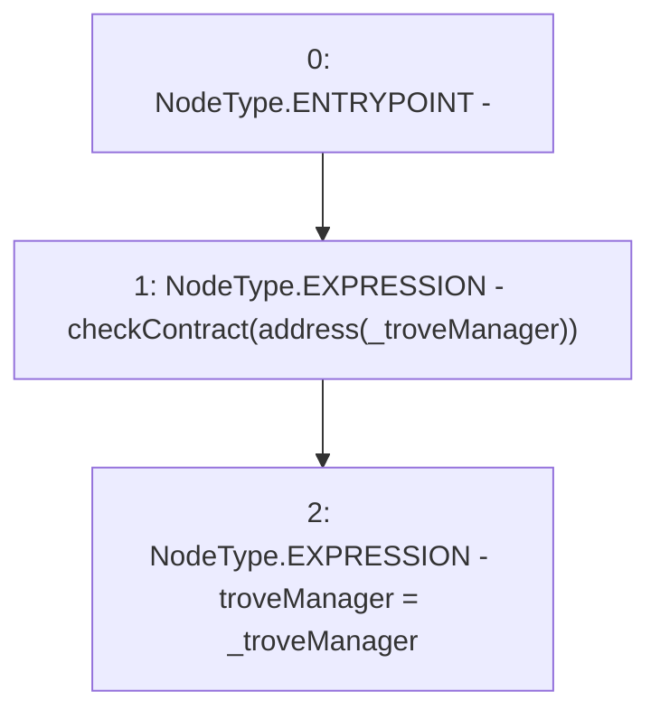

# Context: TroveManagerScript.constructor

**Contract:** `TroveManagerScript` (Inherits: CheckContract)
**Signature:** `constructor(ITroveManager)`
**Method Selector ID:** `0xf8a6c595`
**Visibility:** `public`
**Environment-Free:** `Yes`
**Modifiers:** None

### State Variables Interaction
- **Reads:** None
- **Writes:** troveManager

### Environment & Verification Flags
- **Uses Foundry Cheatcodes:** No
- **Has Echidna Properties:** No

### Internal Calls Tree
- None

### External Calls / Value Transfers
- None

### Control Flow Graph (CFG)


### Source Mapping
Declared in: `certora-ac-datasets/detasets/web3bugs/dataset/web3bugs/66/packages/contracts/contracts/Proxy/TroveManagerScript.sol` on lines **14** to **17**

```solidity
    constructor(ITroveManager _troveManager) public {
        checkContract(address(_troveManager));
        troveManager = _troveManager;
    }

```
