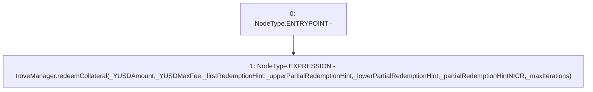

# Context: TroveManagerScript.redeemCollateral

**Contract:** `TroveManagerScript` (Inherits: CheckContract)
**Signature:** `redeemCollateral(uint256,uint256,address,address,address,uint256,uint256) returns (uint256)`
**Method Selector ID:** `0x13312d59`
**Visibility:** `external`
**Environment-Free:** `Yes`
**Modifiers:** None

### State Variables Interaction
- **Reads:** troveManager
- **Writes:** None

### Environment & Verification Flags
- **Uses Foundry Cheatcodes:** No
- **Has Echidna Properties:** No

### Internal Calls Tree
- None

### External Calls / Value Transfers
- `ITroveManager.HIGH_LEVEL_CALL, dest:troveManager(ITroveManager), function:redeemCollateral, arguments:['_YUSDAmount', '_YUSDMaxFee', '_firstRedemptionHint', '_upperPartialRedemptionHint', '_lowerPartialRedemptionHint', '_partialRedemptionHintNICR', '_maxIterations']  `

### Control Flow Graph (CFG)


### Source Mapping
Declared in: `certora-ac-datasets/detasets/web3bugs/dataset/web3bugs/66/packages/contracts/contracts/Proxy/TroveManagerScript.sol` on lines **19** to **39**

```solidity
    function redeemCollateral(
        uint _YUSDAmount,
        uint _YUSDMaxFee,
        address _firstRedemptionHint,
        address _upperPartialRedemptionHint,
        address _lowerPartialRedemptionHint,
        uint _partialRedemptionHintNICR,
        uint _maxIterations
        // uint _maxFee
    ) external returns (uint) {
        troveManager.redeemCollateral(
            _YUSDAmount,
            _YUSDMaxFee,
            _firstRedemptionHint,
            _upperPartialRedemptionHint,
            _lowerPartialRedemptionHint,
            _partialRedemptionHintNICR,
            _maxIterations
            // _maxFee
        );
    }

```
