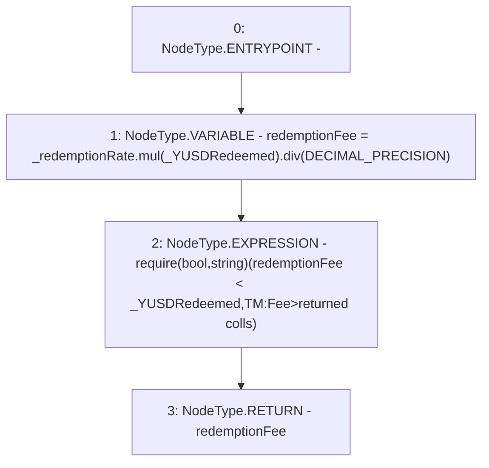

# Context: TroveManagerTester._calcRedemptionFee

**Contract:** `TroveManagerTester` (Inherits: TroveManager, ReentrancyGuard, ITroveManager, TroveManagerBase, CheckContract, Ownable, LiquityBase, YetiCustomBase, BaseMath, ILiquityBase)
**Signature:** `_calcRedemptionFee(uint256,uint256) returns (uint256)`
**Method Selector ID:** `Internal (No Method ID)`
**Visibility:** `internal`
**Environment-Free:** `Yes`
**Modifiers:** None

### State Variables Interaction
- **Reads:** DECIMAL_PRECISION
- **Writes:** None

### Assertion Checks & Business Requirements
- require/assert: `require(bool,string)(redemptionFee < _YUSDRedeemed,TM:Fee>returned colls)`

### Environment & Verification Flags
- **Uses Foundry Cheatcodes:** No
- **Has Echidna Properties:** No

### Internal Calls Tree
- None

### External Calls / Value Transfers
- `SafeMath.TMP_529(uint256) = LIBRARY_CALL, dest:SafeMath, function:SafeMath.mul(uint256,uint256), arguments:['_redemptionRate', '_YUSDRedeemed'] `
- `SafeMath.TMP_530(uint256) = LIBRARY_CALL, dest:SafeMath, function:SafeMath.div(uint256,uint256), arguments:['TMP_529', 'DECIMAL_PRECISION'] `

### Control Flow Graph (CFG)


### Source Mapping
Declared in: `certora-ac-datasets/detasets/web3bugs/dataset/web3bugs/66/packages/contracts/contracts/TroveManager.sol` on lines **735** to **739**

```solidity
    function _calcRedemptionFee(uint _redemptionRate, uint _YUSDRedeemed) internal pure returns (uint) {
        uint redemptionFee = _redemptionRate.mul(_YUSDRedeemed).div(DECIMAL_PRECISION);
        require(redemptionFee < _YUSDRedeemed, "TM:Fee>returned colls");
        return redemptionFee;
    }

```
