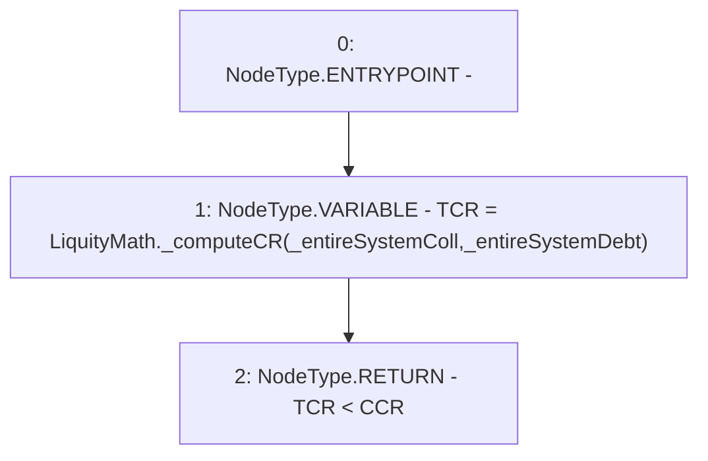

# Context: TroveManagerTester._checkPotentialRecoveryMode

**Contract:** `TroveManagerTester` (Inherits: TroveManager, ReentrancyGuard, ITroveManager, TroveManagerBase, CheckContract, Ownable, LiquityBase, YetiCustomBase, BaseMath, ILiquityBase)
**Signature:** `_checkPotentialRecoveryMode(uint256,uint256) returns (bool)`
**Method Selector ID:** `Internal (No Method ID)`
**Visibility:** `internal`
**Environment-Free:** `Yes`
**Modifiers:** None

### State Variables Interaction
- **Reads:** CCR
- **Writes:** None

### Environment & Verification Flags
- **Uses Foundry Cheatcodes:** No
- **Has Echidna Properties:** No

### Internal Calls Tree
- None

### External Calls / Value Transfers
- `LiquityMath.TMP_638(uint256) = LIBRARY_CALL, dest:LiquityMath, function:LiquityMath._computeCR(uint256,uint256), arguments:['_entireSystemColl', '_entireSystemDebt'] `

### Control Flow Graph (CFG)


### Source Mapping
Declared in: `certora-ac-datasets/detasets/web3bugs/dataset/web3bugs/66/packages/contracts/contracts/Dependencies/LiquityBase.sol` on lines **144** to **152**

```solidity
    function _checkPotentialRecoveryMode(uint _entireSystemColl, uint _entireSystemDebt)
    internal
    pure
    returns (bool)
    {
        uint TCR = LiquityMath._computeCR(_entireSystemColl, _entireSystemDebt);

        return TCR < CCR;
    }

```
