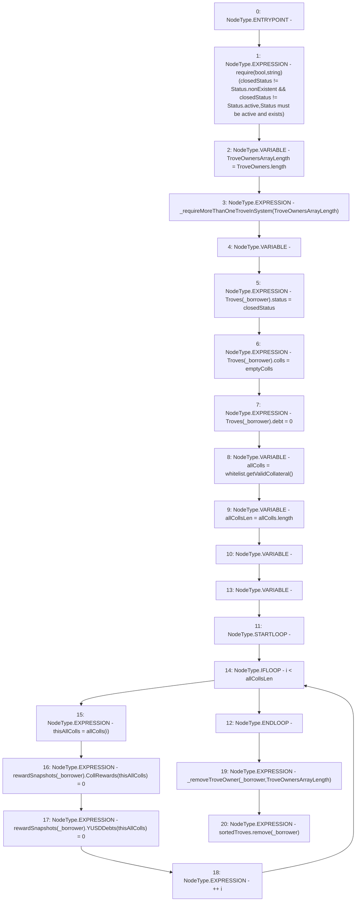

# Context: TroveManagerTester._closeTrove

**Contract:** `TroveManagerTester` (Inherits: TroveManager, ReentrancyGuard, ITroveManager, TroveManagerBase, CheckContract, Ownable, LiquityBase, YetiCustomBase, BaseMath, ILiquityBase)
**Signature:** `_closeTrove(address,TroveManagerBase.Status)`
**Method Selector ID:** `Internal (No Method ID)`
**Visibility:** `internal`
**Environment-Free:** `Yes`
**Modifiers:** None

### State Variables Interaction
- **Reads:** TroveOwners, Troves, rewardSnapshots, sortedTroves, whitelist
- **Writes:** Troves, rewardSnapshots

### Assertion Checks & Business Requirements
- require/assert: `require(bool,string)(closedStatus != Status.nonExistent && closedStatus != Status.active,Status must be active and exists)`

### Environment & Verification Flags
- **Uses Foundry Cheatcodes:** No
- **Has Echidna Properties:** No

### Internal Calls Tree
- None

### External Calls / Value Transfers
- `ISortedTroves.HIGH_LEVEL_CALL, dest:sortedTroves(ISortedTroves), function:remove, arguments:['_borrower']  `
- `IWhitelist.TMP_485(address[]) = HIGH_LEVEL_CALL, dest:whitelist(IWhitelist), function:getValidCollateral, arguments:[]  `

### Control Flow Graph (CFG)


### Source Mapping
Declared in: `certora-ac-datasets/detasets/web3bugs/dataset/web3bugs/66/packages/contracts/contracts/TroveManager.sol` on lines **601** to **623**

```solidity
    function _closeTrove(address _borrower, Status closedStatus) internal {
        require(closedStatus != Status.nonExistent && closedStatus != Status.active, "Status must be active and exists");

        uint TroveOwnersArrayLength = TroveOwners.length;
        _requireMoreThanOneTroveInSystem(TroveOwnersArrayLength);
        newColls memory emptyColls;

        Troves[_borrower].status = closedStatus;
        Troves[_borrower].colls = emptyColls;
        Troves[_borrower].debt = 0;

        address[] memory allColls = whitelist.getValidCollateral();
        uint allCollsLen = allColls.length;
        address thisAllColls;
        for (uint256 i; i < allCollsLen; ++i) {
            thisAllColls = allColls[i];
            rewardSnapshots[_borrower].CollRewards[thisAllColls] = 0;
            rewardSnapshots[_borrower].YUSDDebts[thisAllColls] = 0;
        }

        _removeTroveOwner(_borrower, TroveOwnersArrayLength);
        sortedTroves.remove(_borrower);
    }

```
