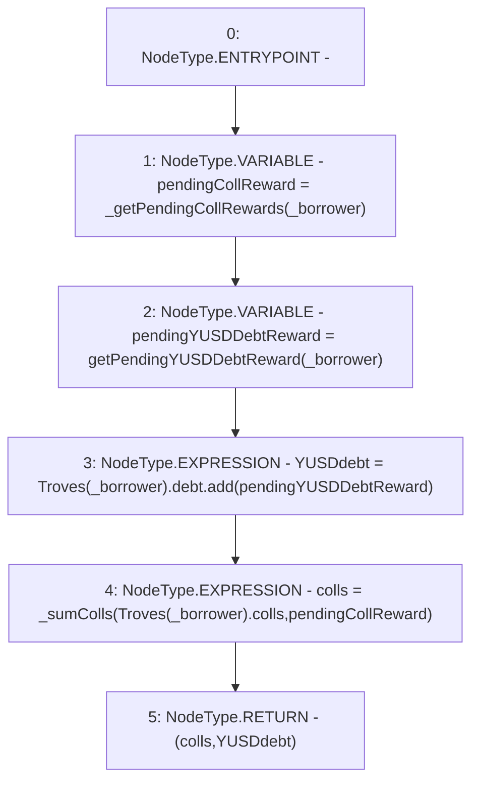

# Context: TroveManagerTester._getCurrentTroveState

**Contract:** `TroveManagerTester` (Inherits: TroveManager, ReentrancyGuard, ITroveManager, TroveManagerBase, CheckContract, Ownable, LiquityBase, YetiCustomBase, BaseMath, ILiquityBase)
**Signature:** `_getCurrentTroveState(address) returns (YetiCustomBase.newColls, uint256)`
**Method Selector ID:** `Internal (No Method ID)`
**Visibility:** `internal`
**Environment-Free:** `Yes`
**Modifiers:** None

### State Variables Interaction
- **Reads:** Troves
- **Writes:** None

### Environment & Verification Flags
- **Uses Foundry Cheatcodes:** No
- **Has Echidna Properties:** No

### Internal Calls Tree
- None

### External Calls / Value Transfers
- `SafeMath.TMP_376(uint256) = LIBRARY_CALL, dest:SafeMath, function:SafeMath.add(uint256,uint256), arguments:['REF_413', 'pendingYUSDDebtReward'] `

### Control Flow Graph (CFG)


### Source Mapping
Declared in: `certora-ac-datasets/detasets/web3bugs/dataset/web3bugs/66/packages/contracts/contracts/TroveManager.sol` on lines **323** to **330**

```solidity
    function _getCurrentTroveState(address _borrower) internal view
    returns (newColls memory colls, uint YUSDdebt) {
        newColls memory pendingCollReward = _getPendingCollRewards(_borrower);
        uint pendingYUSDDebtReward = getPendingYUSDDebtReward(_borrower);
        
        YUSDdebt = Troves[_borrower].debt.add(pendingYUSDDebtReward);
        colls = _sumColls(Troves[_borrower].colls, pendingCollReward);
    }

```
