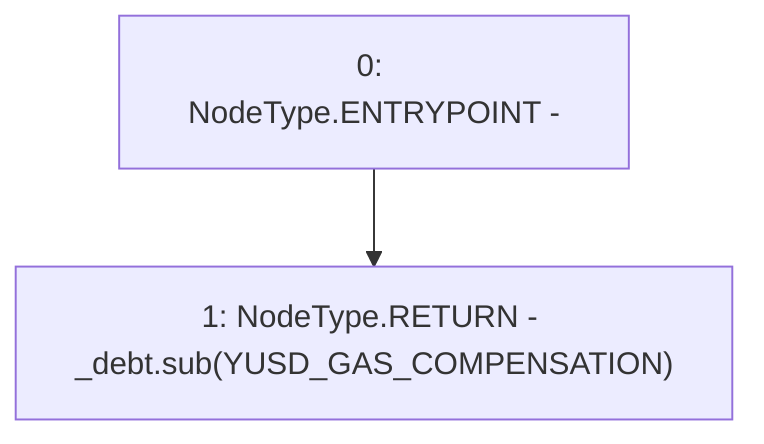

# Context: TroveManagerTester._getNetDebt

**Contract:** `TroveManagerTester` (Inherits: TroveManager, ReentrancyGuard, ITroveManager, TroveManagerBase, CheckContract, Ownable, LiquityBase, YetiCustomBase, BaseMath, ILiquityBase)
**Signature:** `_getNetDebt(uint256) returns (uint256)`
**Method Selector ID:** `Internal (No Method ID)`
**Visibility:** `internal`
**Environment-Free:** `Yes`
**Modifiers:** None

### State Variables Interaction
- **Reads:** YUSD_GAS_COMPENSATION
- **Writes:** None

### Environment & Verification Flags
- **Uses Foundry Cheatcodes:** No
- **Has Echidna Properties:** No

### Internal Calls Tree
- None

### External Calls / Value Transfers
- `SafeMath.TMP_607(uint256) = LIBRARY_CALL, dest:SafeMath, function:SafeMath.sub(uint256,uint256), arguments:['_debt', 'YUSD_GAS_COMPENSATION'] `

### Control Flow Graph (CFG)


### Source Mapping
Declared in: `certora-ac-datasets/detasets/web3bugs/dataset/web3bugs/66/packages/contracts/contracts/Dependencies/LiquityBase.sol` on lines **52** to **54**

```solidity
    function _getNetDebt(uint _debt) internal pure returns (uint) {
        return _debt.sub(YUSD_GAS_COMPENSATION);
    }

```
