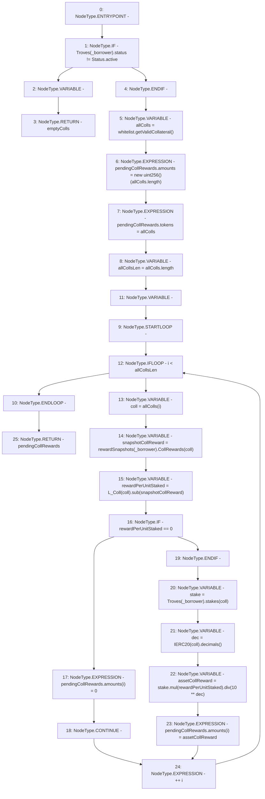

# Context: TroveManagerTester._getPendingCollRewards

**Contract:** `TroveManagerTester` (Inherits: TroveManager, ReentrancyGuard, ITroveManager, TroveManagerBase, CheckContract, Ownable, LiquityBase, YetiCustomBase, BaseMath, ILiquityBase)
**Signature:** `_getPendingCollRewards(address) returns (YetiCustomBase.newColls)`
**Method Selector ID:** `Internal (No Method ID)`
**Visibility:** `internal`
**Environment-Free:** `Yes`
**Modifiers:** None

### State Variables Interaction
- **Reads:** L_Coll, Troves, rewardSnapshots, whitelist
- **Writes:** None

### Environment & Verification Flags
- **Uses Foundry Cheatcodes:** No
- **Has Echidna Properties:** No

### Internal Calls Tree
- None

### External Calls / Value Transfers
- `SafeMath.TMP_400(uint256) = LIBRARY_CALL, dest:SafeMath, function:SafeMath.sub(uint256,uint256), arguments:['REF_462', 'snapshotCollReward'] `
- `IWhitelist.TMP_396(address[]) = HIGH_LEVEL_CALL, dest:whitelist(IWhitelist), function:getValidCollateral, arguments:[]  `
- `SafeMath.TMP_404(uint256) = LIBRARY_CALL, dest:SafeMath, function:SafeMath.mul(uint256,uint256), arguments:['stake', 'rewardPerUnitStaked'] `
- `IERC20.TMP_403(uint8) = HIGH_LEVEL_CALL, dest:TMP_402(IERC20), function:decimals, arguments:[]  `
- `SafeMath.TMP_406(uint256) = LIBRARY_CALL, dest:SafeMath, function:SafeMath.div(uint256,uint256), arguments:['TMP_404', 'TMP_405'] `

### Control Flow Graph (CFG)


### Source Mapping
Declared in: `certora-ac-datasets/detasets/web3bugs/dataset/web3bugs/66/packages/contracts/contracts/TroveManager.sol` on lines **392** to **415**

```solidity
    function _getPendingCollRewards(address _borrower) internal view returns (newColls memory pendingCollRewards) {
        if (Troves[_borrower].status != Status.active) {
            newColls memory emptyColls;
            return emptyColls;
        }

        address[] memory allColls = whitelist.getValidCollateral();
        pendingCollRewards.amounts = new uint[](allColls.length);
        pendingCollRewards.tokens = allColls;
        uint256 allCollsLen = allColls.length;
        for (uint256 i; i < allCollsLen; ++i) {
            address coll = allColls[i];
            uint snapshotCollReward = rewardSnapshots[_borrower].CollRewards[coll];
            uint rewardPerUnitStaked = L_Coll[coll].sub(snapshotCollReward);
            if ( rewardPerUnitStaked == 0) {
                pendingCollRewards.amounts[i] = 0;
                continue; }

            uint stake = Troves[_borrower].stakes[coll];
            uint dec = IERC20(coll).decimals();
            uint assetCollReward = stake.mul(rewardPerUnitStaked).div(10 ** dec);
            pendingCollRewards.amounts[i] = assetCollReward; // i is correct index here
        }
    }

```
