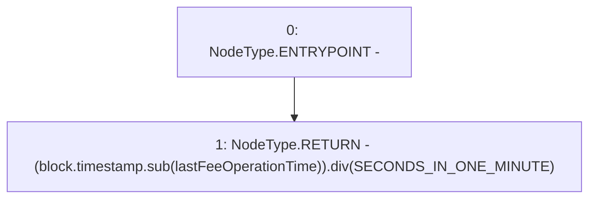

# Context: TroveManagerTester._minutesPassedSinceLastFeeOp

**Contract:** `TroveManagerTester` (Inherits: TroveManager, ReentrancyGuard, ITroveManager, TroveManagerBase, CheckContract, Ownable, LiquityBase, YetiCustomBase, BaseMath, ILiquityBase)
**Signature:** `_minutesPassedSinceLastFeeOp() returns (uint256)`
**Method Selector ID:** `Internal (No Method ID)`
**Visibility:** `internal`
**Environment-Free:** `No (reads EVM state context)`
**Modifiers:** None

### State Variables Interaction
- **Reads:** SECONDS_IN_ONE_MINUTE, lastFeeOperationTime
- **Writes:** None

### Environment & Verification Flags
- **Uses Foundry Cheatcodes:** No
- **Has Echidna Properties:** No

### Internal Calls Tree
- None

### External Calls / Value Transfers
- `SafeMath.TMP_558(uint256) = LIBRARY_CALL, dest:SafeMath, function:SafeMath.div(uint256,uint256), arguments:['TMP_557', 'SECONDS_IN_ONE_MINUTE'] `
- `SafeMath.TMP_557(uint256) = LIBRARY_CALL, dest:SafeMath, function:SafeMath.sub(uint256,uint256), arguments:['block.timestamp', 'lastFeeOperationTime'] `

### Control Flow Graph (CFG)


### Source Mapping
Declared in: `certora-ac-datasets/detasets/web3bugs/dataset/web3bugs/66/packages/contracts/contracts/TroveManager.sol` on lines **805** to **807**

```solidity
    function _minutesPassedSinceLastFeeOp() internal view returns (uint) {
        return (block.timestamp.sub(lastFeeOperationTime)).div(SECONDS_IN_ONE_MINUTE);
    }

```
