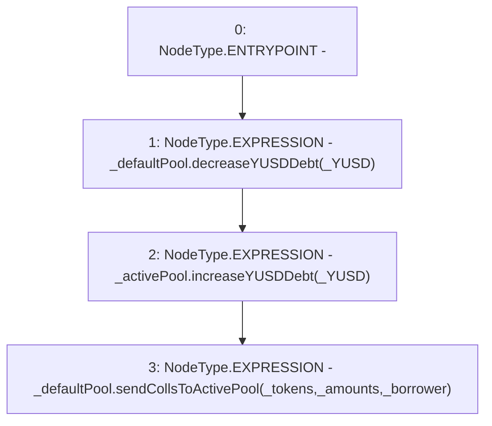

# Context: TroveManagerTester._movePendingTroveRewardsToActivePool

**Contract:** `TroveManagerTester` (Inherits: TroveManager, ReentrancyGuard, ITroveManager, TroveManagerBase, CheckContract, Ownable, LiquityBase, YetiCustomBase, BaseMath, ILiquityBase)
**Signature:** `_movePendingTroveRewardsToActivePool(IActivePool,IDefaultPool,uint256,address[],uint256[],address)`
**Method Selector ID:** `Internal (No Method ID)`
**Visibility:** `internal`
**Environment-Free:** `Yes`
**Modifiers:** None

### State Variables Interaction
- **Reads:** None
- **Writes:** None

### Environment & Verification Flags
- **Uses Foundry Cheatcodes:** No
- **Has Echidna Properties:** No

### Internal Calls Tree
- None

### External Calls / Value Transfers
- `IDefaultPool.HIGH_LEVEL_CALL, dest:_defaultPool(IDefaultPool), function:decreaseYUSDDebt, arguments:['_YUSD']  `
- `IActivePool.HIGH_LEVEL_CALL, dest:_activePool(IActivePool), function:increaseYUSDDebt, arguments:['_YUSD']  `
- `IDefaultPool.HIGH_LEVEL_CALL, dest:_defaultPool(IDefaultPool), function:sendCollsToActivePool, arguments:['_tokens', '_amounts', '_borrower']  `

### Control Flow Graph (CFG)


### Source Mapping
Declared in: `certora-ac-datasets/detasets/web3bugs/dataset/web3bugs/66/packages/contracts/contracts/TroveManager.sol` on lines **235** to **239**

```solidity
    function _movePendingTroveRewardsToActivePool(IActivePool _activePool, IDefaultPool _defaultPool, uint _YUSD, address[] memory _tokens, uint[] memory _amounts, address _borrower) internal {
        _defaultPool.decreaseYUSDDebt(_YUSD);
        _activePool.increaseYUSDDebt(_YUSD);
        _defaultPool.sendCollsToActivePool(_tokens, _amounts, _borrower);
    }

```
