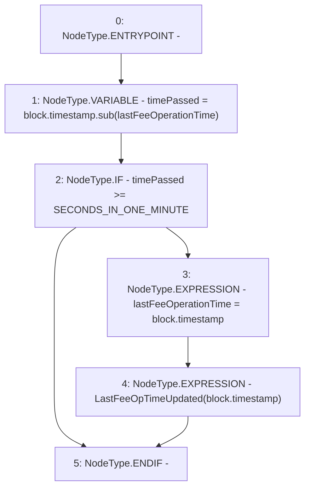

# Context: TroveManagerTester._updateLastFeeOpTime

**Contract:** `TroveManagerTester` (Inherits: TroveManager, ReentrancyGuard, ITroveManager, TroveManagerBase, CheckContract, Ownable, LiquityBase, YetiCustomBase, BaseMath, ILiquityBase)
**Signature:** `_updateLastFeeOpTime()`
**Method Selector ID:** `Internal (No Method ID)`
**Visibility:** `internal`
**Environment-Free:** `No (reads EVM state context)`
**Modifiers:** None

### State Variables Interaction
- **Reads:** SECONDS_IN_ONE_MINUTE, lastFeeOperationTime
- **Writes:** lastFeeOperationTime

### Environment & Verification Flags
- **Uses Foundry Cheatcodes:** No
- **Has Echidna Properties:** No

### Internal Calls Tree
- None

### External Calls / Value Transfers
- `SafeMath.TMP_550(uint256) = LIBRARY_CALL, dest:SafeMath, function:SafeMath.sub(uint256,uint256), arguments:['block.timestamp', 'lastFeeOperationTime'] `

### Control Flow Graph (CFG)


### Source Mapping
Declared in: `certora-ac-datasets/detasets/web3bugs/dataset/web3bugs/66/packages/contracts/contracts/TroveManager.sol` on lines **789** to **796**

```solidity
    function _updateLastFeeOpTime() internal {
        uint timePassed = block.timestamp.sub(lastFeeOperationTime);

        if (timePassed >= SECONDS_IN_ONE_MINUTE) {
            lastFeeOperationTime = block.timestamp;
            emit LastFeeOpTimeUpdated(block.timestamp);
        }
    }

```
