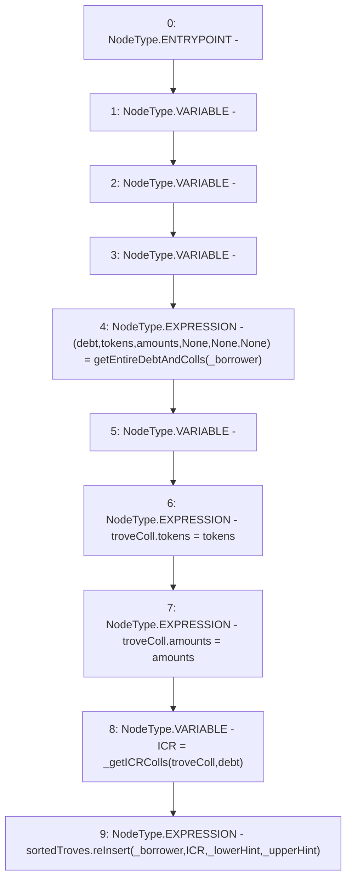

# Context: TroveManagerTester._updateTrove

**Contract:** `TroveManagerTester` (Inherits: TroveManager, ReentrancyGuard, ITroveManager, TroveManagerBase, CheckContract, Ownable, LiquityBase, YetiCustomBase, BaseMath, ILiquityBase)
**Signature:** `_updateTrove(address,address,address)`
**Method Selector ID:** `Internal (No Method ID)`
**Visibility:** `internal`
**Environment-Free:** `Yes`
**Modifiers:** None

### State Variables Interaction
- **Reads:** sortedTroves
- **Writes:** None

### Environment & Verification Flags
- **Uses Foundry Cheatcodes:** No
- **Has Echidna Properties:** No

### Internal Calls Tree
- None

### External Calls / Value Transfers
- `ISortedTroves.HIGH_LEVEL_CALL, dest:sortedTroves(ISortedTroves), function:reInsert, arguments:['_borrower', 'ICR', '_lowerHint', '_upperHint']  `

### Control Flow Graph (CFG)


### Source Mapping
Declared in: `certora-ac-datasets/detasets/web3bugs/dataset/web3bugs/66/packages/contracts/contracts/TroveManager.sol` on lines **242** to **251**

```solidity
    function _updateTrove(address _borrower, address _lowerHint, address _upperHint) internal {
        (uint debt, address[] memory tokens, uint[] memory amounts, , , ) = getEntireDebtAndColls(_borrower);

        newColls memory troveColl;
        troveColl.tokens = tokens;
        troveColl.amounts = amounts;

        uint ICR = _getICRColls(troveColl, debt);
        sortedTroves.reInsert(_borrower, ICR, _lowerHint, _upperHint);
    }

```
