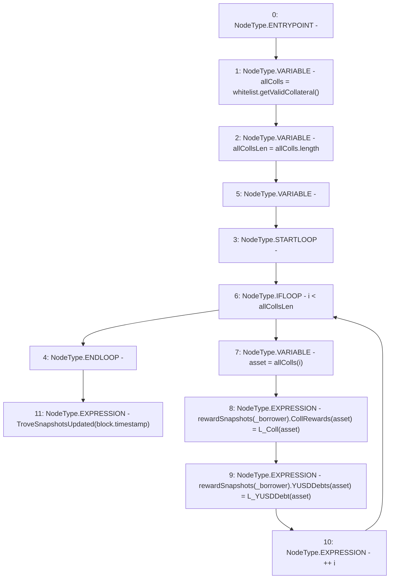

# Context: TroveManagerTester._updateTroveRewardSnapshots

**Contract:** `TroveManagerTester` (Inherits: TroveManager, ReentrancyGuard, ITroveManager, TroveManagerBase, CheckContract, Ownable, LiquityBase, YetiCustomBase, BaseMath, ILiquityBase)
**Signature:** `_updateTroveRewardSnapshots(address)`
**Method Selector ID:** `Internal (No Method ID)`
**Visibility:** `internal`
**Environment-Free:** `No (reads EVM state context)`
**Modifiers:** None

### State Variables Interaction
- **Reads:** L_Coll, L_YUSDDebt, rewardSnapshots, whitelist
- **Writes:** rewardSnapshots

### Environment & Verification Flags
- **Uses Foundry Cheatcodes:** No
- **Has Echidna Properties:** No

### Internal Calls Tree
- None

### External Calls / Value Transfers
- `IWhitelist.TMP_391(address[]) = HIGH_LEVEL_CALL, dest:whitelist(IWhitelist), function:getValidCollateral, arguments:[]  `

### Control Flow Graph (CFG)


### Source Mapping
Declared in: `certora-ac-datasets/detasets/web3bugs/dataset/web3bugs/66/packages/contracts/contracts/TroveManager.sol` on lines **372** to **381**

```solidity
    function _updateTroveRewardSnapshots(address _borrower) internal {
        address[] memory allColls = whitelist.getValidCollateral();
        uint256 allCollsLen = allColls.length;
        for (uint256 i; i < allCollsLen; ++i) {
            address asset = allColls[i];
            rewardSnapshots[_borrower].CollRewards[asset] = L_Coll[asset];
            rewardSnapshots[_borrower].YUSDDebts[asset] = L_YUSDDebt[asset];
        }
        emit TroveSnapshotsUpdated(block.timestamp);
    }

```
