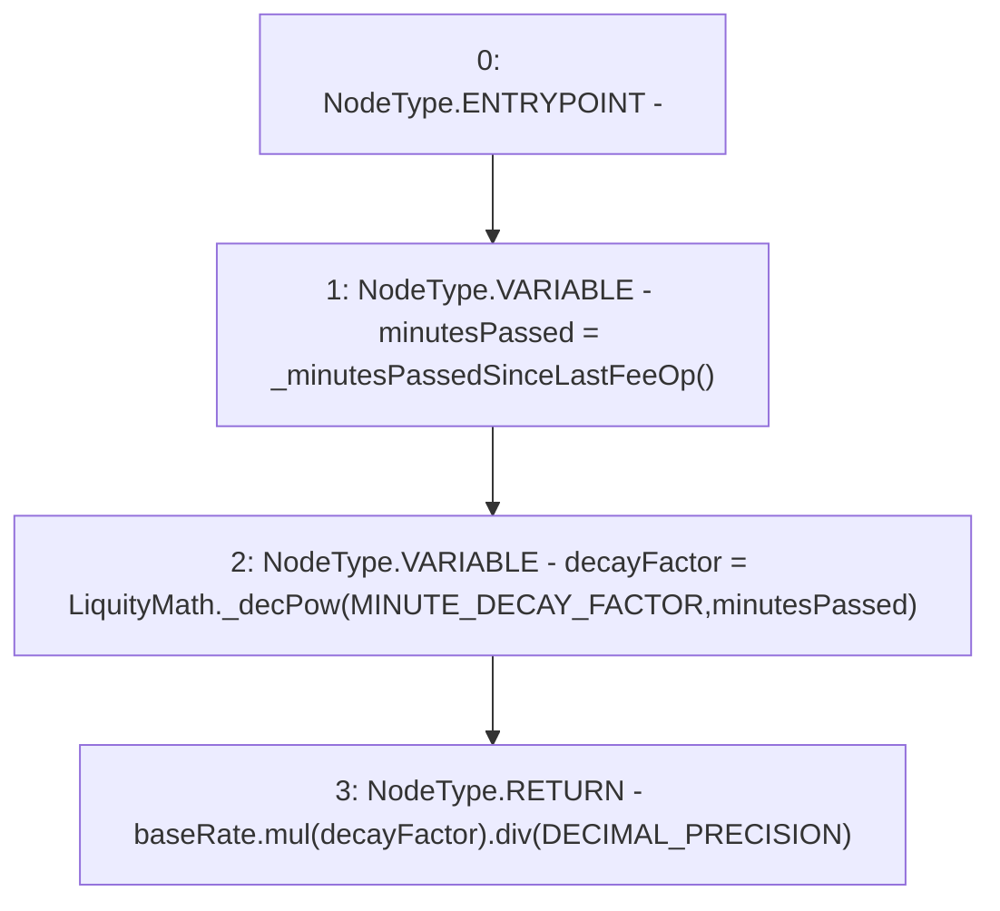

# Context: TroveManagerTester.calcDecayedBaseRate

**Contract:** `TroveManagerTester` (Inherits: TroveManager, ReentrancyGuard, ITroveManager, TroveManagerBase, CheckContract, Ownable, LiquityBase, YetiCustomBase, BaseMath, ILiquityBase)
**Signature:** `calcDecayedBaseRate() returns (uint256)`
**Method Selector ID:** `0x45979978`
**Visibility:** `public`
**Environment-Free:** `No (reads EVM state context)`
**Modifiers:** None

### State Variables Interaction
- **Reads:** DECIMAL_PRECISION, MINUTE_DECAY_FACTOR, baseRate
- **Writes:** None

### Environment & Verification Flags
- **Uses Foundry Cheatcodes:** No
- **Has Echidna Properties:** No

### Internal Calls Tree
- None

### External Calls / Value Transfers
- `SafeMath.TMP_555(uint256) = LIBRARY_CALL, dest:SafeMath, function:SafeMath.mul(uint256,uint256), arguments:['baseRate', 'decayFactor'] `
- `SafeMath.TMP_556(uint256) = LIBRARY_CALL, dest:SafeMath, function:SafeMath.div(uint256,uint256), arguments:['TMP_555', 'DECIMAL_PRECISION'] `
- `LiquityMath.TMP_554(uint256) = LIBRARY_CALL, dest:LiquityMath, function:LiquityMath._decPow(uint256,uint256), arguments:['MINUTE_DECAY_FACTOR', 'minutesPassed'] `

### Control Flow Graph (CFG)


### Source Mapping
Declared in: `certora-ac-datasets/detasets/web3bugs/dataset/web3bugs/66/packages/contracts/contracts/TroveManager.sol` on lines **798** to **803**

```solidity
    function calcDecayedBaseRate() public view override returns (uint) {
        uint minutesPassed = _minutesPassedSinceLastFeeOp();
        uint decayFactor = LiquityMath._decPow(MINUTE_DECAY_FACTOR, minutesPassed);

        return baseRate.mul(decayFactor).div(DECIMAL_PRECISION);
    }

```
