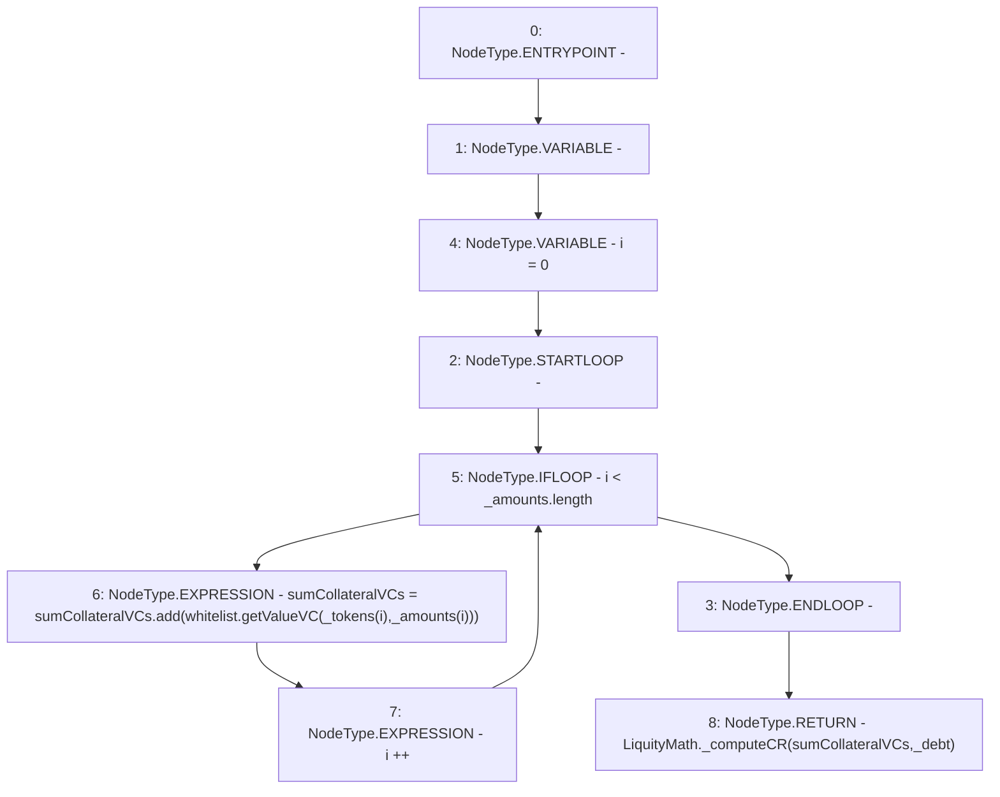

# Context: TroveManagerTester.computeICR

**Contract:** `TroveManagerTester` (Inherits: TroveManager, ReentrancyGuard, ITroveManager, TroveManagerBase, CheckContract, Ownable, LiquityBase, YetiCustomBase, BaseMath, ILiquityBase)
**Signature:** `computeICR(address[],uint256[],uint256) returns (uint256)`
**Method Selector ID:** `0x3d95f5e8`
**Visibility:** `external`
**Environment-Free:** `Yes`
**Modifiers:** None

### State Variables Interaction
- **Reads:** whitelist
- **Writes:** None

### Environment & Verification Flags
- **Uses Foundry Cheatcodes:** No
- **Has Echidna Properties:** No

### Internal Calls Tree
- None

### External Calls / Value Transfers
- `IWhitelist.TMP_699(uint256) = HIGH_LEVEL_CALL, dest:whitelist(IWhitelist), function:getValueVC, arguments:['REF_866', 'REF_867']  `
- `SafeMath.TMP_700(uint256) = LIBRARY_CALL, dest:SafeMath, function:SafeMath.add(uint256,uint256), arguments:['sumCollateralVCs', 'TMP_699'] `
- `LiquityMath.TMP_702(uint256) = LIBRARY_CALL, dest:LiquityMath, function:LiquityMath._computeCR(uint256,uint256), arguments:['sumCollateralVCs', '_debt'] `

### Control Flow Graph (CFG)


### Source Mapping
Declared in: `certora-ac-datasets/detasets/web3bugs/dataset/web3bugs/66/packages/contracts/contracts/TestContracts/CDPManagerTester.sol` on lines **12** to **18**

```solidity
    function computeICR(address[] memory _tokens, uint[] memory _amounts, uint _debt) external view returns (uint) {
        uint sumCollateralVCs;
        for (uint i = 0; i < _amounts.length; i++) {
            sumCollateralVCs = sumCollateralVCs.add(whitelist.getValueVC(_tokens[i], _amounts[i]));
        }
        return LiquityMath._computeCR(sumCollateralVCs, _debt);
    }

```
