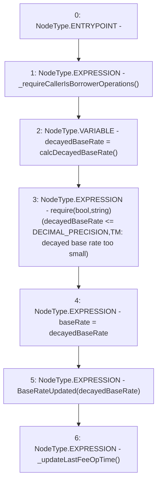

# Context: TroveManagerTester.decayBaseRateFromBorrowing

**Contract:** `TroveManagerTester` (Inherits: TroveManager, ReentrancyGuard, ITroveManager, TroveManagerBase, CheckContract, Ownable, LiquityBase, YetiCustomBase, BaseMath, ILiquityBase)
**Signature:** `decayBaseRateFromBorrowing()`
**Method Selector ID:** `0x5dba4c4a`
**Visibility:** `external`
**Environment-Free:** `No (reads EVM state context)`
**Modifiers:** None

### State Variables Interaction
- **Reads:** DECIMAL_PRECISION
- **Writes:** baseRate

### Assertion Checks & Business Requirements
- require/assert: `require(bool,string)(decayedBaseRate <= DECIMAL_PRECISION,TM: decayed base rate too small)`

### Environment & Verification Flags
- **Uses Foundry Cheatcodes:** No
- **Has Echidna Properties:** No

### Internal Calls Tree
- None

### External Calls / Value Transfers
- None

### Control Flow Graph (CFG)


### Source Mapping
Declared in: `certora-ac-datasets/detasets/web3bugs/dataset/web3bugs/66/packages/contracts/contracts/TroveManager.sol` on lines **773** to **783**

```solidity
    function decayBaseRateFromBorrowing() external override {
        _requireCallerIsBorrowerOperations();

        uint decayedBaseRate = calcDecayedBaseRate();
        require(decayedBaseRate <= DECIMAL_PRECISION, "TM: decayed base rate too small");  // The baseRate can decay to 0

        baseRate = decayedBaseRate;
        emit BaseRateUpdated(decayedBaseRate);

        _updateLastFeeOpTime();
    }

```
