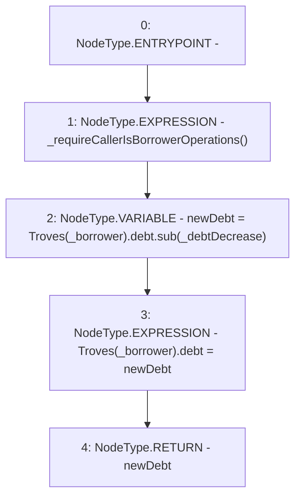

# Context: TroveManagerTester.decreaseTroveDebt

**Contract:** `TroveManagerTester` (Inherits: TroveManager, ReentrancyGuard, ITroveManager, TroveManagerBase, CheckContract, Ownable, LiquityBase, YetiCustomBase, BaseMath, ILiquityBase)
**Signature:** `decreaseTroveDebt(address,uint256) returns (uint256)`
**Method Selector ID:** `0x12610e92`
**Visibility:** `external`
**Environment-Free:** `No (reads EVM state context)`
**Modifiers:** None

### State Variables Interaction
- **Reads:** Troves
- **Writes:** Troves

### Environment & Verification Flags
- **Uses Foundry Cheatcodes:** No
- **Has Echidna Properties:** No

### Internal Calls Tree
- None

### External Calls / Value Transfers
- `SafeMath.TMP_594(uint256) = LIBRARY_CALL, dest:SafeMath, function:SafeMath.sub(uint256,uint256), arguments:['REF_718', '_debtDecrease'] `

### Control Flow Graph (CFG)


### Source Mapping
Declared in: `certora-ac-datasets/detasets/web3bugs/dataset/web3bugs/66/packages/contracts/contracts/TroveManager.sol` on lines **947** to **952**

```solidity
    function decreaseTroveDebt(address _borrower, uint _debtDecrease) external override returns (uint) {
        _requireCallerIsBorrowerOperations();
        uint newDebt = Troves[_borrower].debt.sub(_debtDecrease);
        Troves[_borrower].debt = newDebt;
        return newDebt;
    }

```
