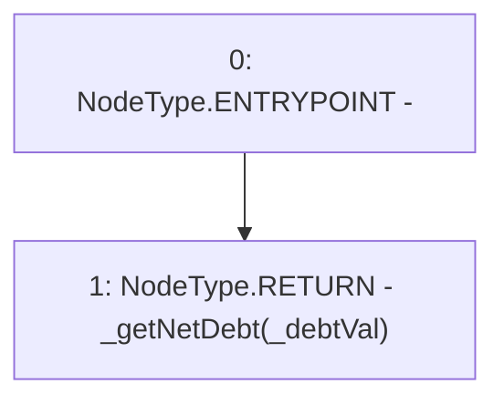

# Context: TroveManagerTester.getActualDebtFromComposite

**Contract:** `TroveManagerTester` (Inherits: TroveManager, ReentrancyGuard, ITroveManager, TroveManagerBase, CheckContract, Ownable, LiquityBase, YetiCustomBase, BaseMath, ILiquityBase)
**Signature:** `getActualDebtFromComposite(uint256) returns (uint256)`
**Method Selector ID:** `0x54062a45`
**Visibility:** `external`
**Environment-Free:** `Yes`
**Modifiers:** None

### State Variables Interaction
- **Reads:** None
- **Writes:** None

### Environment & Verification Flags
- **Uses Foundry Cheatcodes:** No
- **Has Echidna Properties:** No

### Internal Calls Tree
- None

### External Calls / Value Transfers
- None

### Control Flow Graph (CFG)


### Source Mapping
Declared in: `certora-ac-datasets/detasets/web3bugs/dataset/web3bugs/66/packages/contracts/contracts/TestContracts/CDPManagerTester.sol` on lines **60** to **62**

```solidity
    function getActualDebtFromComposite(uint _debtVal) external pure returns (uint) {
        return _getNetDebt(_debtVal);
    }

```
