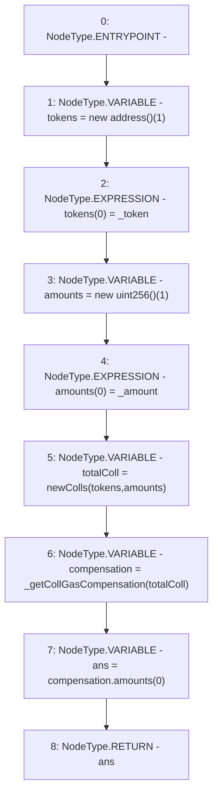

# Context: TroveManagerTester.getCollGasCompensation

**Contract:** `TroveManagerTester` (Inherits: TroveManager, ReentrancyGuard, ITroveManager, TroveManagerBase, CheckContract, Ownable, LiquityBase, YetiCustomBase, BaseMath, ILiquityBase)
**Signature:** `getCollGasCompensation(address,uint256) returns (uint256)`
**Method Selector ID:** `0xb9a9aaa5`
**Visibility:** `external`
**Environment-Free:** `Yes`
**Modifiers:** None

### State Variables Interaction
- **Reads:** None
- **Writes:** None

### Environment & Verification Flags
- **Uses Foundry Cheatcodes:** No
- **Has Echidna Properties:** No

### Internal Calls Tree
- None

### External Calls / Value Transfers
- None

### Control Flow Graph (CFG)


### Source Mapping
Declared in: `certora-ac-datasets/detasets/web3bugs/dataset/web3bugs/66/packages/contracts/contracts/TestContracts/CDPManagerTester.sol` on lines **87** to **99**

```solidity
    function getCollGasCompensation(address _token, uint _amount) external pure returns (uint) {
        address[] memory tokens = new address[](1);
        tokens[0] = _token;

        uint[] memory amounts = new uint[](1);
        amounts[0] = _amount;

        newColls memory totalColl = newColls(tokens, amounts);

        newColls memory compensation = _getCollGasCompensation(totalColl);
        uint ans = compensation.amounts[0];
        return ans;
    }

```
