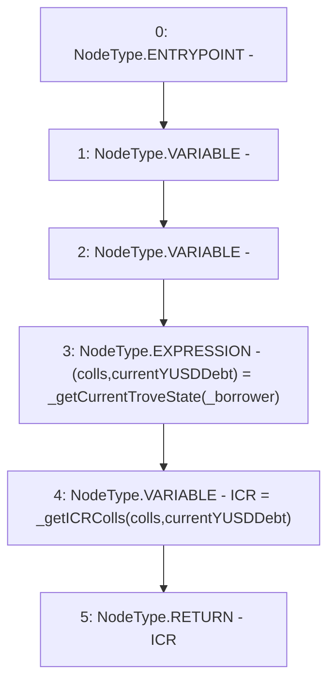

# Context: TroveManagerTester.getCurrentICR

**Contract:** `TroveManagerTester` (Inherits: TroveManager, ReentrancyGuard, ITroveManager, TroveManagerBase, CheckContract, Ownable, LiquityBase, YetiCustomBase, BaseMath, ILiquityBase)
**Signature:** `getCurrentICR(address) returns (uint256)`
**Method Selector ID:** `0x27fb7d89`
**Visibility:** `external`
**Environment-Free:** `Yes`
**Modifiers:** None

### State Variables Interaction
- **Reads:** None
- **Writes:** None

### Environment & Verification Flags
- **Uses Foundry Cheatcodes:** No
- **Has Echidna Properties:** No

### Internal Calls Tree
- None

### External Calls / Value Transfers
- None

### Control Flow Graph (CFG)


### Source Mapping
Declared in: `certora-ac-datasets/detasets/web3bugs/dataset/web3bugs/66/packages/contracts/contracts/TroveManager.sol` on lines **315** to **320**

```solidity
    function getCurrentICR(address _borrower) external view override returns (uint) {
        (newColls memory colls, uint currentYUSDDebt) = _getCurrentTroveState(_borrower);

        uint ICR = _getICRColls(colls, currentYUSDDebt);
        return ICR;
    }

```
