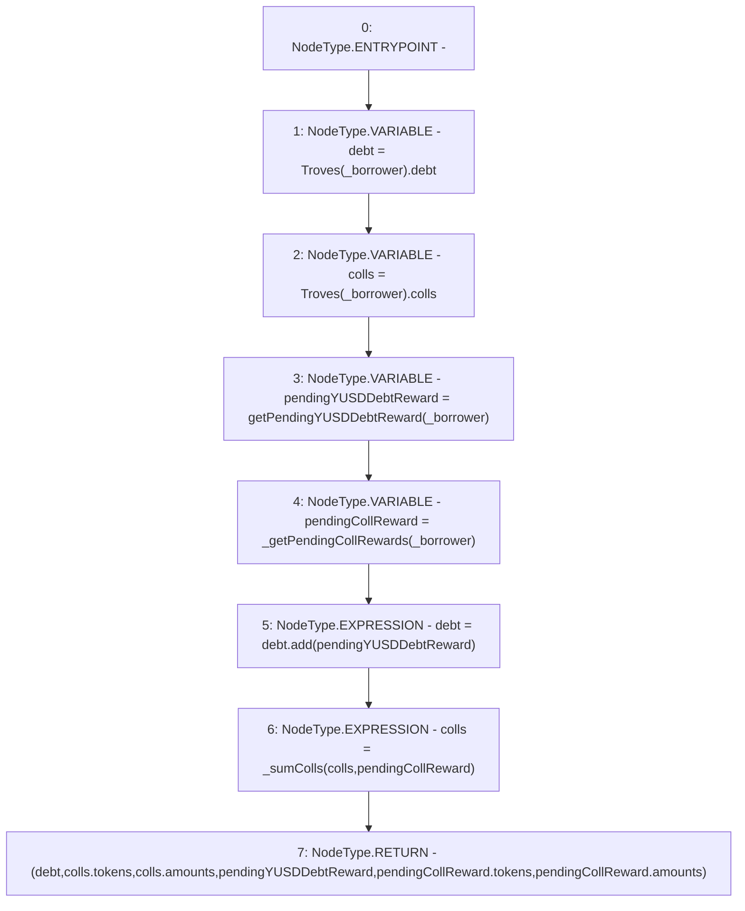

# Context: TroveManagerTester.getEntireDebtAndColls

**Contract:** `TroveManagerTester` (Inherits: TroveManager, ReentrancyGuard, ITroveManager, TroveManagerBase, CheckContract, Ownable, LiquityBase, YetiCustomBase, BaseMath, ILiquityBase)
**Signature:** `getEntireDebtAndColls(address) returns (uint256, address[], uint256[], uint256, address[], uint256[])`
**Method Selector ID:** `0x12adf0c2`
**Visibility:** `public`
**Environment-Free:** `Yes`
**Modifiers:** None

### State Variables Interaction
- **Reads:** Troves
- **Writes:** None

### Environment & Verification Flags
- **Uses Foundry Cheatcodes:** No
- **Has Echidna Properties:** No

### Internal Calls Tree
- None

### External Calls / Value Transfers
- `SafeMath.TMP_420(uint256) = LIBRARY_CALL, dest:SafeMath, function:SafeMath.add(uint256,uint256), arguments:['debt', 'pendingYUSDDebtReward'] `

### Control Flow Graph (CFG)


### Source Mapping
Declared in: `certora-ac-datasets/detasets/web3bugs/dataset/web3bugs/66/packages/contracts/contracts/TroveManager.sol` on lines **457** to **476**

```solidity
    function getEntireDebtAndColls(
        address _borrower
    )
    public
    view override
    returns (uint, address[] memory, uint[] memory, uint, address[] memory, uint[] memory)
    {
        uint debt = Troves[_borrower].debt;
        newColls memory colls = Troves[_borrower].colls;

        uint pendingYUSDDebtReward = getPendingYUSDDebtReward(_borrower);
        newColls memory pendingCollReward = _getPendingCollRewards(_borrower);

        debt = debt.add(pendingYUSDDebtReward);

        // add in pending rewards to colls
        colls = _sumColls(colls, pendingCollReward);

        return (debt, colls.tokens, colls.amounts, pendingYUSDDebtReward, pendingCollReward.tokens, pendingCollReward.amounts);
    }

```
