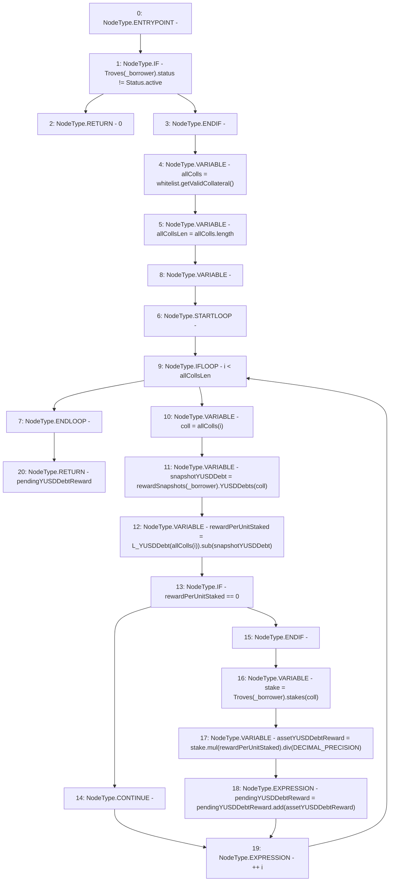

# Context: TroveManagerTester.getPendingYUSDDebtReward

**Contract:** `TroveManagerTester` (Inherits: TroveManager, ReentrancyGuard, ITroveManager, TroveManagerBase, CheckContract, Ownable, LiquityBase, YetiCustomBase, BaseMath, ILiquityBase)
**Signature:** `getPendingYUSDDebtReward(address) returns (uint256)`
**Method Selector ID:** `0x371e45ba`
**Visibility:** `public`
**Environment-Free:** `Yes`
**Modifiers:** None

### State Variables Interaction
- **Reads:** DECIMAL_PRECISION, L_YUSDDebt, Troves, rewardSnapshots, whitelist
- **Writes:** None

### Environment & Verification Flags
- **Uses Foundry Cheatcodes:** No
- **Has Echidna Properties:** No

### Internal Calls Tree
- None

### External Calls / Value Transfers
- `SafeMath.TMP_414(uint256) = LIBRARY_CALL, dest:SafeMath, function:SafeMath.add(uint256,uint256), arguments:['pendingYUSDDebtReward', 'assetYUSDDebtReward'] `
- `IWhitelist.TMP_408(address[]) = HIGH_LEVEL_CALL, dest:whitelist(IWhitelist), function:getValidCollateral, arguments:[]  `
- `SafeMath.TMP_410(uint256) = LIBRARY_CALL, dest:SafeMath, function:SafeMath.sub(uint256,uint256), arguments:['REF_484', 'snapshotYUSDDebt'] `
- `SafeMath.TMP_412(uint256) = LIBRARY_CALL, dest:SafeMath, function:SafeMath.mul(uint256,uint256), arguments:['stake', 'rewardPerUnitStaked'] `
- `SafeMath.TMP_413(uint256) = LIBRARY_CALL, dest:SafeMath, function:SafeMath.div(uint256,uint256), arguments:['TMP_412', 'DECIMAL_PRECISION'] `

### Control Flow Graph (CFG)


### Source Mapping
Declared in: `certora-ac-datasets/detasets/web3bugs/dataset/web3bugs/66/packages/contracts/contracts/TroveManager.sol` on lines **418** to **436**

```solidity
    function getPendingYUSDDebtReward(address _borrower) public view override returns (uint pendingYUSDDebtReward) {
        if (Troves[_borrower].status != Status.active) {
            return 0;
        }
        address[] memory allColls = whitelist.getValidCollateral();

        uint256 allCollsLen = allColls.length;
        for (uint256 i; i < allCollsLen; ++i) {
            address coll = allColls[i];
            uint snapshotYUSDDebt = rewardSnapshots[_borrower].YUSDDebts[coll];
            uint rewardPerUnitStaked = L_YUSDDebt[allColls[i]].sub(snapshotYUSDDebt);
            if ( rewardPerUnitStaked == 0) { continue; }

            uint stake =  Troves[_borrower].stakes[coll];

            uint assetYUSDDebtReward = stake.mul(rewardPerUnitStaked).div(DECIMAL_PRECISION);
            pendingYUSDDebtReward = pendingYUSDDebtReward.add(assetYUSDDebtReward);
        }
    }

```
