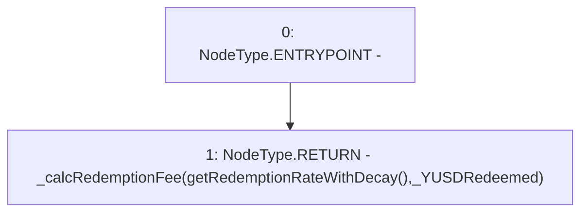

# Context: TroveManagerTester.getRedemptionFeeWithDecay

**Contract:** `TroveManagerTester` (Inherits: TroveManager, ReentrancyGuard, ITroveManager, TroveManagerBase, CheckContract, Ownable, LiquityBase, YetiCustomBase, BaseMath, ILiquityBase)
**Signature:** `getRedemptionFeeWithDecay(uint256) returns (uint256)`
**Method Selector ID:** `0xd5b35635`
**Visibility:** `external`
**Environment-Free:** `No (reads EVM state context)`
**Modifiers:** None

### State Variables Interaction
- **Reads:** None
- **Writes:** None

### Environment & Verification Flags
- **Uses Foundry Cheatcodes:** No
- **Has Echidna Properties:** No

### Internal Calls Tree
- None

### External Calls / Value Transfers
- None

### Control Flow Graph (CFG)


### Source Mapping
Declared in: `certora-ac-datasets/detasets/web3bugs/dataset/web3bugs/66/packages/contracts/contracts/TroveManager.sol` on lines **731** to **733**

```solidity
    function getRedemptionFeeWithDecay(uint _YUSDRedeemed) external view override returns (uint) {
        return _calcRedemptionFee(getRedemptionRateWithDecay(), _YUSDRedeemed);
    }

```
